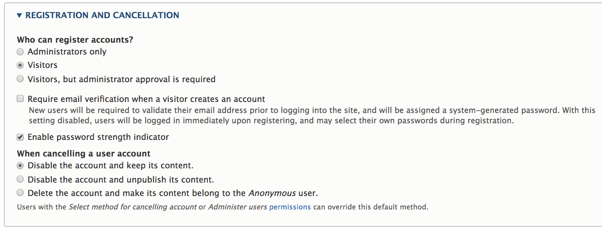

! We need help filling out this section! Feel free to follow the *edit this page* link and contribute.

### Getting started
There are important security considerations involved in user account management. If this is your first Drupal site, see the [Managing User Accounts] documentation, in the Drupal 8 User Guide for an introduction to the topic. something about how this page is specific for commerce sites.

### Customizing customer accounts
The *Registration and Cancellation* settings for your customer/user accounts are located at `/admin/config/people/accounts`. To avoid cart abandonment, you will typically want to allow *Visitors* to register accounts without administrator approval. Requiring email verification may also be a deterrent to new customers, but for many sites, this is a necessary ...

### Managing customer accounts

[User management modules](https://www.drupal.org/module-categories/user-management)

[Managing User Accounts]: https://www.drupal.org/docs/user_guide/en/user-chapter.html