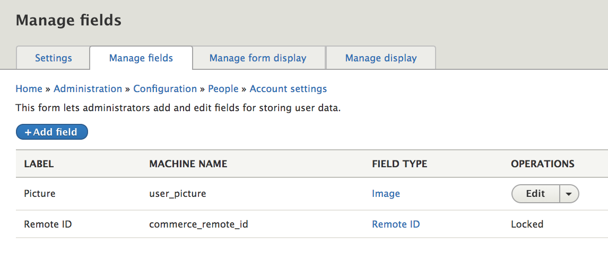

### Getting started
There are important security considerations involved in user account management. If this is your first Drupal site, see the [Managing User Accounts] documentation, in the Drupal 8 User Guide, for a good introduction. This documentation page will focus only on aspects of user accounts that are specific to Drupal Commerce. Within Drupal Commerce, we refer to *users* and *user accounts* as *customers* and *customer accounts* even though they are actually the same entities. A *customer* is simply a *user* who has placed an order on your site.

### Customizing customer accounts
The *Registration and Cancellation* settings for your customer accounts are located at `/admin/config/people/accounts`. To reduce cart abandonment, you will typically want to allow *Visitors* to register accounts without administrator approval. Requiring email verification may also be a deterrent to new customers, but you may decide that it's necessary for your particular site.

Handling canceled user accounts will also require some consideration. On the one hand, Drupal Commerce does guard against deleted users, to prevent breakage when historical orders reference users that no longer exist. So you can completely delete users if you want. On the other hand, there may be legal or financial implications with respect to retaining certain customer information.

In addition to configuring *Account settings*, you may also want to add custom fields to your customer accounts. Use the *Manage fields* administrative page at `/admin/config/people/accounts/fields` to add custom fields. In a default Drupal installation, you will see a user *Picture* field and, if you have the *Commerce Payment* module enabled, you will also see a *Remote ID* field. If you won't use the *Picture* field, it's fine to delete it. The *Remote ID* field is locked and shouldn't be deleted, since it's necessary for *Commerce Payment* functionality.

### Managing customer accounts
The list of all user accounts, including both customers and administrative users is available on the *People* administrative page at `/admin/people`. You can customize this page by configuring its View settings at `/admin/structure/views/view/user_admin_people`.

There are many contributed Drupal modules that can help you manage customer accounts or provide additional functionality. See the [User management modules](https://www.drupal.org/module-categories/user-management) listing. For example, Commerce sites often allow users to log in with their email addresses. By default, Drupal only allows login by username, but you can add this functionality with the simple [Login Email or Username module] or the slightly more complex [Email Registration module].

[Managing User Accounts]: https://www.drupal.org/docs/user_guide/en/user-chapter.html
[Login Email or Username module]: https://www.drupal.org/project/login_emailusername
[Email Registration module]: https://www.drupal.org/project/email_registration
