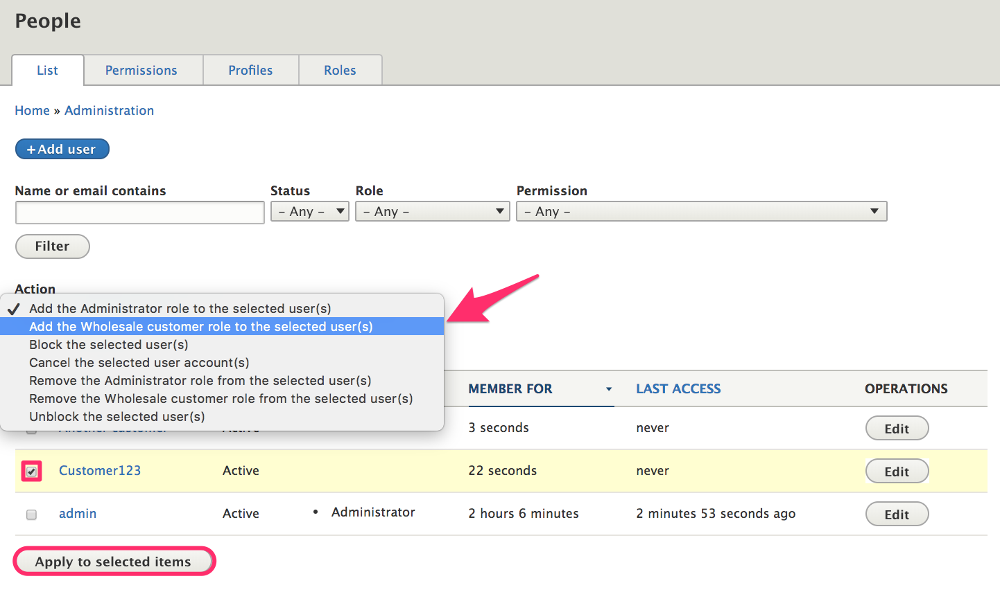
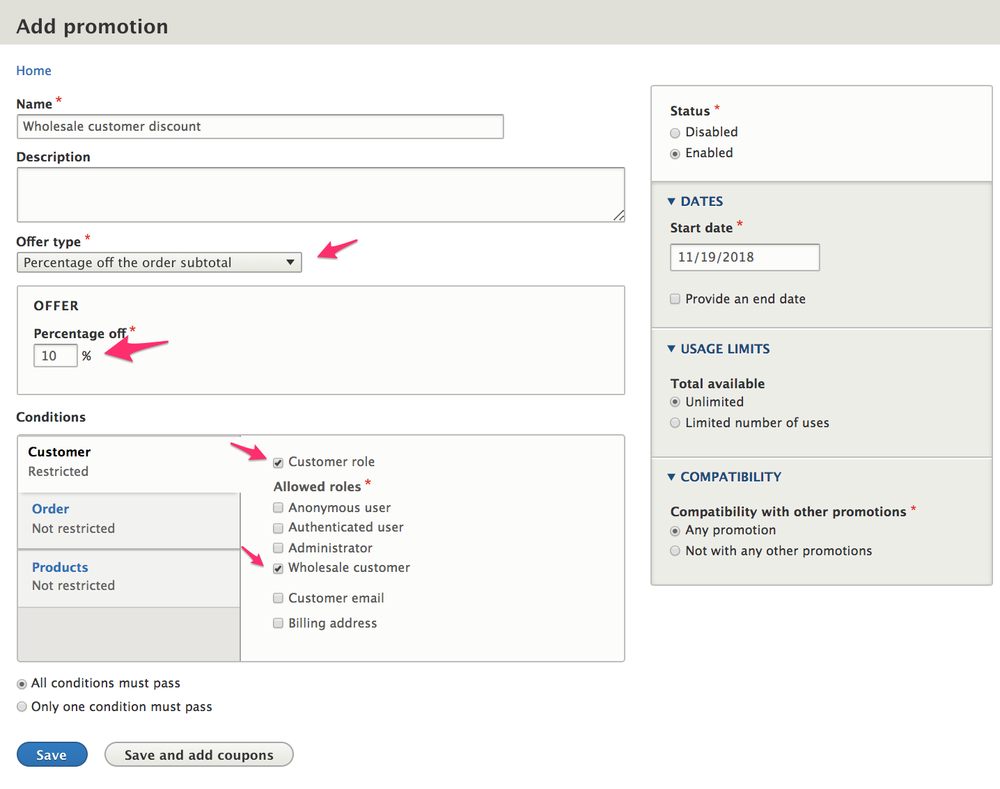
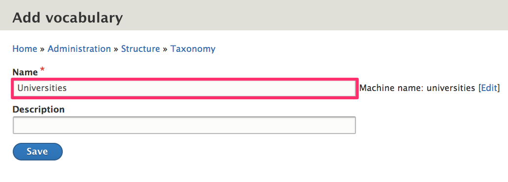
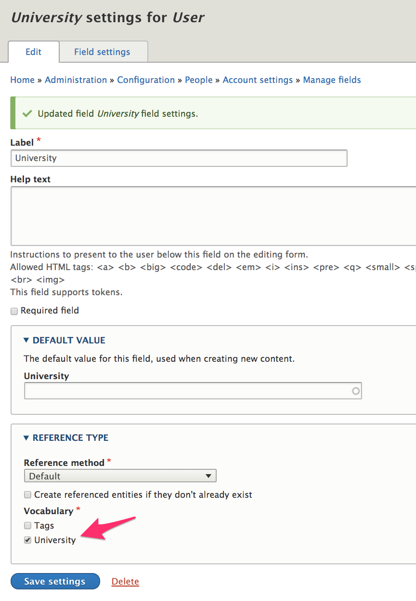

In this section we'll look at two different approaches for organizing customers into groups. First, we'll look at how user roles can be used to limit access to discounts or other functionality within Drupal Commerce. Then, we'll look at how taxonomies can be used in situations where the number of different groups makes the user role approach impractical.

If neither user roles nor taxonomies provide enough functionality for your needs, there may be a contribued Drupal module that would work. See the [User management modules](https://www.drupal.org/module-categories/user-management) listing.

### Customer group user roles
You can use *User roles* to organize customers to limit access to payment gateways, promotions, or certain fees/charges based on customer type. Drupal Commerce provides plugin-based *Conditions* functionality and includes a condition for *Customer role*. As an example, let's suppose we have a select group of *wholesale* customers that should receive a 10% discount on all products. Here's how we could set that up:

#### Create a *Wholesale* customer user role.
1. Navigate to the *Roles* administrative page at `/admin/people/roles`.
2. Click the *Add role* button.
3. Enter *Wholesale customer* from the name.
4. Click the *Save* button.

You will also need to assign this role to the appropriate customers by editing their *Customer accounts* at `/admin/people`. You can make bulk assignments by using the checkboxes to select customers and selecting the appropriate option under the *Action* menu:

#### Create a promotion for *wholesale* customers
1. Navigate to the *Promotions* administrative page at `/admin/commerce/promotions`.
2. Click the *Add promotion* button.
3. Enter *Wholesale customer discount* for the name.
4. Select *Percentage off the order subtotal* for the Offer type.
5. Enter *10* for the *Percentage off* value.
6. In the Conditions section, select *Customer role* as a *Customer* condition.
7. Select *Wholesale customer* for the Allowed roles.
8. Click the *Save* button.

### Customer group taxonomies
If you have a high number of different customer groups, creating a user role for each might not be practical. For example, suppose you sell products to individual customers at universities. You might want to track sales based on university or provide discounts to specific universities. Creating a *Universities* taxonomy and populating it with the names of all your university customers is a good way to handle this.

#### Create a *Universities* taxonomy to group customers
1. Navigate to the *Taxonomy* page at `/admin/structure/taxonomy`.
2. Click the *Add vocabulary* button.
3. Enter "Universities" for the Name.
4. Click *Save* to create the new vocabulary.

Now you can add terms to the vocabulary or look into using the [Feeds module] or [Migrate Tools module] to import your pre-existing data.

#### Add a *University* field to customer accounts
1. Navigate to the *Manage fields* administrative page for customer accounts at `/admin/config/people/accounts/fields`.
2. Click the *Add field* button.
3. Select *Taxonomy term* (in the *Reference* section) for the new field type.
4. Enter *University* for the Label.
5. Click the *Save and continue* button.
6. Click the *Save field settings* on the next page to save the default configuration values.
7. On the *University settings for User* administrative page, select *Universities* for the Vocabulary.
8. Click the *Save settings* button.

This *University* field will now appear on user account edit forms, and customers will be able to enter their own universities. If you do not want customers to have access to this field, you can use the [Field permissions] contrib module to provide that functionality. Also, you might want to consider using [Profiles](../03.profiles) to store the information instead of customer accounts, depending on what other information you might need to capture. The [Profile management](../03.profiles/03.profile-management) documentation page describes how the Field permissions module can be used to limit access to certain fields.

Once you've created your *University* field, it can be added to Order views and sales reports. If you need to create discounts based on a customer group taxonomy like our *Universities* example, you'll probably need to look for a contrib module or create custom code. A condition for customer groups based on taxonomies does not exist in Drupal Commerce core. If you decide to write custom code, take a look at the *Product category* condition that's provided by the *Product* module. Specifically, you can use the code in the `OrderProductCategory` plugin and the `ProductCategoryTrait` trait as a starting point.

### Links and resources
* Drupal 8 User Guide documentation on [Creating a Role]
* Drupal 8 User Guide documentation on [Concept: Taxonomy]
* [Field permissions] module

[Concept: Taxonomy]: https://www.drupal.org/docs/user_guide/en/structure-taxonomy.html
[Feeds module]: https://www.drupal.org/project/feeds
[Migrate Tools module]: https://www.drupal.org/project/migrate_tools
[Creating a Role]: https://www.drupal.org/docs/user_guide/en/user-new-role.html
[Field permissions]: https://www.drupal.org/project/field_permissions
