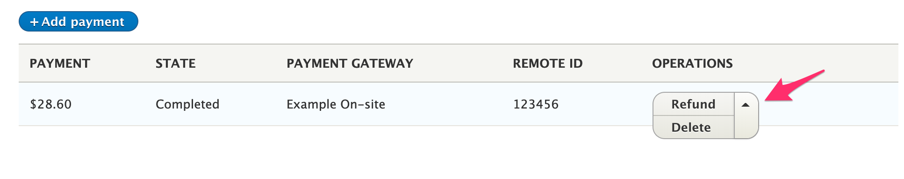

Drupal Commerce provides separate interfaces for authorization, void, and refund functionality so that you can more easily customize your payment gateway module based on the requirements of your payment provider. Implementing these interfaces will affect the options available on the *Payments* tab for an order.



- **Capture** is displayed when `SupportsAuthorizationsInterface` is implemented, and the current payment state is `authorization`.
- **Void** is displayed when `SupportsVoidsInterface` is implemented, and the current payment state is `authorization`.
- **Refund** is displayed when `SupportsRefundsInterface` is implemented, and the current payment state is either `completed` or `partially_refunded`.

This documentation page describes the methods defined by these interfaces and provides example code based on the *Commerce Payment Example*, [Commerce Authorize.Net], and [Commerce Braintree] modules.

### Capturing payments (authorizations)
The  `SupportsAuthorizationsInterface` defines `capturePayment`:

`public function capturePayment(PaymentInterface $payment, Price $amount = NULL);`

This method is responsible for capturing the transaction for a previously authorized payment and moving it to the current batch for settlement. Only payments in the *authorization* state can be captured. An optional *amount* can be specified to capture only a portion of the entire payment amount.

#### Customizing the capture payment form
When a payment gateway implements the `SupportsAuthorizationsInterface` interface, the `PaymentCaptureForm` is used for collecting all information required for editing the payment method. You can create your own payment method add form by extending `Drupal\commerce_payment\PluginForm\PaymentCaptureForm` with your own `Drupal\my_custom_gateway\PluginForm\PaymentCaptureForm` class. In your payment gateway plugin annotation, you will need to include your custom form as the `capture-payment` form.

#### Example `capturePayment` method implementation

```php
public function capturePayment(PaymentInterface $payment, Price $amount = NULL) {
  $this->assertPaymentState($payment, ['authorization']);
  // If not specified, capture the entire amount.
  $amount = $amount ?: $payment->getAmount();

  // Perform the capture request here, throw an exception if it fails.
  try {
    $remote_id = $payment->getRemoteId();
    $decimal_amount = $amount->getNumber();
    $result = $this->api->transaction()->submitForSettlement($remote_id, $decimal_amount);
  }
  catch (\Exception $e) {
    $this->logger->log('error', 'Error message about the failure');
    throw new PaymentGatewayException('Error message about the failure');
  }

  $payment->setState('completed');
  $payment->setAmount($amount);
  $payment->save();
}
```

### Voiding payments
The  `SupportsVoidsInterface` defines `voidPayment`:

`public function voidPayment(PaymentInterface $payment);`

This method is responsible for voiding a transaction that was previously authorized but has not been settled. (Payments can usually only be voided before they are captured/received.)

#### Customizing the void payment form
When a payment gateway implements the `SupportsVoidsInterface` interface, the `PaymentVoidForm` is used for collecting all information required for editing the payment method. You can create your own payment method add form by extending `Drupal\commerce_payment\PluginForm\PaymentVoidForm` with your own `Drupal\my_custom_gateway\PluginForm\PaymentVoidForm` class. In your payment gateway plugin annotation, you will need to include your custom form as the `void-payment` form.

#### Example `voidPayment` method implementation

```php
public function voidPayment(PaymentInterface $payment) {
  $this->assertPaymentState($payment, ['authorization']);
  // Perform the void request here, throw an exception if it fails.
  try {
    $remote_id = $payment->getRemoteId();
    $result = $this->api->transaction()->void($remote_id);
  }
  catch (\Exception $e) {
    $this->logger->log('error', 'Error message about the failure');
    throw new PaymentGatewayException('Error message about the failure');
  }

  $payment->setState('authorization_voided');
  $payment->save();
}
```

### Refunding payments
The  `SupportsRefundsInterface` defines `refundPayment`:

`public function refundPayment(PaymentInterface $payment, Price $amount = NULL);`

This method is responsible for refunding all or part of a payment. An optional *amount* can be specified to refund only a portion of the entire payment amount.

#### Customizing the refund payment form
When a payment gateway implements the `SupportsRefundsInterface` interface, the `PaymentRefundForm` is used for collecting all information required for editing the payment method. You can create your own payment method add form by extending `Drupal\commerce_payment\PluginForm\PaymentRefundForm` with your own `Drupal\my_custom_gateway\PluginForm\PaymentRefundForm` class. In your payment gateway plugin annotation, you will need to include your custom form as the `refund-payment` form.

#### Example `refundPayment` method implementation:

```php
public function refundPayment(PaymentInterface $payment, Price $amount = NULL) {
  $this->assertPaymentState($payment, ['completed', 'partially_refunded']);
  // If not specified, refund the entire amount.
  $amount = $amount ?: $payment->getAmount();
  $this->assertRefundAmount($payment, $amount);

  // Perform the refund request here, throw an exception if it fails.
  try {
    $remote_id = $payment->getRemoteId();
    $decimal_amount = $amount->getNumber();
    $result = $this->api->transaction()->refund($remote_id, $decimal_amount);
  }
  catch (\Exception $e) {
    $this->logger->log('error', 'Error message about the failure');
    throw new PaymentGatewayException('Error message about the failure');
  }

  // Determine whether payment has been fully or partially refunded.
  $old_refunded_amount = $payment->getRefundedAmount();
  $new_refunded_amount = $old_refunded_amount->add($amount);
  if ($new_refunded_amount->lessThan($payment->getAmount())) {
    $payment->setState('partially_refunded');
  }
  else {
    $payment->setState('refunded');
  }

  $payment->setRefundedAmount($new_refunded_amount);
  $payment->save();
}
```

[Commerce Authorize.Net]: https://www.drupal.org/project/commerce_authnet
[Commerce Braintree]: https://www.drupal.org/project/commerce_braintree