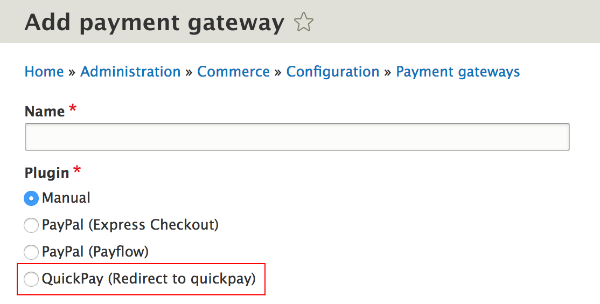
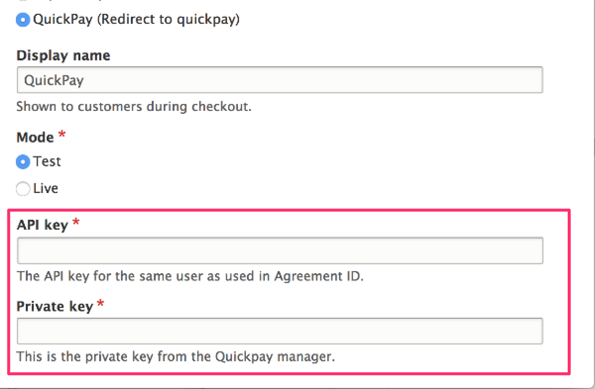

The Commerce 2 Payment API provides a framework for implementing online payment gateways. Most of the code you will need to write is gateway specific. This documentation section includes examples in separate pages for several types of payment gateways:

* [On-site payment gateways](01.on-site-gateways)
* [Off-site (redirect) gateways](02.off-site-redirect-gateways)
* [Off-site (iframe) gateways](03.off-site-iframe-gateways)
* [Off-site (IPN) gateways](04.handling-ipn)

##### Initial steps for creating a payment gateway in Drupal Commerce:
For all these gateway types, the initial steps are the same. We'll go through these steps here, using the the Commerce QuickPay module (*not yet released*) as an example.

1. [Create a new module.](#step-1-create-a-new-module)
2. [Create the configuration schema.](#step-2-create-a-configuration-schema-file)
3. [Create a payment gateway plugin.](#step-3-create-a-payment-gateway-plugin)
4. [Implement the plugin configuration form.](#step-4-implement-the-plugin-configuration-form)

### Step 1: Create a new module

The first thing you will need to do is create a new module with a YAML file that includes the *commerce_payment* dependency. For more information, see the [Drupal 8 documentation on creating custom modules]. For the Commerce QuickPay module, this file is named `commerce_quickpay.info.yml` and looks like this:

```php
name: Commerce QuickPay
type: module
description: Provides Commerce integration for the QuickPay Gateway.
core: 8.x
package: Commerce (contrib)
dependencies:
  - commerce:commerce_payment
```

If your payment gateway depends on a vendor-supplied library, you may also need to include a `composer.json` file with a pointer to its repository. For more information, see the [Add a composer.json file section] of the Drupal 8 documentation on creating custom modules.

### Step 2: Create a configuration schema file
For your payment provider, you will probably need some information like *API key*, *Private key*, etc. These will be your payment gateway settings that are stored by Drupal's configuration system. You will need to figure out which settings you need, based on documentation provided by your specific payment provider. Once you've determined the necessary settings, create your configuration schema file:

1. Create a new `config` folder in your custom module.
2. Create a `schema` subfolder within the `config` folder.
3. Create a file within the `schema` folder named `my_module.schema.yml`, where `my_module` is replaced by the name of your custom module. For Commerce QuickPay, this would be `commerce_quickpay.schema.yml`.
4. In your schema configuration file, enter a mapping with key-value pairs for each of your payment gateway settings.

Here is a simplistic example for the QuickPay module, with only *private_key* and *api_key* settings. The actual QuickPay integration would require additional settings. The ***type*** should be `commerce_payment_gateway_configuration`. For the name of the configuration object, use `commerce_payment.commerce_payment_gateway.plugin`. as a prefix followed by a descriptive name, like *quickpay_redirect_checkout*.

```yml
# config/schema/commerce_quickpay.schema.yml
commerce_payment.commerce_payment_gateway.plugin.quickpay_redirect_checkout:
  type: commerce_payment_gateway_configuration
  mapping:
    private_key:
      type: string
      label: 'Private key'
    api_key:
      type: string
      label: 'API key'

```

For more information on creating schema files, see the [Drupal 8 documentation on configuration schema/metadata].

### Step 3: Create a payment gateway plugin
If you are new to creating plugins, see the [Drupal 8 Plugin API documentation]. Your plugin class should be located within your custom module in the `src/Plugin/Commerce/PaymentGateway` folder. To create your payment gateway plugin, begin by subclassing one of the payment gateway base classes:
* For an on-site gateway, use: `Drupal\commerce_payment\Plugin\Commerce\PaymentGateway\OnsitePaymentGatewayBase`.
* For an off-site gateway, use: `Drupal\commerce_payment\Plugin\Commerce\PaymentGateway\OffsitePaymentGatewayBase`.

Here is an example of a payment gateway plugin for Commerce QuickPay (an off-site gateway):

```php
<?php

namespace Drupal\commerce_quickpay\Plugin\Commerce\PaymentGateway;

use Drupal\commerce_payment\Plugin\Commerce\PaymentGateway\OffsitePaymentGatewayBase;
use Drupal\Core\Form\FormStateInterface;

/**
 * Provides the QuickPay offsite Checkout payment gateway.
 *
 * @CommercePaymentGateway(
 *   id = "quickpay_redirect_checkout",
 *   label = @Translation("QuickPay (Redirect to quickpay)"),
 *   display_label = @Translation("QuickPay"),
 *    forms = {
 *     "offsite-payment" = "Drupal\commerce_quickpay\PluginForm\RedirectCheckoutForm",
 *   },
 *   payment_method_types = {"credit_card"},
 *   credit_card_types = {
 *     "mastercard", "visa",
 *   },
 * )
 */
class RedirectCheckout extends OffsitePaymentGatewayBase {

}
```

An important aspect of your plugin class its ***annotation***, identified by ***@CommercePaymentGateway***. The annotation contains the information Drupal Commerce needs to *discover* your plugin. To learn more about annotations, see the [Drupal 8 documentation on Annotations-base plugins]. For example, if you enable the Commerce QuickPay module (or rebuild caches if the module is already enabled), you will then see *QuickPay (Redirect to quickpay)* as a payment gateway *Plugin* option:



Here is the full list of properties for Commerce Payment Gateway annotations:

| Property | Description |
| -------- | ----------- |
| id       | The plugin ID, a string. |
| label    | The payment gateway label, a translatable string. |
| display_label | The display label, a translatable string. |
| modes    | An array of supported modes, keyed by machine name. If no modes are provided, the default modes are *Test* and *Live* are provided. The mode labels are translatable strings. |
| forms    | An array of form classes, keyed by operation. For example, the *Manual* payment gateway has as its *forms* property:<br /><code>  forms = {<br />&nbsp;&nbsp;"add-payment" = "Drupal\commerce_payment\PluginForm\ManualPaymentAddForm",<br />&nbsp;&nbsp;"receive-payment" = "Drupal\commerce_payment\PluginForm\PaymentReceiveForm",<br />},</code> |
 | js_library | The JavaScript library ID. |
 | payment_type | The payment type used by the payment gateway, a string. If no payment type is provided, the default value is *payment_default*. |
 | payment_method_types | An array of the payment method types handled by the payment gateway. If no payment method types are provided, a *credit_card* default type is provided. Other types can be things like *paypal*, or *paypal_credit*. |
 | default_payment_method_type | The default payment method type, a string. If no default type is provided, the first payment method type is used as the default. |
 | credit_card_types | An array of credit card types handled by the payment gateway. If no credit card types are provided, the default list of credit card types is provided by the `getTypes()` method in the `Drupal\commerce_payment\CreditCard` class: *visa*, *mastercard*, *maestro*, *amex*, *dinersclub*, *discover*, *jcb*, and *unionpay*. |

### Step 4: Implement the plugin configuration form

When a plugin is selected on the *Payment gateway* administrative page, its configuration form is automatically loaded. The base payment gateway class, `PaymentGatewayBase` builds a form for the *Display name*, *Mode*, and *Payment method types* settings. (*Mode* and *Payment method types* are hidden when only single options exist.) However, it's up to you to implement the configuration form methods for the settings that are specific to your Payment gateway. For the Commerce QuickPay example, we need add the *API Key* and *Private key* settings to the configuration form:



We can do that by implementing the *defaultConfiguration()*, *buildConfigurationForm()*, and *submitConfigurationForm()* methods in our `RedirectCheckout` plugin class.

#### The defaultConfiguration() method
Use the *defaultConfiguration()* method to return default values, corresponding to the settings you defined in your module's [configuration schema file](#create-a-configuration-schema-file). For the *Commerce QuickPay* module, we only defined *private_key* and *api_key* settings, so the defaultConfiguration() method looks like this:

```php
  public function defaultConfiguration() {
    return [
        'private_key' => '',
        'api_key' => '',
      ] + parent::defaultConfiguration();
  }
```

#### The buildConfigurationForm() method
The *buildConfigurationForm* method is a standard Drupal form builder. To display the fields in the plugin congiguration form, add them as Form API fields in your buildConfigurationForm method. For *Commerce QuickPay*, we can use simple *textfield* elements for each of the settings. If you are unfamiliar with building forms in Drupal 8, the [Drupal 8 Form API reference] may be helpful.

```php
  public function buildConfigurationForm(array $form, FormStateInterface $form_state) {
    $form = parent::buildConfigurationForm($form, $form_state);

    $form['private_key'] = [
      '#type' => 'textfield',
      '#title' => $this->t('Private key'),
      '#description' => $this->t('This is the private key from the Quickpay manager.'),
      '#default_value' => $this->configuration['private_key'],
      '#required' => TRUE,
    ];

    $form['api_key'] = [
      '#type' => 'textfield',
      '#title' => $this->t('API key'),
      '#description' => $this->t('The API key for the same user as used in Agreement ID.'),
      '#default_value' => $this->configuration['api_key'],
      '#required' => TRUE,
    ];

    return $form;
  }
```

#### The submitConfigurationForm() method
Finally, to save the settings values entered by administrative users, we need to implement the *submitConfigurationForm* method. The submitConfigurationForm saves the input into the configuration.

```php
  public function submitConfigurationForm(array &$form, FormStateInterface $form_state) {
    parent::submitConfigurationForm($form, $form_state);
    $values = $form_state->getValue($form['#parents']);
    $this->configuration['private_key'] = $values['private_key'];
    $this->configuration['api_key'] = $values['api_key'];
  }
```

[Drupal 8 documentation on creating custom modules]: https://www.drupal.org/docs/8/creating-custom-modules
[Drupal 8 documentation on configuration schema/metadata]: https://www.drupal.org/docs/8/api/configuration-api/configuration-schemametadata
[Drupal 8 Plugin API documentation]: https://www.drupal.org/docs/8/api/plugin-api
[Drupal 8 documentation on Annotations-base plugins]: https://www.drupal.org/docs/8/api/plugin-api/annotations-based-plugins
[Drupal 8 Form API reference]: https://api.drupal.org/api/drupal/elements/
[Add a composer.json file section]: https://www.drupal.org/docs/8/creating-custom-modules/add-a-composerjson-file
