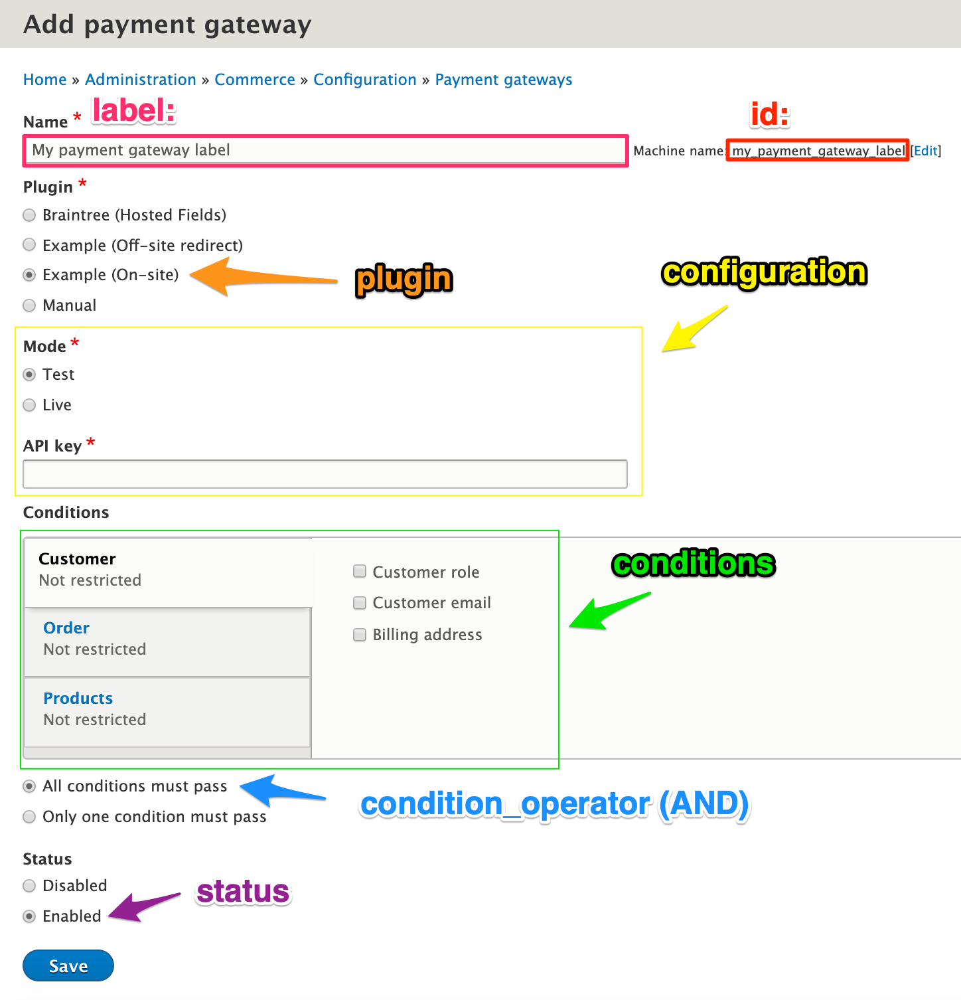

This page provides specific, technical explanations of the payment-related data structures and relationships in Drupal Commerce. Familiarity with Drupal concepts including configuration entities, content entities, fields, and plugins is assumed. For a more general introduction to Drupal Commerce payments,  see the [Payments documentation page](../). For step-by-step instructions for setting up payments for your site, see the [Getting started documentation](../../getting-started).

#### Payment gateways
A **payment gateway** is a configuration entity that manages a single instance of a payment gateway plugin. Payment gateways are created and managed through the adminstrative UI (or programatically). Customers interact with payment gateways only indirectly, when they select a payment option during checkout. See the [Payment options builder section](#payment-options-builder) for additional information. Payment gateway plugins provide the functionality that allows customers to enter their payment information, interact with the payment providers that capture the actual payments, and update order information locally to correctly track whether orders have been paid. See the [Creating payment gateways documentation](../create-payment-gateway) for information about payment gateway plugins.

> TBD more about payment gateway plugins here, further down the page??

Payment, payment method, and order entities all have an entity reference field to a payment gateway entity.

####Payment gateway fields

| Field      | Description |
| ---------- | ----------- |
| id         | Unique string id for the gateway |
| label      | Name of the gateway, for administrative use only |
| weight     | Used for ordering payment gateways |
| conditions | An array of \Drupal\commerce\Plugin\Commerce\Condition\ConditionInterface condition plugins |
| condition_operator | The condition operator: `AND` or `OR`, a string |
| plugin     | The payment gateway plugin |
| configuration | An array of plugin configuration |
| status     | Whether the plugin gateway is enabled or disabled |

#### Payments and payment types
A **payment** is a content entity that stores local information about payment transactions that are executed remotely. These payment transactions may be submitted to a payment provider via its API or they may be payments that are received "in the real world" (cash, check, etc.) Every payment belongs to a single Drupal Commerce *order* and a single *payment gateway*. *Payments* are created by *payment gateway plugins*; each *payment gateway plugin* defines the **payment type** for the *payments* it creates.

Out of the box, the Commerce Payment module provides two **payment types**: `payment_default` and `payment_manual`. The *manual* payment type is used for *manual* payment gateways; *default* is used, by default, by all other payment gateways. Each payment type has its own *workflow*, which defines the states and transitions for a payment's status. Both *manual* and *default* payment types have `new`, `completed`, `partially_refunded`, and `refunded` states. *Manual* payment types also have `pending` and `voided` states; *default* payment types have `authorization`, `authorization_voided`, and `authorization_expired` states. Each payment type also has an `id` and a `label`.

##### Payment fields
> TBD -- these were copied here but are not correct. Do this next.
| Field      | Description |
| ---------- | ----------- |
| payment_id | Unique numeric id for the payment |
| label      | Name of the gateway, for administrative use only |
| weight     | Used for ordering payment gateways |
| conditions | An array of \Drupal\commerce\Plugin\Commerce\Condition\ConditionInterface condition plugins |
| condition_operator | The condition operator: `AND` or `OR`, a string |
| plugin     | The payment gateway plugin |
| configuration | An array of plugin configuration |
| status     | Whether the plugin gateway is enabled or disabled |

**Creating payments**
Payments are created during checkout when a customer confirms his order and can be created manually through the administrative UI. See also the [Code recipes documentation](../code-recipes) for an example of creating a payment programatically. For *Manual* and *On-site* payment gateway plugins, payments are created by the `createPayment()` method. For *Off-site* payment gateway plugins, payments are typically created in the `onReturn()` method or the `onNotify()` method, if the gateway supports asynchronous notifications (IPNs).

**Saving payments**
- When a payment is saved, the payment gateway mode is automatically set, based on the current mode for its payment gateways's plugin.
- Authorized and completed timestamps are updated automatically.
- When a payment is saved, the total paid amount for the payment's order is updated.

**Deleting payments**
- When a payment is deleted, the total paid amount for the payment's order is updated.

- payment method entities
- payment gateway plugins, payment method types
- payment options, credit card / credit card type objects
- payment order manager, payment statuses

#### Payment options builder
- TBD: describe payment options and the payment options builder service.

### Payment gateway plugins
See the [Creating payment gateways documentation](../create-payment-gateway) for information about payment gateway plugins.