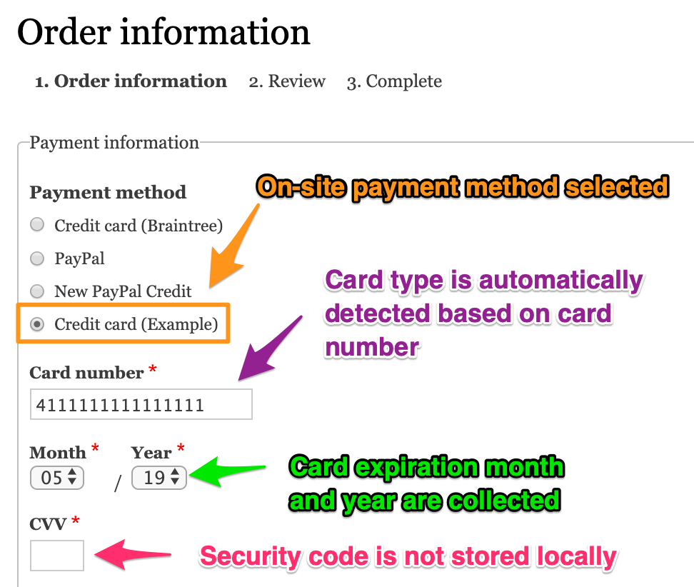
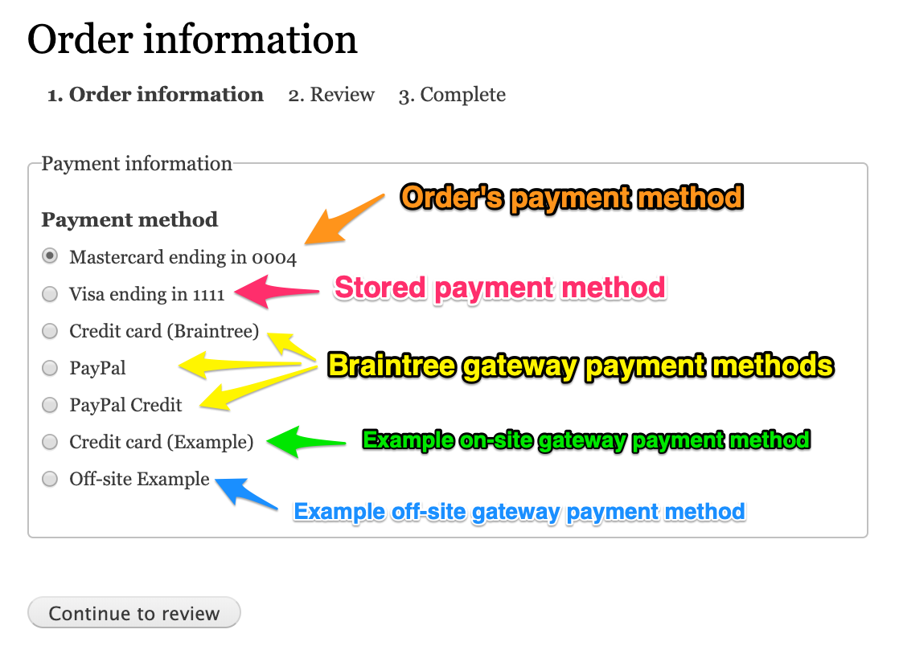

This page provides specific, technical explanations of the payment-related data structures and relationships in Drupal Commerce. Familiarity with Drupal concepts including configuration entities, content entities, fields, and plugins is assumed. For a more general introduction to Drupal Commerce payments,  see the [Payments documentation page](../). For step-by-step instructions for setting up payments for your site, see the [Getting started documentation](../../getting-started).

#### Payment gateways
A **payment gateway** is a configuration entity that manages a single instance of a payment gateway plugin. Payment gateways are created and managed through the administrative UI (or programatically). Customers interact with payment gateways only indirectly, when they select a payment option during checkout. See the [Payment options builder section](#payment-options-builder) for additional information. Payment gateway plugins provide the functionality that allows customers to enter their payment information, interact with the payment providers that capture the actual payments, and update order information locally to correctly track whether orders have been paid. See the [Creating payment gateways documentation](../create-payment-gateway) for information about payment gateway plugins.

Payment, payment method, and order entities all have a payment gateway entity reference field.

####Payment gateway fields

| Field      | Description |
| ---------- | ----------- |
| id         | Unique string id for the gateway |
| label      | Name of the gateway, for administrative use only |
| weight     | Used for ordering payment gateways |
| conditions | An array of `\Drupal\commerce\Plugin\Commerce\Condition\ConditionInterface` condition plugins, see [Core Conditions documentation](../../core/conditions) |
| condition_operator | The condition operator: `AND` or `OR`, a string |
| plugin     | The payment gateway plugin |
| configuration | An array of plugin configuration, see [Payment gateways: Getting started documentation](../create-payment-gateway/getting-started) |
| status     | Whether the plugin gateway is enabled or disabled |

#### Payments and payment types
A **payment** is a content entity that stores local information about payment transactions that are executed remotely. These payment transactions may be submitted to a payment provider via its API or they may be payments that are received "in the real world" (cash, check, etc.) Every payment belongs to a single Drupal Commerce *order* and a single *payment gateway*. *Payments* are created by *payment gateway plugins*; each *payment gateway plugin* defines the **payment type** for the *payments* it creates.

Out of the box, the Commerce Payment module provides two **payment types**: `payment_default` and `payment_manual`. The *manual* payment type is used for *manual* payment gateways; *default* is used, by default, by all other payment gateways. Each payment type has its own *workflow*, which defines the states and transitions for a payment's status. 

##### Payment states
**Default** payment types have the following payment transaction statuses:

| State Id              | Label                   | Description |
| --------------------- | ----------------------- |
| new                   | New                     | The initial state for any new payment.
| authorization         | Authorization           | If the payment gateway supports authorizations, payments will typically transition from New to Authorization. |
| completed             | Completed               | If the payment gateway supports authorizations, payments will typically transition from Authorization to Completed, once the transaction is "captured". For other payment gateways, payments will typically transition directly from New to Completed. Only amounts for payments that have been *completed* are added to the order's total paid amount. |
| authorization_voided  | Authorization (Voided)  | If the payment gateway supports voids, a payment can transition from Authorization to Authorization (Voided). |
| authorization_expired | Authorization (Expired) | If the payment gateway supports authorizations, a payment can transition from Authorization to Authorization (Expired). |
| partially_refunded    | Partially refunded      | If the payment gateway supports refunds, a payment can transition from Completed to Partially refunded. |
| refunded              | Refunded | If the payment gateway supports refunds, a payment can transition from either New or Partially refunded to Refunded. |

**Manual** payment types have the following payment transaction statuses:

| State Id              | Label                   | Description |
| --------------------- | ----------------------- |
| new                   | New                     | The initial state for any new payment.
| pending               | Pending                 | When a payment is created, typically at the final checkout confirmation step, it transitions from New to Pending. |
| completed             | Completed               | Once the payment transaction is "received", the payment transitions from Pending to Completed. |
| voided                | Voided                  | If a payment transaction is not going to be received, the payment can transition from Pending to Voided. |
| partially_refunded    | Partially refunded      | If the payment gateway supports refunds, a payment can transition from Completed to Partially refunded. |
| refunded              | Refunded | If the payment gateway supports refunds, a payment can transition from either New or Partially refunded to Refunded. |

##### Payment fields
| Field           | Description |
| --------------- | ----------- |
| payment_id      | Unique numeric id for the payment |
| type            | String id for the payment type plugin; core types are `payment_default` and `payment_manual`. |
| payment_gateway | String id for the payment gateway, required |
| payment_gateway_mode | String id for the payment gateway mode, required; default types are `test` and `live`. |
| payment_method  | Id of the payment method (On site payment gateways)  |
| order_id        | Id of the parent order |
| remote_id       | Remote id for the payment, a string up to 255 characters long |
| remote_state    | Remote payment state, a string up to 255 characters long |
| amount          | The payment amount, with currency, required |
| refunded_amount | The refunded amount, with currency |
| state           | The status of the payment, a string corresponding to a workflow state, required |
| authorized      | The time when the payment was authorized, (i.e., when the payment's state is set to `authorization`) |
| expires         | The time when the payment expires, 0 for never |
| completed       | The time when the payment was completed, (i.e., when the payment's state is set to `completed`) |

##### Payment type properties
| Field      | Description |
| ---------- | ----------- |
| id         | Unique string id for the payment type |
| label      | The payment type label, for administrative use only |
| workflow   | The payment workflow, default is `payment_default`; *Manual* payment types use `payment_manual` |

##### Creating payments
Payments are created during checkout when a customer confirms his order and can be created manually through the administrative UI. See the [Code recipes documentation](../code-recipes) for an example of creating a payment programatically. For *Manual* and *On-site* payment gateway plugins, payments are created by the `createPayment()` method. For *Off-site* payment gateway plugins, payments are typically created in the `onReturn()` method or in the `onNotify()` method, if the gateway supports asynchronous notifications (IPNs).

##### Saving payments
- When a payment is saved, the payment gateway mode is automatically set, based on the current mode for its payment gateways's plugin.
- Authorized and completed timestamps are updated automatically.
- When a payment is saved, the total paid amount for the payment's order is updated.

##### Deleting payments
- When a payment is deleted, the total paid amount for the payment's order is updated.

#### Payment methods and payment method types
A **payment method** is a content entity that stores local information for a payment method created and stored remotely by a payment provider. *Credit card* and *Paypal* are two types of payment methods, both of which are provided by the core *Commerce Payment* module. *Payments* can be created from payment methods. Currently, payment methods are only available for *On site* payment gateways that support stored payment methods. Payment methods belong to customers and can generally be re-used for multiple orders.

Payment gateways define the *types* of payment methods they support. For example, the [Commerce Braintree payment gateway] supports `credit_card`, `paypal`,  and `paypal_credit` payment method types. A **payment method type** defines the information to be collected and stored locally whenever a *payment method* is created. For example, for `credit_card` payment methods, *Card type* and *Card number* (last few digits only) are required fields; *Card expiration month* and *Card expiration year* are additional fields that can be optionally used for credit card payments.

##### Payment method fields
| Field           | Description |
| --------------- | ----------- |
| id              | Unique numeric id for the payment method |
| type            | String id for the payment method type plugin; core types are `credit_card` and `paypal` |
| uid             | Numeric id for the payment method owner |
| payment_gateway | String id for the payment gateway, required |
| payment_gateway_mode | String id for the payment gateway mode, required; default types are `test` and `live`. |
| remote_id       | Remote id for the payment method, a string up to 255 characters long |
| billing_profile | Numeric id for the billing profile |
| reusable        | Whether the payment method is reusable, default value is `TRUE` |
| is_default      | Whether the payment method is the user's default payment method |
| expires         | The time when the payment method expires, 0 for never |
| created         | The time when the payment method was created |
| changed         | The time when the payment method was last edited |

One standard field that's not listed as a payment method field is, "label". That's because the label for a payment method is actually generated by its payment method type's plugin method. All payment method type plugins must implement the `buildLabel()` method. For example, the *credit card* payment method type builds labels that look like, "Visa ending in 1111" or "Mastercard ending in 0004". For the *PayPal* payment method type, labels look like "PayPal (mymail@example.com)".

##### Payment method type properties
| Field        | Description |
| ------------ | ----------- |
| id           | Unique string id for the payment method type |
| label        | The payment method type main label, for administrative use |
| create_label | The label displayed to customers when the payment method is included in a list of payment options, defaults to the main label |

##### Creating payment methods
*Payment methods* are created by *payment gateway plugins* that implement `SupportsStoredPaymentMethodsInterface`. During checkout, when a customer selects a payment option provided by an *On site* gateway, he is prompted to enter payment details which are transmitted to the payment provider. If the request is successful, a *payment method* entity is created locally by the payment gateway's `createPaymentMethod()` method, and that *payment method* is attached to the customer and the order. See also the [Code recipes documentation](../code-recipes) for an example of creating a payment method programatically.

##### Saving payment methods
- When a payment method is saved, the payment gateway mode is automatically set, based on the current mode for its payment gateways's plugin.

#### Payment options builder
The `PaymentOptionsBuilder` service ties together all the internally stored payment gateway and payment method information to provide the list of "Payment methods" the customer sees during checkout. (If only one payment method is available, it is set automatically; the customer won't see a list of options.) These options can come from a variety of sources:

1. The customer's stored payment methods. If a customer created payment methods for previous orders, and they are reusable and applicable to the current order, they will be displayed as options. The labels used for these options are generated based on the payment method type.

2. The payment method for the order. If a payment method has already been added to the order, it will be displayed as one of the options. Its label is also generated based on its payment method type.

3. Options to create new payment methods for applicable payment gateways. For example, if the "Credit card", "PayPal", and "PayPal Credit" payment method options are all enabled for the [Commerce Braintree payment gateway], then they will also appear as options. The payment method type's `create_label` is used for the labels.

4. Options for applicable payment gateways that do not provide payment methods (off-site, manual, etc). The payment gateway plugin's `display_label` is used for the labels.

These options appear on the "Payment information" checkout pane that is typically part of the "Order Information" step.

To manage all this information, `PaymentOption` objects are used, with the following structure:

##### Payment option properties
| Field                | Description |
| -------------------- | ----------- |
| id                   | Unique string id for the payment option |
| label                | The payment option label that's displayed to customers |
| paymentGatewayId     | The payment gateway ID, a string |
| paymentMethodId      | The payment method ID, when known, a string |
| paymentMethodTypeId  | The payment method ID, when known, a string |

[Commerce Braintree payment gateway]: https://www.drupal.org/project/commerce_braintree
