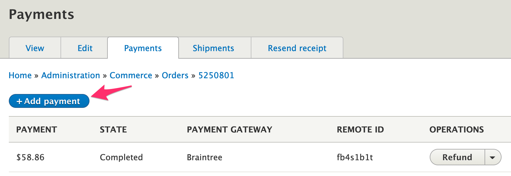

On-site payment gateways implement the `OnsitePaymentGatewayInterface`, which defines the `createPayment` method:

`public function createPayment(PaymentInterface $payment, $capture = TRUE);`

This method gets called during the checkout process, when the *Payment Information* form is submitted. It is also called when a payment is added to an order manually, through the administrative UI:

 

This method is responsible for:
* gathering all necessary information from the payment, payment method, and order
* performing verifications, throwing exceptions as needed
* performing the API request(s), throwing exceptions as needed
* creating and saving information to the Drupal Commerce payment

#### Gathering information
The payment entity that's passed in to this method should be a *new* payment, so you will generally want to start with an assertion:

`$this->assertPaymentState($payment, ['new']);`

This new payment entity will have a payment method, amount, and an order assigned to it. Here are some helpful methods for retrieving information from the payment:

```php
$payment_method = $payment->getPaymentMethod();
$amount = $payment->getAmount()->getNumber();
$currency_code = $payment->getAmount()->getCurrencyCode();
$order = $payment->getOrder();
$order_id = $payment->getOrderId();
```

The payment method can provide you with the remote ID, whether the method is re-usable, the owner, and the billing address:

```php
$remote_id = $payment_method->getRemoteId();
$is_reusable = $payment_method->isReusable();
$owner = $payment_method->getOwner();
$billing_address = $payment_method->getBillingProfile()->address->first();
```

See the `Drupal\commerce_payment\Entity\PaymentInterface` and `Drupal\commerce_payment\Entity\PaymentMethodInterface` interfaces for additional methods available for these entities.

#### Performing verifications
Depending the on the requirements of your payment provider, verifications may relate to billing address, payment currency, etc. For example:

```php
if (empty($this->configuration['merchant_account_id'][$currency_code])) {
  throw new InvalidRequestException(sprintf('No merchant account ID configured for currency %s', $currency_code));
}
```
See `\Drupal\commerce_payment\Exception` for the available exceptions.


#### Performing the API request
Remember to take into account the `$capture` value when performing the request. If `$capture` is TRUE, a *sale* transaction should be run; if FALSE, an *authorize only* transaction should be run. For example:

```php
$transaction_data = [
  'merchantAccountId' => $this->configuration['merchant_account_id'][$currency_code],
  // orderId must be unique.
  'orderId' => $payment->getOrderId(),
  'amount' => $payment->getAmount()->getNumber(),
  'options' => [
    'submitForSettlement' => $capture,
  ],
  'paymentMethodToken' => $payment_method->getRemoteId(),
];

try {
  $response = $this->api->transaction()->sale($transaction_data);
}
catch (\PaymentGatewayAPI\Exception $e) {
  throw new PaymentGatewayException('Payment gateway error');
}

```

#### Exception handling
If an exception thrown by `createPayment` is an instance of `DeclineException` or `PaymentGatewayException` (or of a class that extends one of them), the error message is hidden from the customer for security reasons.  (These two exception classes are in the `Drupal\commerce_payment\Exception` namespace.)  Note that any other exception thrown **will not be handled at all and will likely result in a blank screen or other undesirable outcome.**

Here is the code in `Drupal\commerce_payment\Plugin\Commerce\CheckoutPane\PaymentProcess` that handles the `createPayment` exceptions:

```php
catch (DeclineException $e) {
  $message = $this->t('We encountered an error processing your payment method. Please verify your details and try again.');
  $this->messenger()->addError($message);
  $this->checkoutFlow->redirectToStep($error_step_id);
}
catch (PaymentGatewayException $e) {
  \Drupal::logger('commerce_payment')->error($e->getMessage());
  $message = $this->t('We encountered an unexpected error processing your payment method. Please try again later.');
  $this->messenger()->addError($message);
  $this->checkoutFlow->redirectToStep($error_step_id);
}
```

#### Saving the payment locally
 After the payment transaction has been run on the gateway, the `$payment` entity should be updated and saved, using the information returned by the gateway. For example:

```php
$next_state = $capture ? 'completed' : 'authorization';
$payment->setState($next_state);
$payment->setRemoteId($response->transaction->id);
$payment->setExpiresTime(strtotime('+5 days'));
$payment->save();
```
