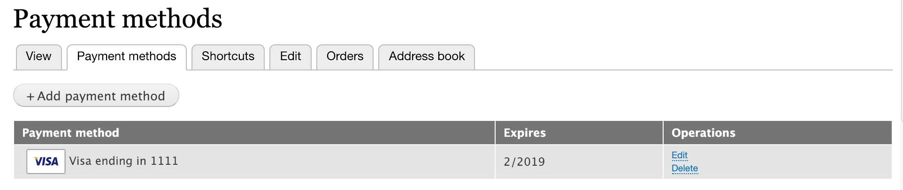

On-site payment gateways typically provide *stored payment method* functionality. This allows customers to save their credit card or other payment method details for future use. Customers can save payment methods during checkout and manage their stored payment methods on the *Payment methods* tab of their user account page:


The Drupal Commerce Payment module supports stored payment methods by defining two interfaces:
1. The `SupportsStoredPaymentMethodsInterface` defines methods for creating and deleting stored payment methods. The Drupal Commerce *On-site* payment gateway interface extends this interface.
2. The `SupportsUpdatingStoredPaymentMethodsInterface` defines a method for updating stored payment methods. By default, the payment gateway types provided by Drupal Commerce do *not* extend this interface

This documentation page describes the methods defined by these interfaces and provides example code based on the *Commerce Payment Example*, [Commerce Authorize.Net], and [Commerce Braintree] modules.


### Creating payment methods
The first method defined by `SupportsStoredPaymentMethodsInterface` is `createPayment`:

`public function createPayment(PaymentInterface $payment, $capture = TRUE);`

This method is called during the checkout process, when the *Payment Information* form is submitted. It is responsible for validating payment details, updating information on the remote payment gateway as needed, and saving payment method details locally.

#### Customizing the payment method add form
When a payment gateway implements the `SupportsStoredPaymentMethodsInterface` interface, the `PaymentMethodAddForm` is used for collecting all information required for creating the payment method. You can create your own payment method add form by extending `Drupal\commerce_payment\PluginForm\PaymentMethodAddForm` with your own `Drupal\my_custom_gateway\PluginForm\PaymentMethodAddForm` class. In your payment gateway plugin annotation, you will need to include your custom form as the `add-payment-method` form. For example, the [Commerce Braintree] module has a custom payment method add form for its Hosted Fields payment gateway:

```php
/**
 * Provides the HostedFields payment gateway.
 *
 * @CommercePaymentGateway(
 *   id = "braintree_hostedfields",
 *   label = "Braintree (Hosted Fields)",
 *   display_label = "Braintree",
 *   forms = {
 *     "add-payment-method" = "Drupal\commerce_braintree\PluginForm\HostedFields\PaymentMethodAddForm",
 *   },
  ...
```

#### Validating payment details
 The `$payment_details` array that's passed into the method contains all credit card information collected from the *Payment Information* form. The expected keys are payment gateway specific and usually match the `Drupal\commerce_payment\PluginForm\PaymentMethodAddForm` form elements.

 The *payment details* keys should be validated at the start of your `createPaymentMethod` implementation. For example:

```php
$required_keys = [
  'type', 'number', 'expiration',
];
foreach ($required_keys as $required_key) {
  if (empty($payment_details[$required_key])) {
    throw new \InvalidArgumentException(sprintf('$payment_details must contain the %s key.', $required_key));
  }
}
 ```

#### Exception handling for `createPaymentMethod`
If an exception is thrown by `createPaymentMethod`, the actual error message is logged, but a more generic message is displayed to the customer, for security reasons. So, for example, if required *payment details* keys are missing, the logged error message might be:

`$payment_details must contain the expiration key`

Displaying such a message to the customer would represent a security risk. Instead, the customer would see:

`We encountered an unexpected error processing your payment method. Please try again later.`

Exceptions of type `DeclineException` are logged as warnings; all other `PaymentGatewayException` type exceptions are logged as errors.

#### Updating information on the remote payment gateway
Billing address and credit card information is typically stored or updated on the payment gateway inside of this method.

For some payment gateway APIs, you will need to create or update a remote customer:
```php
$owner = $payment_method->getOwner();

// Build data array for submission to payment gateway.
if ($owner && $owner->isAuthenticated()) {
  $customer_id = $this->getRemoteCustomerId($owner);

  $address = $payment_method->getBillingProfile()->address->first();
  $customer_data = [
    'email' => $owner->getEmail(),
    'cardholderName' => $address->getGivenName() . ' ' . $address->getFamilyName(),
    'billingAddress' => [
      'firstName' => $address->getGivenName(),
      'lastName' => $address->getFamilyName(),
      'company' => $address->getOrganization(),
      'streetAddress' => $address->getAddressLine1(),
      'extendedAddress' => $address->getAddressLine2(),
      'locality' => $address->getLocality(),
      'region' => $address->getAdministrativeArea(),
      'postalCode' => $address->getPostalCode(),
      'countryCodeAlpha2' => $address->getCountryCode(),
    ],
  ];
}

// Create the customer remotely using API methods here.

if ($owner && $owner->isAuthenticated()) {
  $this->setRemoteCustomerId($owner, $result->customer->id);
  $owner->save();
}
```

For the request to create a payment method, you might need to do different API requests based on whether the payment method is reusable. Non-reusable payment methods usually have an expiration timestamp. For example:

```php
if (!$payment_method->isReusable()) {
  $payment_method->card_number = $payment_details['last2'];

  $remote_id = $payment_details['payment_method_nonce'];
  // Nonces expire after 3h. We reduce that time by 5s to account for the
  // time it took to do the server request after the JS tokenization.
  $expires = $this->time->getRequestTime() + (3600 * 3) - 5;
}
```

When performing any requests, you should throw an exception if it fails. See `\Drupal\commerce_payment\Exception` for the available exceptions.

```php
try {
  $result = $this->api->paymentMethod()->create($data);
  ErrorHelper::handleErrors($result);
}
catch (\Braintree\Exception $e) {
  ErrorHelper::handleException($e);
}

$remote_payment_method = $result->paymentMethod;
```

#### Saving payment method details locally
 After the information has been stored on the gateway, payment method details are saved locally in the `$payment_method` variable. 

```php
// The remote ID returned by the request.
$remote_id = $remote_payment_method->token;

$payment_method->setRemoteId($remote_id);
$payment_method->setExpiresTime($expires);
$payment_method->save();
```

### Deleting payment methods
The second method defined by `SupportsStoredPaymentMethodsInterface` is `deletePaymentMethod`:

`public function deletePaymentMethod(PaymentMethodInterface $payment_method);`

This method is called from the *Payment methods* tab of a user's account. It is responsible for deleting a saved payment method both on the Commerce site and in the gateway customer records.

Here's an example of a *deletePaymentMethod* implementation:

```php
public function deletePaymentMethod(PaymentMethodInterface $payment_method) {
  // Delete the remote record.
  try {
    $result = $this->api->paymentMethod()->delete($payment_method->getRemoteId());
    ErrorHelper::handleErrors($result);
  }
  catch (\Braintree\Exception $e) {
    ErrorHelper::handleException($e);
  }

  // Delete the local entity.
  $payment_method->delete();
}
```

### Updating payment methods
The  `SupportsUpdatingStoredPaymentMethodsInterface` defines `updatePaymentMethod`:

`public function updatePaymentMethod(PaymentMethodInterface $payment_method);`

This method is called from the *Payment methods* tab of a user's account. It is responsible for updating a saved payment method both on the Drupal Commerce site and in the gateway customer records. The default payment method edit form only supports updating billing info and the card expiration date.

#### Customizing the payment method edit form
When a payment gateway implements the `SupportsUpdatingStoredPaymentMethodsInterface` interface, the `PaymentMethodEditForm` is used for collecting all information required for editing the payment method. You can create your own payment method add form by extending `Drupal\commerce_payment\PluginForm\PaymentMethodEditForm` with your own `Drupal\my_custom_gateway\PluginForm\PaymentMethodEditForm` class. In your payment gateway plugin annotation, you will need to include your custom form as the `edit-payment-method` form.

#### Example `updatePaymentMethod` implementation

```php
public function updatePaymentMethod(PaymentMethodInterface $payment_method) {
  // Build data for the request.
  $address = $payment_method->getBillingProfile()->address->first();
  $data = [
    'billingAddress' => [
      'firstName' => $address->getGivenName(),
      'lastName' => $address->getFamilyName(),
      'company' => $address->getOrganization(),
      'streetAddress' => $address->getAddressLine1(),
      'extendedAddress' => $address->getAddressLine2(),
      'locality' => $address->getLocality(),
      'region' => $address->getAdministrativeArea(),
      'postalCode' => $address->getPostalCode(),
      'countryCodeAlpha2' => $address->getCountryCode(),
    ],
    'expirationDate' => sprintf('%s-%s', $payment_method->get('card_exp_month')->value, $payment_method->get('card_exp_year')->value),
  ];

  // Perform the update request; throw an exception if it fails.
  try {
    $response = $this->api->paymentMethod()->create($data);
  }
    throw new DeclineException('Unable to update the payment method.');
  }
}
```

#### Exception handling for `updatePaymentMethod`
Just as in `createPaymentMethod`, if an exception is thrown by `updatePaymentMethod`, that error message is hidden from the customer, for security reasons. The actual error message is logged, but a more generic message is displayed to the customer. Here is the code in ` Drupal\commerce_payment\PluginForm\PaymentMethodEditForm` that handles the `updatePaymentMethod` exceptions:

```php
try {
  $payment_gateway_plugin->updatePaymentMethod($payment_method);
  $payment_method->save();
}
catch (DeclineException $e) {
  $this->logger->warning($e->getMessage());
  throw new DeclineException(t('We encountered an error processing your payment method. Please verify your details and try again.'));
}
catch (PaymentGatewayException $e) {
  $this->logger->error($e->getMessage());
  throw new PaymentGatewayException(t('We encountered an unexpected error processing your payment method. Please try again later.'));
}
```

[Commerce Authorize.Net]: https://www.drupal.org/project/commerce_authnet
[Commerce Braintree]: https://www.drupal.org/project/commerce_braintree
