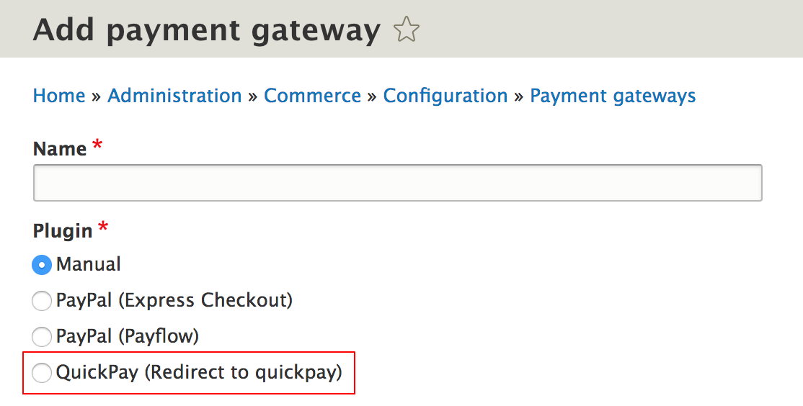
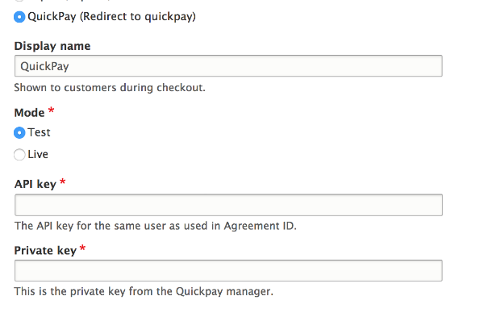
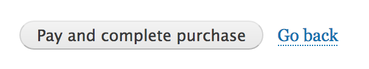
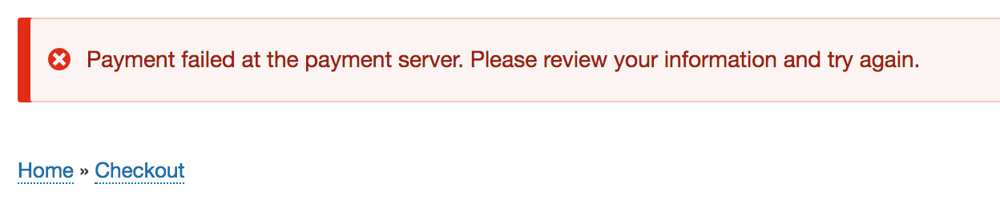

This documentation will explain how to setup an offsite payment gateway.

Prior to this guide, you should either have a custom module to modify, or create a new module: (Creating custom modules)[https://www.drupal.org/docs/8/creating-custom-modules]. This documentation is written while developing the __commerce_quickpay__ module (not yet released), so in all the examples you should replace __commerce_quickpay__ with __the id of your module__.


### Configuration
The payment provider you are setting up, will probably need some information like ___API key___, ___Private key___ etc.  
These settings will be stored by Drupal's configuration system. You need to figure out what settings you need, and then create a `my_module.schema.yml` file in a `config/schema` folder of your module:

```yml
# config/schema/commerce_quickpay.schema.yml
commerce_quickpay.commerce_payment_gateway.plugin.quickpay_redirect_checkout:
  type: commerce_payment_gateway_configuration
  mapping:
    private_key:
      type: string
      label: 'Private key'
    api_key:
      type: string
      label: 'API key'

```
___Note that the QuickPay integration needs a lot more configuration, but for simplicity's sake, only these two settings are include throughout this documentation.___

With the configuration schema in place, its time to implement the actual payment plugin.  
Create a plugin file (really just a PHP file) in `src/Plugin/Commerce/PaymentGateway`. Since we are creating an offsite payment, I have called this file `RedirectCheckout.php`.  
The class, in this case `RedirectCheckout`, must extend the `OffsitePaymentGatewayBase` class, and specify some `CommercePaymentGateway` annotation. This will make Commerce pickup this plugin in the `Payment gateways` configuration page.

```php
<?php

namespace Drupal\commerce_quickpay\Plugin\Commerce\PaymentGateway;

use Drupal\commerce_payment\Plugin\Commerce\PaymentGateway\OffsitePaymentGatewayBase;
use Drupal\Core\Form\FormStateInterface;

/**
 * Provides the QuickPay offsite Checkout payment gateway.
 *
 * @CommercePaymentGateway(
 *   id = "quickpay_redirect_checkout",
 *   label = @Translation("QuickPay (Redirect to quickpay)"),
 *   display_label = @Translation("QuickPay"),
 *    forms = {
 *     "offsite-payment" = "Drupal\commerce_quickpay\PluginForm\RedirectCheckoutForm",
 *   },
 *   payment_method_types = {"credit_card"},
 *   credit_card_types = {
 *     "mastercard", "visa",
 *   },
 * )
 */
class RedirectCheckout extends OffsitePaymentGatewayBase {

}
```

When you have created this file (and enabled the module), then when you go to __Commerce__ > __Configuration__ > __Payment gateways__ > __Add new payment gateway__ you should be able to choose the new payment method at __Plugin__:



This page is also the page where you should be promted to input the configuration settings above.  
To do this, go back to the `RedirectCheckout` plugin file, and implement the methods `defaultConfiguration`, `buildConfigurationForm` and `submitConfigurationForm`:

```php
  public function defaultConfiguration() {
    return [
        'private_key' => '',
        'api_key' => '',
      ] + parent::defaultConfiguration();
  }
  
  public function buildConfigurationForm(array $form, FormStateInterface $form_state) {
    $form = parent::buildConfigurationForm($form, $form_state);

    $form['private_key'] = [
      '#type' => 'textfield',
      '#title' => $this->t('Private key'),
      '#description' => $this->t('This is the private key from the Quickpay manager.'),
      '#default_value' => $this->configuration['private_key'],
      '#required' => TRUE,
    ];

    $form['api_key'] = [
      '#type' => 'textfield',
      '#title' => $this->t('API key'),
      '#description' => $this->t('The API key for the same user as used in Agreement ID.'),
      '#default_value' => $this->configuration['api_key'],
      '#required' => TRUE,
    ];

    return $form;
  }
  
  public function submitConfigurationForm(array &$form, FormStateInterface $form_state) {
    parent::submitConfigurationForm($form, $form_state);
    $values = $form_state->getValue($form['#parents']);
    $this->configuration['private_key'] = $values['private_key'];
    $this->configuration['api_key'] = $values['api_key'];
  }
```

The `defaultConfiguration` method provides default values for our configuration form.  
The `buildConfigurationForm` is a standard Drupal form builder, and provides all the fields for our configuration form.  
The `submitConfigurationForm` saves the input into the configuration.

With these method in place, when we go to the Add payment gateway configuration form, we will now see the new fields, when our new plugin is selected:



### Checkout

With the configuration all setup, it's now time to configure the checkout.  

Since this is an offsite checkout form, the user will at some point be redirect to the payment gateway (QuickPay in this example). 
Remember the __annotation__ `"offsite-payment" = "Drupal\commerce_quickpay\PluginForm\RedirectCheckoutForm",` in the `RedirectCheckout` class. This defines a form that Commerce will redirect to, when the user clicks the __Pay and complete purchase__ button:



Let's implement the `RedirectCheckoutForm` form.

```php
<?php

namespace Drupal\commerce_quickpay\PluginForm;

use Drupal\commerce_payment\PluginForm\PaymentOffsiteForm;
use Drupal\Core\Form\FormStateInterface;

class RedirectCheckoutForm extends PaymentOffsiteForm {

  public function buildConfigurationForm(array $form, FormStateInterface $form_state) {
    $form = parent::buildConfigurationForm($form, $form_state);
    $configuration = $this->getConfiguration();

    /** @var \Drupal\commerce_payment\Entity\PaymentInterface $payment */
    $payment = $this->entity;

    $data['version'] = 'v10';
    $data['private_key'] = $configuration['private_key'];
    $data['api_key'] = $configuration['api_key'];

    return $this->buildRedirectForm(
      $form,
      $form_state,
      'https://payment.quickpay.net',
      $data,
      PaymentOffsiteForm::REDIRECT_POST
    );
  }
}
```
___Again remember that this is just for illustration purposes, and the real QuickPay implementation requires a lot more details.___  

The `RedirectCheckoutForm` only needs to implement one method, `buildConfigurationForm`. This is a pretty straightforward Drupal form, and it should not hold any surprises. For this example, we will set a lot of hidden fields, and automatically redirect the user to QuickPay.

And thats it for __Checkout__. Now we only need to handle the returning user.

### Return from Payment provider

When the user returns from the payment provider, we need to validate that the payment actually succeed. 

To do this, simply implement the `onReturn` method in the `RedirectCheckout` class:

```php
public function onReturn(OrderInterface $order, Request $request) {
    if ($request->something_that_marks_a_failure) {
        throw new PaymentGatewayException('Payment failed!');
    }
    
    $payment_storage = $this->entityTypeManager->getStorage('commerce_payment');
    $payment = $payment_storage->create([
      'state' => 'completed',
      'amount' => $order->getTotalPrice(),
      'payment_gateway' => $this->entityId,
      'order_id' => $order->id(),
      'remote_id' => $request->request->get('remote_id'),
      'remote_state' => $request->request->get('remote_state'),
    ]);

    $payment->save();
}
```

There are a couple of things to be aware of in the `onReturn` method. 
First, this method might be called, even though that the payment failed. So you should implement some payment provider specific logic, for figuring out whether the payment was successfull or not (`if ($request->something_that_marks_a_failure) {`).
Second, QuickPay for instance will not pass any valueable information in the request when returning from QuickPay. So for QuickPay you either need to implement a callback method, or do a lookup at QuickPay in this method. Both can work equally well. Just note, that the payment provider you are integrating with, might have different ways to complete a payment.

If an error are detected, the method should throw a `PaymentGatewayException`. This will reset the payment:



Other than that, the onReturn should create a payment and store it.

And thats it. You should now be able to do checkouts through the payment provider of your choice.
