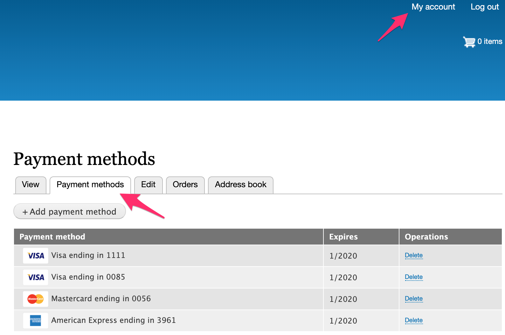
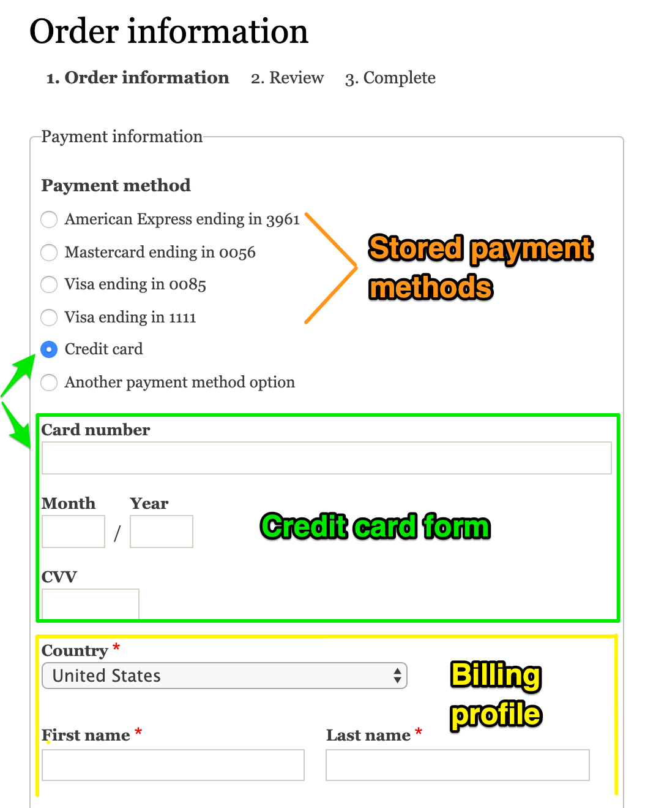

This page provides an overview of Drupal Commerce payments at a conceptual level. For step-by-step instructions for setting up payments for your site, see the [Getting Started documentation](getting-started). For more specific, technical explanations of the payments-related data structures and relationships, see [Payments information structure documentation](payments-information-structure).

#### Payment providers and payment gateways
First, what are payment gateways? Payment gateways are a pluggable system that allows you to interface with a payment provider to handle the secure payment transactions for whatever you are selling. Amazon Pay, Authorize.net, Paypal, and Stripe are all examples of payment providers. The systems that send information about your orders off to your payment provider and handle responses from the payment provider are called payment gateways. These gateways are all unique because they have very different features and requirements.

There are two kinds of payment gateways that payment providers use: *On-site* and *Off-site*:

* **On-site:** You can think of on-site payment as having the credit card field on your website. The software is specifically designed to not let you store that information, only to send it to a payment provider. The customer never leaves your site during the payment processing.
* **Off-site:** In this form of payment, you send your customers, with order details, off to another site that will process the transactions and then send them back (hopefully) to your site to complete the checkout process. You provide the payment provider the url for the return page on your site.

For a list of payment gateways currently supported by Drupal Commerce, see the [Available payment gateways documentation](available-gateways).

The Drupal Commerce payment module also supports a third type of payment gateway: **Manual**. A *manual* payment gateway is one which does *not* interface with a payment provider. Instead, they can be used to allow payments made "in the real world". For example, a *manual* payment gateway could be created to provide a "Bill Me" option for pre-authorized customers. Those customers could complete their orders without paying and then pay by cash, check, bank transfer, etc. after receiving an invoice for the order.

#### Payment method types and payment methods
*On-site* payment gateways define the types of payment methods that can be accepted. Drupal Commerce provides *Credit card* and *PayPal* payment method types, but custom payment gateways may define their own payment method types. So, what are payment methods then? In the case of the *Credit card* payment type, each individual credit card is a payment method. A single customer might have multiple credit cards (MasterCard, American Express, two different Visa cards, etc.), each of which will have its own number, expiration, security code, and associated customer data (like customer zip code).

If a payment gateway supports *Stored payment methods*, then your customers will be able to re-use their payment methods on future orders. Currently, stored payment methods are only supported within Drupal Commerce for *On-site* payment gateway types. However, work is currently underway to also allow *Off-site* payment gateways to use stored payment methods. See [Issue #2838380: Allow offsite payment gateways to create and use payment methods].

Stored payment methods are displayed to customers as options during checkout. (See the *Payments in the checkout process*.) Customers can manage their stored payment methods through their User Account interface, located on your site at `/user`. By default, stored payment methods can be added or deleted. Some payment gateways may also allow stored payment methods to be updated.

#### Remote *Payment transactions* vs. local *Payments*
Payment providers accept payments from Drupal Commerce sites in the form of *payment transactions*, as defined by their specific APIs. Within Drupal Commerce sites, *payments* are created for each of these *payment transactions* to keep track of how much has been paid for each specific order. Each of these local *payment* records is linked to a remote *payment transaction* by the transaction's unique ID. In addition to the remote ID, local *payment* records also store the amount paid, the amount refunded, the remote state of the transaction, and the local state of the payment. The *state* options for a payment vary by the payment type; possible states include *new*, *completed*, and *refunded*.

#### Payments in the checkout process
When the Payments module is installed, the standard *Billing information* checkout pane is replaced by a *Payment information* pane. Additionally, a *Payment process* pane is provided. If the *Payment information* pane is disabled, then the *Payment process* pane is automatically disabled, since they are always used together. The standard *Billing information* pane only collects the information for the order's billing profile. Let's look at how the *Payment information* and *Payment process* panes work together to also collect and process payment information.

##### *Payment information* checkout pane
If multiple payment methods are available for the order, then the *Payment information* pane will display them as a radio button list. When the customer selects an option, the form is dynamically refreshed to collect information relevant to the payment method's payment gateway type:
- If the payment gateway supports stored payment methods (i.e., *On-site* gateways), then the form that is displayed will be generated by the payment gateway plugin. Typically, this form will include billing information fields as well as fields specific to the payment method type. For example, for credit card payments, the form might include credit card number, security card, and expiration date. This form will almost always have attached JavaScript that handles the interaction with the payment gateway API so that the payment processing can be handled remotely, *without payment information being saved to your site*.
- If the payment gateway does not support stored payment methods (i.e., *Off-site* gateways), then standard billing information is collected, to be stored in the order's billing profile. Actual payment information is collected off-site by the payment provider so that *no payment information is saved to your site*.

In the following screenshot, there are several stored payment method options in addition to two options for creating new payment methods. When the *Credit card* payment option is selected, the credit card form is rendered to collect information to submit to the payment provider via the payment gateway. The billing profile form is also rendered at this time.

When the *payment information* checkout pane form is submitted, the payment gateway for the selected payment option and the information entered for the billing profile are saved to the order. If a stored payment method was selected, that payment method is also saved to the order. If the customer elected to create a new payment method, that payment method is created both locally and remotely and saved to the order (with a reference to the remote payment method).

Note that if the order has already paid or the order is free, then no payment information is collected; only the billing profile information is collected and saved to the order.

##### *Payment process* checkout pane
Following submission of the *Payment information* checkout pane, the customer will continue on to the Review step. If the customer clicks the *Pay and complete purchase* button, the *Payment process* checkout pane will be built to handle the actual payment process. 

The *payment process* checkout pane has *Transaction mode* setting that can be set to either "Authorize and capture" or "Authorize only (requires manual capture after checkout)". Both *On-site* and *Off-site* gateways use this setting when creating the remote *payment transaction* through the payment provider's API. See the Payments administration section (below) for information on manually capturing payments after checkout.

The payment processing steps are:
1. Get the payment gateway from the order.
2. Use the payment gateway plugin to interface with the payment provider to create a *payment transaction* remotely and a *payment* record locally.
 - For *On-site* payment gateways, the *payment transaction* is created remotely using the payment method that was saved to the order.
 - For *Manual* payment gateways, a *payment* record is saved locally but no *payment transaction* is created remotely.
 - For *Off-site* payment gateways, a form is built to redirect customers to the payment provider's site to enter their payment information. When they submit their information, they are redirected back to your site. The local *payment* record may be created when the customer returns, or it may be created asynchronously, whenever the *payment transaction* has been processed by the payment provider.
3. Handle any errors produced by the payment gateway plugin.
4. If the payment is successfully processed, allow checkout to proceed to the next step. (This is typically the *Completion* step.)

#### Payments administration: payment transaction workflows
Additional payments can be added to orders, and existing payments can be managed through the order administrative page, located at `/admin/commerce/orders`. If an "Authorize only" *payment transaction* was created for the payment, then administrative users will be able to manually *capture* or *void* the transaction. A **capture** operation is a request to the payment provider to transfer the authorized payment amount from the customer's account to the merchant's account. 

A *payment transaction* reaches the **settled** state when the payment transfer has completed (either automatically for an "Authorize and capture" *payment transaction* or manually for a *capture* operation). Typically, a *payment transaction* can be *voided* up until the transaction is settled. A **void** operation is a request to the payment provider to tell the card issuing bank that we don't intend to exercise the right to collect funds. After settlement, an administrative user can **refund** some or all of the *payment transaction*.

[Issue #2838380: Allow offsite payment gateways to create and use payment methods]: https://www.drupal.org/project/commerce/issues/2838380
