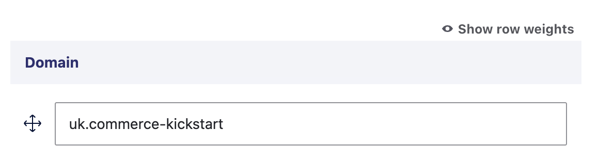
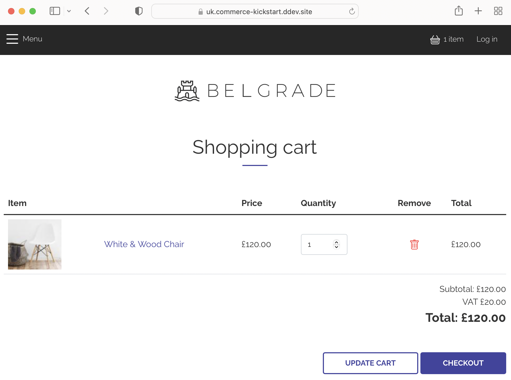

The [Commerce Store Domain](https://www.drupal.org/project/commerce_store_domain) module  allows you to set a sub-domain to your stores. It uses this sub-domain to resolve the current store for the user.

When a product is added to the cart, this will be domain specific. For instance, the below cart is set to the UK sub-domain and will not be visible on the parent domain.

The Store Domain feature can also be used during the checkout process. For example, if you want to use a separate payment gateway for different countries. See our blog post for more information. https://www.centarro.io/blog/introducing-centarro-commerce-2x-multi-store-multi-domain-demo
