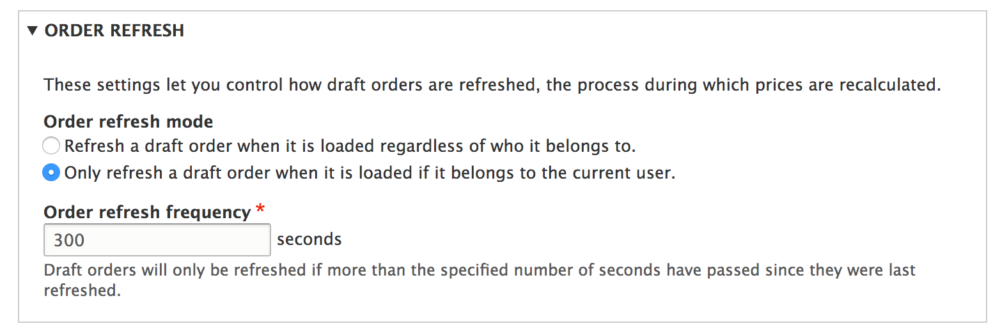

Order processing is part of the order refresh process. This is run when on draft orders to ensure that it has up to date adjustments and that its order items are up to date.

## The order refresh lifecycle

The order refresh is vital to ensuring that an order has up to date product pricing, promotional adjustments, taxes, and more. When an order is loaded, the order's storage checks if it requires a refresh. This then invokes the order refresh cycle, controlled by the `commerce_order.order_refresh` process.

!!! The order refresh process only runs on **draft** orders. It will not run on orders which have been placed.

The following is an overview of the process:

* An order is loaded from storage and checked if it should be refreshed.
* All adjustments on the order are removed.
* Each order item is processed
  * All adjustments are removed.
  * If there is a purchasable entity reference, the order item's price is updated to that purchasable entity's current price.
* Services that have hooked into the process will run on the order
  * The Promotions module uses this to apply order and order item promotions adjustments.
  * Tax applies tax adjustments.
* If order items have been changed (new pricing, new adjustments) they are saved.

## Configure the order refresh threshold

Each order type can configure its refresh threshold. For instance, a regular customer order type might be fine at an hourly refresh interval. On the other hand, a wholesaler order type may need a more constant refresh, such as every minute, due to pricing logic.

By default order types refresh every five minutes. This can be modified by editing the order type.



## Hooking into the process

The order refresh process uses tagged services to identify services which should be ran. Service classes must implement `\Drupal\commerce_order\OrderProcessorInterface`.

The following is an example for a module's `*.services.yml` file.

```
  # Order refresh process to apply some adjustments.
  # We set the priority very low so it calculates last.
  example_module.order_process.adjustments:
    class: Drupal\example_module\OrderProcessor\ApplyAdjustments
    tags:
      - { name: commerce_order.order_processor, priority: -300 }
```

```php
<?php

namespace Drupal\example_module\OrderProcessor;

use Drupal\commerce_order\Entity\OrderInterface;
use Drupal\commerce_order\OrderProcessorInterface;
use Drupal\commerce_price\Price;

/**
 * Applies a 5% discount per high quanity item  because it is Thursday.
 */
class ApplyAdjustments implements OrderProcessorInterface {

  /**
   * {@inheritdoc}
   */
  public function process(OrderInterface $order) {
    if (date('w') == 5) {
      foreach ($order->getItems() as $order_item) {
        if ($order_item->getQuantity() > 4) {
          $unit_price = $order_item->getUnitPrice();
          $price = $unit_price->multiply(0.95);
          $order_item->setUnitPrice($price);
        }
      }
    }
  }

}

```
