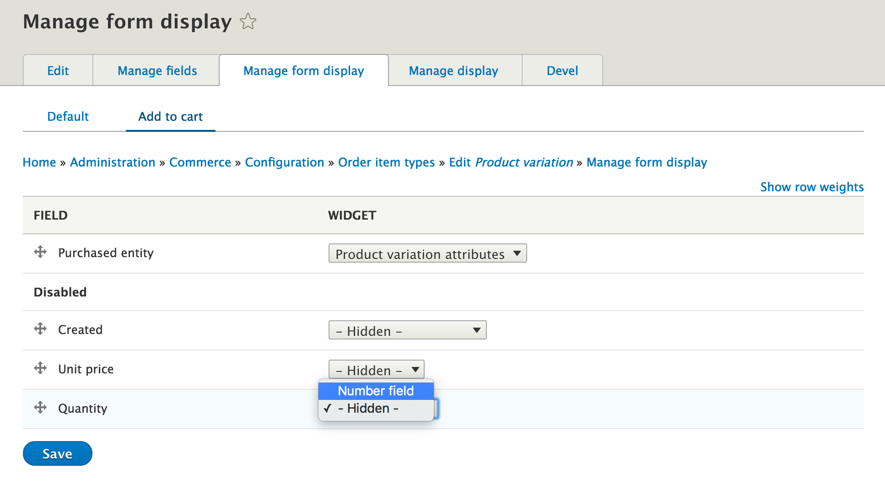

An order item represents a purchasable entity inside of an order. It
contains a reference to the purchasable entity, a quantity, a unit price
and a total price.

Order items are fieldable and may also store other data relevant to the order, such as product customizations/configurations that are unique to the order. For example, suppose you offer products that are available in a variety of lengths. If there are just a few, limited options, like "10 cm, 20 cm, or 50cm", then the best approach will typically be to create a "length" [product attribute](../../products/product-architecture/product-attributes) for your product variation type with these values. On the other hand, if a customer can enter any value from 10 cm up through 100 m, you may not want to create a unique attribute value (and SKU) for every possible value.

Creating an excess of product variations makes management hard. An alternative to using product attributes is to create a "length" field for your order item type, configured so that customers can enter the length value when adding the product to their carts.

> **Note:** In Drupal Commerce 1.x, these were called line items.

The order total is based off the unit price of order items multiplied by
their quantity and the sum of all order item totals.

Order items have their unit price calculated during the [order refresh process](../01.order-refresh-and-process). This synchronizes the price with the
current purchasable entity’s price while the order is still in a draft state, as well as applying any promotions and discounts as well as any custom functionality that may adjust the price - or custom fields on the order item.

The add to cart form is actually the create form for an order item
entity. It is a specific form display. Selecting attributes on the add
to cart form identifies the proper reference purchased entity to
reference.

