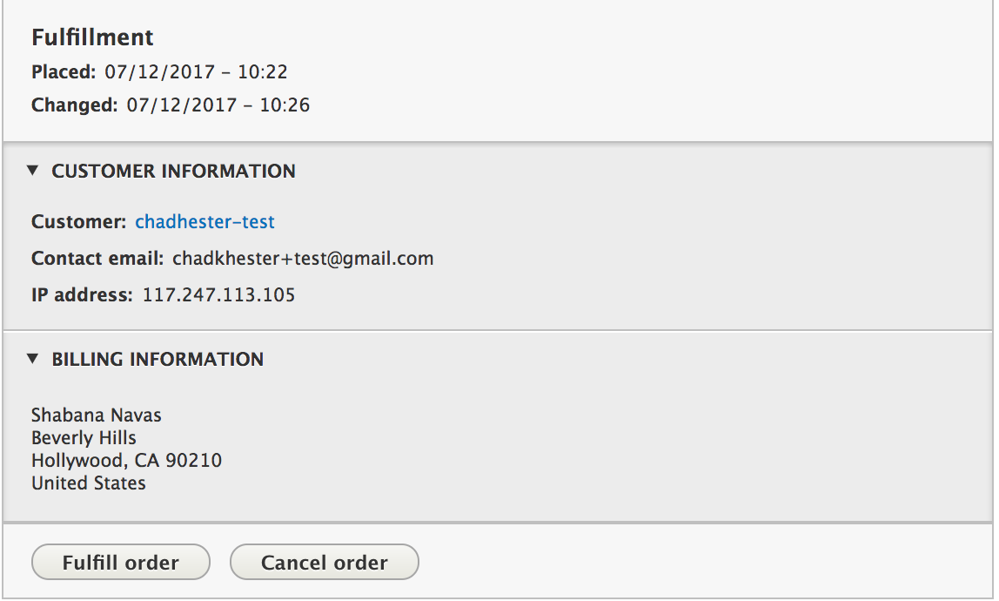

Creating an Order
-----------------
Site administrators can create orders on behalf of their customers by going to ``/admin/commerce/orders/add``. From here, you can either create a new order for an existing customer (chosen from the autocomplete search box). Or, you can create a new customer on the fly by providing just an email address.

**Note:** You also have the option to create the order for a different date.

Once you've made the appropriate selections, you are taken to the order creation page where you enter the billing details and the products in the order.

As you move further down, you'll see that there is an "Adjustments" section. This where you can add promotions, add a shipping amount, add tax, as well as, any custom amount to the order total. ([See steps on creating a promotion](../../../user-guide/promotions/create-promotion))

 And finally, you can apply coupons to the order. ([See steps on creating a coupon](../../../06.product-merchandising/02.create-coupon))

If you already have promotions running, this will automatically be reflected in the item pricing and the overall order total.

Saving an Order
---------------

Now that you've added all the order details, let's save the order. You also have the option of saving this new order to our cart. This will automatically add the products in this order to the shopping cart so you can complete the checkout by going to ``/cart``.

Now, click to view the order. Notice that a discount has been automatically applied to the order total as there was a "20% Off" promotion running store-wide. Also, notice that the order is currently in `Draft` state.

Adding Payments
----------------

As an admin, once you've got all the order details done, our next job would be to complete payment on the order. That's where the 'Payments' tab comes in. The payments page allows us to process a Credit Card/Email Money Transfer/Bank Transfer/Cheque payment for the order using the store's preferred Payment Gateway.

Now, that you've got money for the goods from the customer, let's go ahead and officially place the order by clicking on the "Place order" button. This will put the order in `Validation` state.

Completing the Order
--------------------

Once you are ready to ship the order, you must click the "Validate Order" button and it will put the order in `Fulfillment` state.

And finally, once the order has shipped out, you can hit the "Fulfill Order" button and the order enters `Completed` state.

See the [Order workflow documentation](../workflows) for more information about Order states and transitions.
