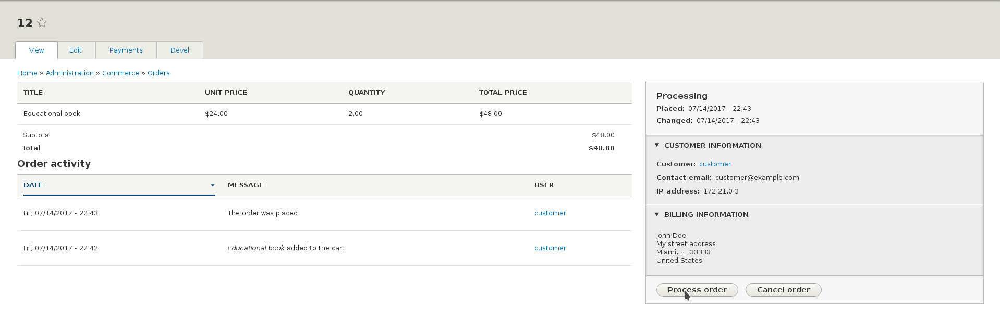

In many cases, the default order workflows may not provide the states and transitions that match a store's operational processes. Commerce 2 allows developers to create custom workflows that fit custom requirements.

In this tutorial we show you how to create a custom workflow, building on top of the Fulfillment workflow provided by the Commerce Order module. Let's suppose that processing and fulfilling an order are two separate steps for our store. This could be because different staff process the order e.g. verify payment and check availability, and different staff packages and ships the products.

Defining a Workflow
-------------------

An order workflow is defined in a YAML configuration file in a custom or contrib module, let's call it ``my_module``. The file should be called ``my_module.workflows.yml`` and it should be created at the root folder of the module. Drupal Commerce will automatically detect the file and load the workflows defined in it, after you clear the caches.

Have a look at the original definition of the Fulfillment workflow in the ``commerce_order.workflows.yml`` file. We are going to add a Processing state and specify that the order should move from Draft, to Processing, to Fulfillment, and finally to Completed state.

The group key in the definition should always have "commerce_order" as its value.

```yaml
    // my_module.workflows.yml

    my_module_fulfillment_processing:
      id: my_module_fulfillment_processing
      group: commerce_order
      label: 'Fulfillment, with processing'
      states:
        draft:
          label: Draft
        processing:
          label: Processing
        fulfillment:
          label: Fulfillment
        completed:
          label: Completed
        canceled:
          label: Canceled
      transitions:
        place:
          label: 'Place order'
          from: [draft]
          to: processing
        process:
          label: 'Process order'
          from: [processing]
          to: fulfillment
        fulfill:
          label: 'Fulfill order'
          from: [fulfillment]
          to: completed
        cancel:
          label: 'Cancel order'
          from: [draft, processing, fulfillment]
          to:   canceled
```

Associating the Order Type with the Workflow
--------------------------------------------

Once the workflow is registered, we need to associate an order type with it. We will assume that we use the default order type for this example. Visit ``/admin/commerce/config/order-types`` and select to Edit the default workflow. Use the workflow dropdown to choose the "Fulfill, with processing" option.


On a production site you may want to export the Order Type as configuration and that would contain its workflow association as well - see [Managing your site's configuration](https://www.drupal.org/docs/8/configuration-management/managing-your-sites-configuration).

Testing the Result
------------------

Once the workflow is registered and it is associated with an order type, store managers should be able to move the order through the define states via the defined transitions. Place a test order and go to its View admin page. The order should be automatically put in the Processing state and you should be able to move it to the Fulfillment state by clicking the "Process order" button (indicating that the order has been processed), and then to the Completed state by clicking the "Fulfill order" button.

You can also cancel the order at any step, as defined in the workflow's transitions.




