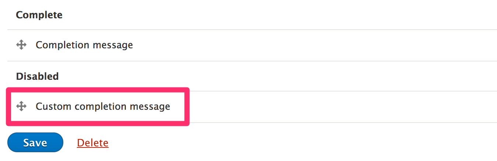
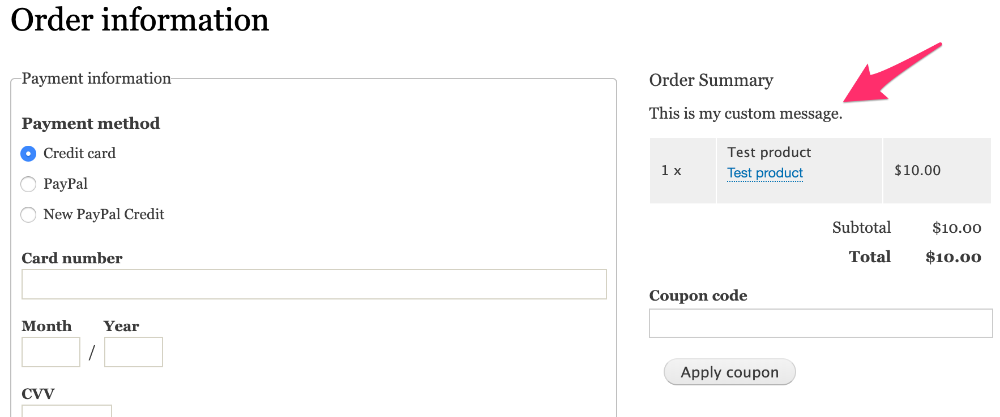
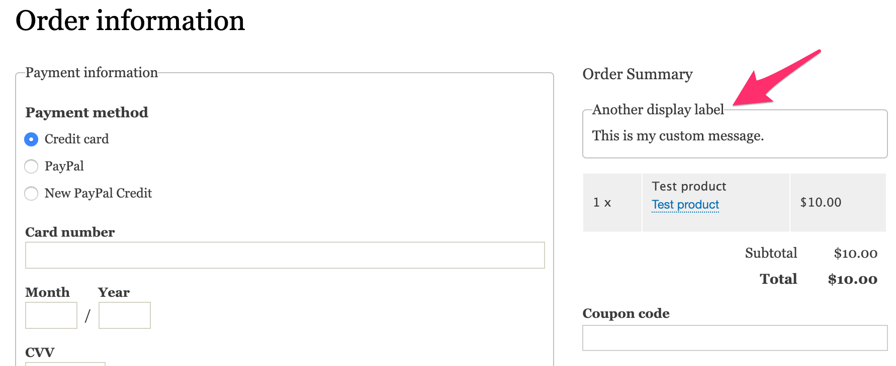
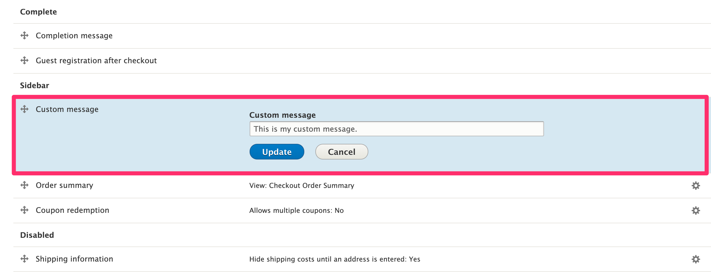
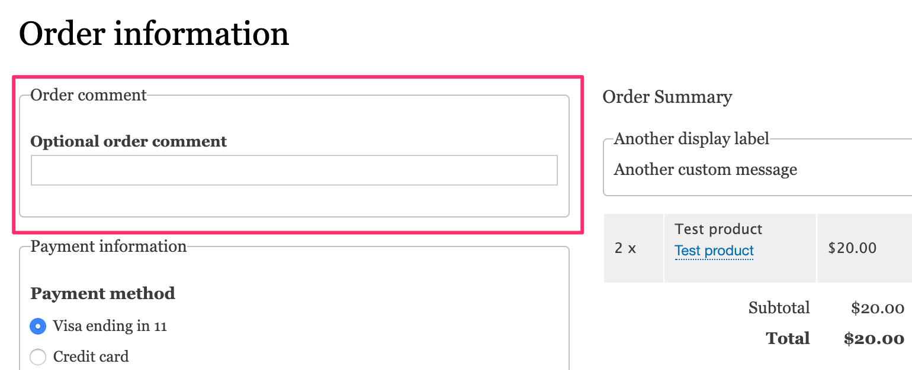
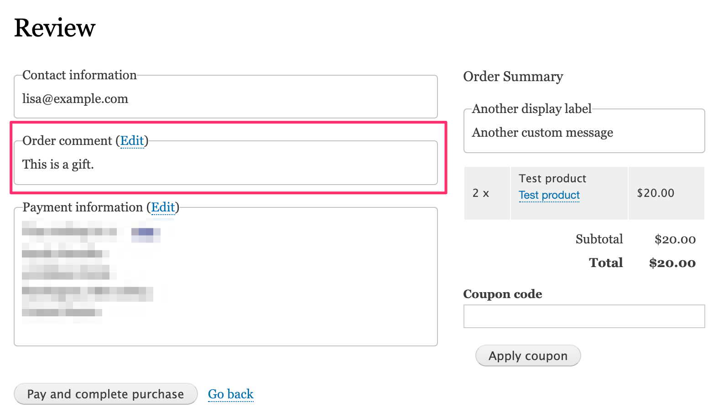
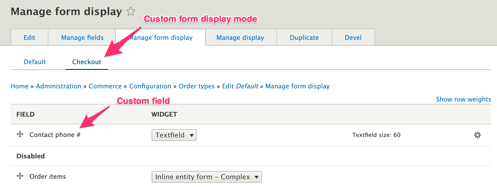

Custom checkout panes can be used to display information during checkout or collect additional data from the customer. To create a custom checkout pane you will need to write your own code, in a custom module. This page provides several examples of custom checkout panes.

### Setup: Create a basic custom module
If you don't already have a custom module you can use for your new plugin, you can create a basic one with a few simple steps:

1. Create a new folder for your module within your project in the `/modules/custom` folder.  We'll name ours `my_checkout_pane` for these examples.

2. Within the `my_checkout_pane` folder, create a new file named `my_checkout_pane.info.yml` with the following text:

```yaml
name: My Checkout Pane
type: module
description: Defines custom checkout panes.
core: 8.x
package: Custom

```

3. Don't forget to enable your custom module either through the admin UI, drush, or drupal console:

```bash
drupal module:install my_checkout_pane
```

### Example 1: Create a custom message checkout pane.

In this example, we create a simple checkout pane plugin that displays a custom message. We'll name our plugin `CustomMessagePane` and implement it in a file named `CustomMessagePane.php`, located in `/modules/custom/my_checkout_pane/src/Plugin/Commerce/CheckoutPane`. 

Commerce checkout panes are [annotation-based plugins], so we start by placing a `@CommerceCheckoutPane` annotation right before our class definition. Also, the `buildPaneForm()` method is required, so we'll add that in as well.


```php
<?php

namespace Drupal\my_checkout_pane\Plugin\Commerce\CheckoutPane;

use Drupal\commerce_checkout\Plugin\Commerce\CheckoutPane\CheckoutPaneBase;
use Drupal\Core\Form\FormStateInterface;

/**
 * Provides a custom message pane.
 *
 * @CommerceCheckoutPane(
 *   id = "my_checkout_pane_custom_message",
 *   label = @Translation("Custom message"),
 * )
 */
class CustomMessagePane extends CheckoutPaneBase {

  /**
   * {@inheritdoc}
   */
  public function buildPaneForm(array $pane_form, FormStateInterface $form_state, array &$complete_form) {
  }

}

```

The `id` and `label` keys are required. The `id` can be any unique, valid machine name, but it's considered a good practice to prefix it with the name of your module. The `label` identifies the pane on the Checkout flow edit page. If we rebuild the plugin cache, our new pane will appear in the "Disabled" section. To enable it, drag it into a checkout step like you would any other checkout pane.



If you go to "Checkout" now, you will find that our custom checkout pane is *not* rendered, even if it's moved out of the "Disabled" section. This is because it does not have any visible markup. Let's add some markup to our pane form so that we can see it in Checkout.

```php
public function buildPaneForm(array $pane_form, FormStateInterface $form_state, array &$complete_form) {
  $pane_form['message'] = [
    '#markup' => $this->t('This is my custom message.'),
  ];
  return $pane_form;
}
```

Here, the custom checkout pane has been added to the "Sidebar" step:



#### Checkout pane annotation
In addition to `id` and `label`, several other keys are defined for the `CommerceCheckoutPane` annotation.

| Key | Definition |
| ---------------- |
| display_label | The checkout pane display label, defaults to the main label. |
| default_step | The ID of the default step. If missing, defaults to disabled. The steps available for the default checkout flow are `login`, `order_information`, `review`, `_sidebar` and `_disabled` |
| wrapper_element | The wrapper element to use when rendering the pane, defaults to "container". |

Let's add in these additional elements to our CustomMessagePane annotation, like this:

```php
/**
 * Provides a custom message pane.
 *
 * @CommerceCheckoutPane(
 *   id = "my_checkout_pane_custom_message",
 *   label = @Translation("Custom message"),
 *   display_label = @Translation("Another display label"),
 *   default_step = "_sidebar",
 *   wrapper_element = "fieldset",
 * )
 */
```

Now if we rebuild caches and reload the Checkout page, our custom pane is rendered in a fieldset with its display label:



### Example 2: Create a *configurable* custom message pane
You can make your checkout pane plugin configurable by implementing its  `defaultConfiguration()`, `buildConfigurationSummary()`,`buildConfigurationForm()`, and `submitConfigurationForm()` methods. Here's an example implementation that makes our custom message configurable through the admin UI:


```php
public function defaultConfiguration() {
  return [
    'custom_message' => 'This is my custom message.',
  ] + parent::defaultConfiguration();
}

public function buildConfigurationSummary() {
  return $this->t('Custom message: @custom_message', ['@custom_message' => $this->configuration['custom_message']]);
}

public function buildConfigurationForm(array $form, FormStateInterface $form_state) {
  $form = parent::buildConfigurationForm($form, $form_state);
  $form['custom_message'] = [
    '#type' => 'textfield',
    '#title' => $this->t('Custom message'),
    '#default_value' => $this->configuration['custom_message'],
  ];

  return $form;
}

public function submitConfigurationForm(array &$form, FormStateInterface $form_state) {
  parent::submitConfigurationForm($form, $form_state);

  if (!$form_state->getErrors()) {
    $values = $form_state->getValue($form['#parents']);
    $this->configuration['custom_message'] = $values['custom_message'];
  }
}
```

Note that you can use the `validateConfigurationForm()` method if your configuration form requires validation.

Now we can configure our custom message through the admin UI:



To display the custom message, we need to modify the `buildPaneForm()` method to use the text saved in configuration:

```php
public function buildPaneForm(array $pane_form, FormStateInterface $form_state, array &$complete_form) {
  $pane_form['message'] = [
    '#markup' => $this->t('@custom_message', ['@custom_message' => $this->configuration['custom_message']]),
  ];
  return $pane_form;
}
```

### Example 3: Control visibility of a custom checkout pane
There are many situations in which you may want to display a checkout pane for some orders but not others. For example, suppose some of the products you sell require a special disclaimer message. You could add a custom boolean field to your product variation type and then check for its existence on any of the products in the customer's cart, during checkout. The key to making this functionality work is the `isVisible()` method. Let's assume the ID for our disclaimer boolean field is `field_needs_disclaimer`. Here is an implementation of `isVisible()` we can add to our custom checkout pane:

```php
public function isVisible() {
  // Check whether the order has an item that requires the disclaimer message.
  foreach ($this->order->getItems() as $order_item) {
    $purchased_entity = $order_item->getPurchasedEntity();
    if ($purchased_entity->get('field_needs_disclaimer')->value == 1) {
      return TRUE;
    }
  }

  return FALSE;
}
```

Notice that we used `$this->order` in the method. You can access the order and all its items like this in any of the custom checkout pane methods. The `CheckoutPaneBase` class additionally defines `entityTypeManager` and `checkoutFlow` (the parent checkout flow) as protected class properties.

### Example 4: Allow customer to add a comment to the order.
In this example, we'll build an actual form in `buildPaneForm()` instead of just displaying information. See the Drupal.org documentation on [Form and render elements] for more information on building custom forms. Our simple pane form has a single textfield element:

```php
public function buildPaneForm(array $pane_form, FormStateInterface $form_state, array &$complete_form) {
  $pane_form['comment'] = [
    '#type' => 'textfield',
    '#title' => $this->t('Optional order comment'),
    '#size' => 60,
  ];
  return $pane_form;
}
```

If we add our new custom checkout pane to the "Order information" step of our checkout flow, customers will be able to add comments to their orders:



To save the comment entered by the customer, we can use the Commerce Order entity's `setData()` method. For a more complex example, we could implement `validatePaneForm()`, but all we need here is `submitPaneForm()`:

```php
public function submitPaneForm(array &$pane_form, FormStateInterface $form_state, array &$complete_form) {
  $values = $form_state->getValue($pane_form['#parents']);
  $this->order->setData('order_comment', $values['comment']);
}
```

After saving the comment to the order, you can access the comment value using the Commerce order `getData()` method with the *key* value we used in `submitPaneForm()`, "order_comment":

```php
$comment = $order->getData('order_comment');
```

We can use the `getData()` method to improve our implementation in two ways:
1. Set the default value for the comment in `buildPaneForm()` so that customers won't have to re-enter their comment if they go back to this checkout step after submitting the form.

2. Implement the checkout pane method `buildPaneSummary()` so that the comment text appears on the Review page.

Here is that updated code:
```php
public function buildPaneForm(array $pane_form, FormStateInterface $form_state, array &$complete_form) {
  $comment = $this->order->getData('order_comment');
  $pane_form['comment'] = [
    '#type' => 'textfield',
    '#title' => $this->t('Optional order comment'),
    '#default_value' => $comment ? $comment : '',
    '#size' => 60,
  ];
  return $pane_form;
}

public function buildPaneSummary() {
  if ($order_comment = $this->order->getData('order_comment')) {
    return [
      '#plain_text' => $order_comment,
    ];
  }
  return [];
}
```

And here's how our "Order comment" appears in the "Review" step now:



### Example 5: Use the `EntityFormDisplay` class for pane form build/validate/submit methods
As an alternative to using the `data` field to store order information, you can add custom fields to your order type and create a custom [form display mode]. Configure your custom form display mode so that only your new custom fields are enabled. For example, suppose our custom form display mode is named, "Checkout" (with id `checkout`), and we've added a custom field for a "Contact phone #":



We can use the methods provided by the [EntityFormDisplay] class to provide the functionality for our custom checkout pane, like this:

```php
public function buildPaneForm(array $pane_form, FormStateInterface $form_state, array &$complete_form) {
  $form_display = EntityFormDisplay::collectRenderDisplay($this->order, 'checkout');
  $form_display->buildForm($this->order, $pane_form, $form_state);
  return $pane_form;
}

public function validatePaneForm(array &$pane_form, FormStateInterface $form_state, array &$complete_form) {
  $form_display = EntityFormDisplay::collectRenderDisplay($this->order, 'checkout');
  $form_display->extractFormValues($this->order, $pane_form, $form_state);
  $form_display->validateFormValues($this->order, $pane_form, $form_state);
}

public function submitPaneForm(array &$pane_form, FormStateInterface $form_state, array &$complete_form) {
  $form_display = EntityFormDisplay::collectRenderDisplay($this->order, 'checkout');
  $form_display->extractFormValues($this->order, $pane_form, $form_state);
}
```

Don't forget the `use` statement: `use Drupal\Core\Entity\Entity\EntityFormDisplay;`


[annotation-based plugins]: https://www.drupal.org/docs/8/api/plugin-api/annotations-based-plugins
[form display mode]: https://www.drupal.org/node/2511722
[EntityFormDisplay]: https://api.drupal.org/api/drupal/core%21lib%21Drupal%21Core%21Entity%21Entity%21EntityFormDisplay.php/class/EntityFormDisplay/8.8.x
[Form and render elements]: https://api.drupal.org/api/drupal/elements/8.8.x
