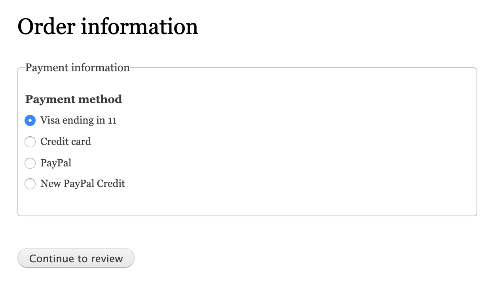
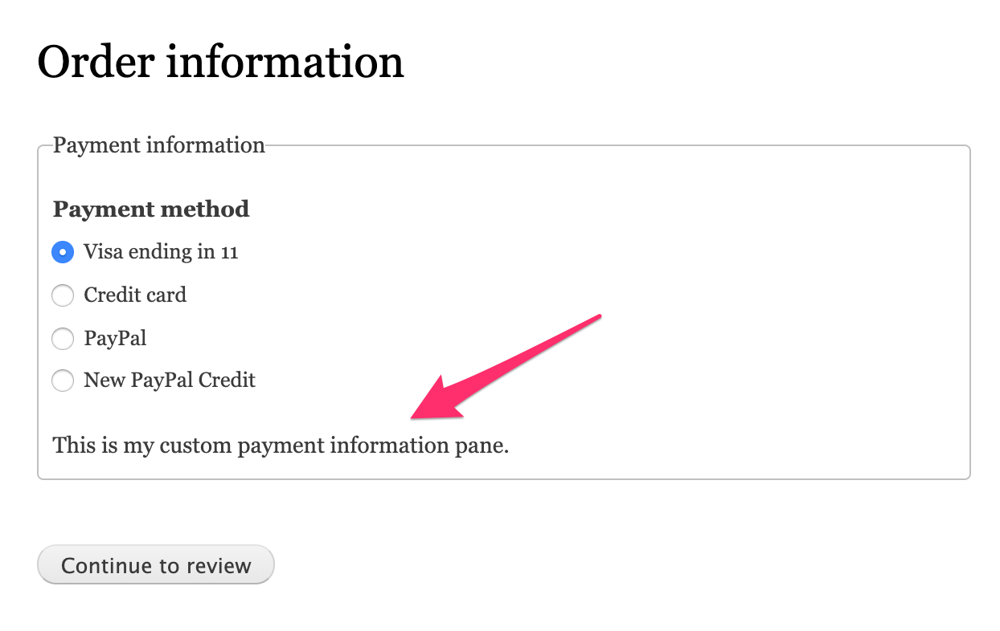

The drag-and-drop UI for checkout flows makes it seem easy to simply disable existing checkout panes provided by core and replace them with your own custom panes. However, disabling certain checkout panes can cause problems. Specifically, because the "Payment process" pane is dependent on the "Payment information" pane, if you disable the "Payment information" pane, the "Payment process" pane is automatically disabled. Which is probably not what you want. This documentation page describes how you can safely replace the "Payment information" pane (or any other existing pane) with your own.

The process for creating the replacement checkout pane is essentially the same as for any other [custom checkout pane](../create-custom-checkout-pane). The one big exception is that you should ***not*** include a `@CommerceCheckoutPane` annotation for your new plugin. If other Commerce Core code is dependent on the pane you're replacing, it will reference the pane using the `id` set in the annotation. So if you create a new pane with a new id, references to the existing pane will still point to that existing pane.

For example, let's suppose that we want to replace the Commerce Core "Payment information" pane with one of our own. We'll extend the existing pane class to avoid duplicating code unnecessarily, but if your custom pane is significantly different from the pane it's replacing, you could instead extend `Drupal\commerce_checkout\Plugin\Commerce\CheckoutPane\CheckoutPaneBase`. Here's our custom `PaymentInformation` pane:

```php
<?php

namespace Drupal\my_checkout_pane\Plugin\Commerce\CheckoutPane;

use Drupal\commerce_payment\Plugin\Commerce\CheckoutPane\PaymentInformation as BasePaymentInformation;
use Drupal\Core\Form\FormStateInterface;

/**
 * Provides a custom payment information pane.
 */
class PaymentInformation extends BasePaymentInformation {

  /**
   * {@inheritdoc}
   */
  public function buildPaneForm(array $pane_form, FormStateInterface $form_state, array &$complete_form) {
    $pane_form = parent::buildPaneForm($pane_form, $form_state, $complete_form);
    // Do something custom with the pane form here.
    $pane_form['message'] = [
	    '#markup' => $this->t('This is my custom payment information pane.'),
	  ];
    return $pane_form;
  }

}
```

Note that this custom checkout pane won't show up on the Checkout Flow admin UI page since it doesn't have an annotation. And at this point, the "Payment information" pane is still generated by the Commerce Core code rather than your custom code.

Standard Payment information pane, in the Order information step:



To "fix" references to the existing pane so that they point to your custom checkout pane, you can use `hook_commerce_checkout_pane_info_alter`. For our "Payment information" checkout pane replacement example, that code looks like this:

```php
/**
 * Implements hook_commerce_checkout_pane_info_alter().
 */
function my_checkout_pane_commerce_checkout_pane_info_alter(&$definitions) {
  if (isset($definitions['payment_information'])) {
    $definitions['payment_information']['class'] = \Drupal\my_checkout_pane\Plugin\Commerce\CheckoutPane\PaymentInformation::class;
    $definitions['payment_information']['provider'] = 'my_checkout_pane';
  }
}
```

Add that code to your custom modules's `.module` file, rebuild caches, and reload your checkout page. It now looks like this:



