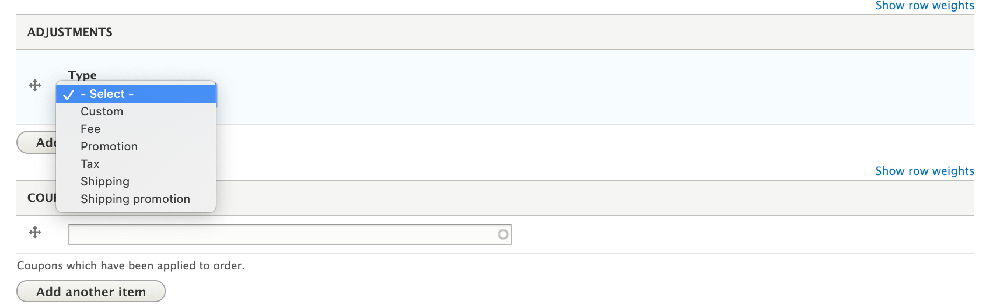
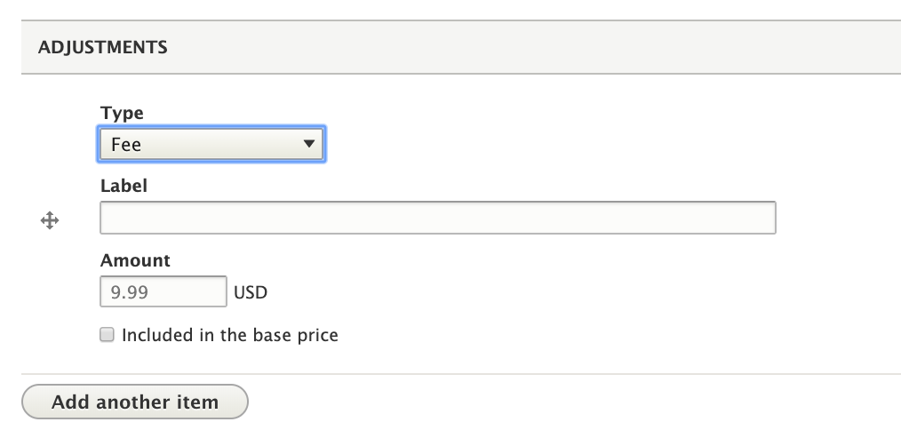
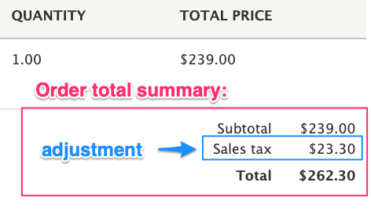
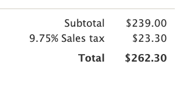

Drupal Commerce provides a framework for complex pricing logic through its system of [Price resolvers](../price-resolvers) and ***Adjustments***. Price resolvers are services that affect prices dynamically, based on Store and Customer data. Adjustments store promotions, taxes, fees, and shipping costs and can rely on Order data (including store and customer data) when calculating the price. Adjustments are *applied* to Price fields by [Order processors](../../orders/order-refresh-and-process). They can be applied and calculated on the order level (based on the order subtotal), or on the order item level (based on the order item total).

Within the Drupal Commerce module, only Order and Order item entities use Adjustments for their Price fields, but other entities can implement the `EntityAdjustableInterface` to leverage the methods and services available for Adjustments. The [Commerce Invoice] and [Commerce Shipping] contributed modules both have entities that use Adjustments.
 

### Adjustment types
The Commerce Order module defines *Custom*, *Fee*, *Promotion*, and *Tax* Adjustment types. Additionally, the [Commerce Shipping] contrib module defines *Shipping* and *Shipping promotion* types. An Adjustment type is a plugin that defines the following properties:

| Property       | ID | Description | Example value |
|----------------|----|-------------|---------------|
| ID             | id | Unique id string | `'shipping'` |
| Label          | label | Description of the adjustment type | `'Shipping'` |
| Singular label | singular_label | Label to use for a single adjustment of this type | `'shipping cost'` |
| Plural label   | plural_label | Label to use for multiple adjustments of type type | `'shipping costs'` |
| Weight         | weight | Used to sort adjustments, grouped by type, from lowest to height weight when displayed (e.g., in the Order Summary display) | `-20` |
| Has UI         | has_ui | Whether adjustments of this type can be created through the admin UI | `true` |

The *Has UI* setting controls the list of *Adjustment type* options that appear on the Order admin form:


Adjustment type definitions are provided by the the *Commerce Order* module in `commerce_order.commerce_adjustment_types.yml` and by the *Commerce Shipping* module in `commerce_shipping.commerce_adjustment_types.yml`. 

#### Customizing Adjustment types
You can define your own custom Adjustment type by creating a `my_custom_module.commerce_adjustment_types.yml` configuration file in your own custom module (replacing `my_custom_module` with your own module's name). Remember to rebuild caches after creating the file so that your new definition(s) can be discovered by the `AdjustmentTypeManager` service.

For example, here is a definition for a custom "Credit" adjustment type:

```yaml
credit:
  label: 'Credit'
  singular_label: 'credit'
  plural_label: 'credits'
  has_ui: false
  weight: 10
```

If you want to modify existing adjustment types, perhaps to change the label or weight of a particular type, there's a hook for that:
`hook_commerce_adjustment_type_info_alter(array &$info);`

#### Example: Modify labels for the *Promotion* adjustment type

The *Promotion* adjustment type is defined like this:

```yaml
promotion:
  label: 'Promotion'
  singular_label: 'promotion'
  plural_label: 'promotions'
  has_ui: true
  weight: 0
 ```

Here's how we can change the labels for the *Promotion* adjustment type in a custom module:

```php
/**
 * Implements hook_commerce_adjustment_type_info_alter().
 */
function my_custom_module_commerce_adjustment_type_info_alter(array &$info) {
  if (isset($info['promotion'])) {
    $info['promotion']['label'] = 'Discount';
    $info['promotion']['singular_label'] = 'discount';
    $info['promotion']['plural_label'] = 'discounts';
  }
}
 ```

### Adjustments
Like [Prices](../prices), Adjustments are not standalone entities; rather, they are value objects that can be stored to fields on an entity. The `Adjustment` class and the `AdjustmentItem` field type are provided by the Commerce Order module.

#### Adjustment properties
| Property ID | Definition | Example |
|-------------|------------|---------|
| type        | The string ID of an adjustment type, as defined in a `commerce_addjustment_types.yml` configuration file. | `'custom'` |
| label       | The adjustment label. | `'20% off'` |
| amount      | The adjustment value, a `Price` object with number and currency. When adjustments are applied to orders or order items, this amount is added to (if positive) or subtracted from (if negative) the order total price. | `new Price('-12.00', 'USD')` |
| percentage  | If the adjustment was calculated from a percentage, it is the percentage as a decimal, stored as a string. Otherwise, it is null. Note that the percentage value is purely informational. It has no effect on any pricing calculations. See [Displaying adjustments](#displaying-adjustments) for a usage example. | `'0.2'` |
| sourceId    | A string ID value that references the source object, if known. For example, the ID of a promotion entity is set for a discount adjustment. See [Combining adjustments](#combining-adjustments) for additional information on how Adjustments are combined based on source ID value. When Adjustments are added through the admin UI, the default value for sourceId is `'custom'`. | `'23'` |
| included    | Whether the adjustment is included in the base price. The default value is FALSE. | `TRUE` |
| locked      | Whether the adjustment is locked. The default value is FALSE. Locked adjustments are not automatically removed during the [Order refresh process](../../orders/order-refresh-and-process). Unlocked adjustments are removed so that they can be recalculated by order processors. When an Adjustment is added through the admin UI, it is automatically locked. | `FALSE` |

#### Example: adding a new *Adjustment* to an Order item
Here, we add a *custom* adjustment to an order item entity. This adjustment *adds* a 10% custom adjustment and is not included in the order item base price.

```php
/** @var \Drupal\commerce_order\Entity\OrderItemInterface $order_item */
$adjustment_amount = $order_item->getUnitPrice()->multiply(0.1);
$order_item->addAdjustment(new Adjustment([
  'type' => 'custom',
  'label' => 'Plus 10%',
  'amount' => $adjustment_amount,
  'percentage' => '0.1',
  'included' => FALSE,
  'locked' => TRUE,
]));
```

#### Price Splitting
Drupal Commerce provides a service for splitting Price amounts across order items. It is useful for dividing a single order-level promotion or fee into multiple order-item-level ones, for easier VAT calculation, or refunds. It has a single `split()` method:

```public function split(OrderInterface $order, Price $amount, $percentage = NULL);```

For example, suppose we want to split a $10 adjustment across all our Order items. The Splitter service returns an array of `Price` amounts, keyed by order item ID.

```php
$splitter = \Drupal::getContainer()->get('commerce_order.price_splitter');

/** @var \Drupal\commerce_order\Entity\OrderInterface $order */
$amounts = $splitter->split($order, new Price('10.00', 'USD'));

foreach ($order->getItems() as $order_item) {
  if (isset($amounts[$order_item->id()])) {
    $order_item->addAdjustment(new Adjustment([
      'type' => 'custom',
      'label' => $this->t('Special'),
      'amount' => $amounts[$order_item->id()]->multiply('-1'),
    ]));
  }
}
```

In addition to the `order` and `amount` arguments, the Splitter service also has an optional `percentage` string argument.  For example, '0.2' for 20%. When missing, it is calculated by comparing the amount to the order subtotal.

The *Splitter* service starts by calculating per-order-item amounts using the percentage. Then if the sum of the individual amounts does not match the full amount, the remainder is distributed among the order items. For example, if an order has 3 items, and we want to split $10.00 among them, $3.33 will be added to each and then the remaining $.01 will be added to the first order item's amount.

#### Useful Mathematical Adjustment methods

| Method | Definition |
|--------|------------|
| `isPositive()` | Gets whether the adjustment amount is positive. Returns `TRUE|FALSE`. |
| `isNegative()` | Gets whether the adjustment amount is negative. Returns `TRUE|FALSE`. |
| `add(Adjustment $adjustment)` | Adds the amount of the given adjustment to the current adjustment amount. Returns the resulting Adjustment. |
| `subtract(Adjustment $adjustment)` | Subtracts the amount of the given adjustment from the current adjustment amount. Returns the resulting Adjustment. |
| `multiply($number)` | Multiplies the adjustment amount by the given number (numeric value represented as a string). Returns the resulting Adjustment. |
| `divide($number)` | Divides the adjustment amount by the given number (numeric value represented as a string). Returns the resulting Adjustment. |

### Adjustment Transformer service
The Adjustment transformer service (`commerce_order.adjustment_transformer`) provides common logic for processing and transforming Adjustments.

#### Rounding adjustments
* Method `roundAdjustment(Adjustment $adjustment, $mode = PHP_ROUND_HALF_UP)` rounds an Adjustment to its currency precision.
* Method `roundAdjustments(array $adjustments, $mode = PHP_ROUND_HALF_UP)` rounds an array of Adjustment to their currency precision.

```php
$adjustment_transformer = \Drupal::service('commerce_order.adjustment_transformer');

/** @var \Drupal\commerce_order\AdjustmentInterface $adjustment */
$adjustment = new Adjustment([
  'type' => 'promotion',
  'label' => '20% off',
  'amount' => new Price('20.555', 'USD'),
]);

$rounded_adjustment = $adjustment_transformer->roundAdjustment($adjustment);
assert($rounded_adjustment->getAmount()->equals(new Price('20.56', 'USD')));

$rounded_down_adjustment = $adjustment_transformer->roundAdjustment($adjustment, PHP_ROUND_HALF_DOWN);
assert($rounded_down_adjustment->getAmount()->equals(new Price('20.55', 'USD')));
```
#### Sorting adjustments
* Method `sortAdjustments(array $adjustments)` sorts an array of Adjustments by their Adjustment type weight, as defined in `commerce_order.commerce_adjustment_types.yml`. The sorted array of Adjustments is returned.

#### Combining adjustments
* Method `combineAdjustments(array $adjustments)` combines an array of Adjustments based on their `type` and `sourceId` values. Adjustments without a source ID value are not combined; they are always shown standalone. When Adjustments are *combined*, their Amounts are added together. If combined Adjustments have different label/percentage/included/locked values, the values for the first Adjustment in the orginal array are used.

```php
$adjustment_transformer = \Drupal::service('commerce_order.adjustment_transformer');

/** @var \Drupal\commerce_order\AdjustmentInterface[] $adjustments */
$adjustments = [];
// Adjustments 0 and 2 will be combined.
$adjustments[0] = new Adjustment([
  'type' => 'tax',
  'label' => 'VAT',
  'amount' => new Price('10', 'USD'),
  'source_id' => 'us_vat|default|standard',
  'percentage' => '0.1',
]);
$adjustments[1] = new Adjustment([
  'type' => 'promotion',
  'label' => '20% off',
  'amount' => new Price('20', 'USD'),
  'percentage' => '0.2',
]);
$adjustments[2] = new Adjustment([
  'type' => 'tax',
  'label' => 'VAT',
  'amount' => new Price('3', 'USD'),
  'source_id' => 'us_vat|default|standard',
  'percentage' => '0.1',
]);
$adjustments[3] = new Adjustment([
  'type' => 'tax',
  'label' => 'VAT',
  'amount' => new Price('4', 'USD'),
  'source_id' => 'us_vat|default|reduced',
  'percentage' => '0.1',
]);

$combined_adjustments = $adjustment_transformer->combineAdjustments($adjustments);
$combined_adjustment = $combined_adjustments[0];
assert($combined_adjustment->getAmount()->equals(new Price('13', 'USD')));
```

#### Processing adjustments
* Method `processAdjustments(array $adjustments)` combines, sorts, and rounds the given Adjustments (in that order):
```php
public function processAdjustments(array $adjustments) {
	  $adjustments = $this->combineAdjustments($adjustments);
	  $adjustments = $this->sortAdjustments($adjustments);
	  $adjustments = $this->roundAdjustments($adjustments);

	  return $adjustments;
}
```

### Adjustment fields
The Commerce Order module provides a `commerce_adjustment` field type to store Adjustments to the parent entity's price as well as two custom methods for managing adjustment item field values:

* The `getAdjustments()` method gets the Adjustment value objects from the field list.
* The `removeAdjustment(Adjustment $adjustment)` method removes the matching Adjustment value.

Adjustments are usually added to entities by [Order processors](../../orders/order-refresh-and-process) or other custom code. Additionally, a default *Adjustment field widget* is available for manual entry of adjustments through the admin UI. Administrative users can specify the Adjustment type, Label, Amount, and whether the adjustment should be included in the base price. The `sourceId` for the manually added Adjustment is automatically set to `custom`, and the Adjustment is `locked` so that it does not get removed during the Order refresh process.



### Displaying adjustments
The Commerce Order module provides an Order Total Summary (`commerce_order_total_summary`) field formatter for displaying an order total price field as a summary that includes the subtotal, adjustments, and order total price.



Note that "included" adjustments are not displayed to the customer. The one exception is taxes, which need to be shown for legal reasons. This field formatter uses the `commerce-order-total-summary.html.twig` template, which can be overridden to customize the display of adjustments. All properties of adjustments are available for display. By default, only the adjustment "label" and "amount" (formatted as a price) are displayed. If you have adjustments with "perentage" values, you can add them to the template like this:

| Twig | Output example (for 9.75% adjustment) |
| ---- | ------ |
|`{{ adjustment.percentage }}` | 0.0975 |
|`{{ adjustment.percentage * 100 }}%` | 9.75% |

Customized order summary display example output:


Adjustments are also displayed in the order receipt email which uses the template `commerce-order-receipt.html.twig` and can be customized in the same way.


[Commerce Invoice]: https://www.drupal.org/project/commerce_invoice
[Commerce Shipping]: https://www.drupal.org/project/commerce_shipping

