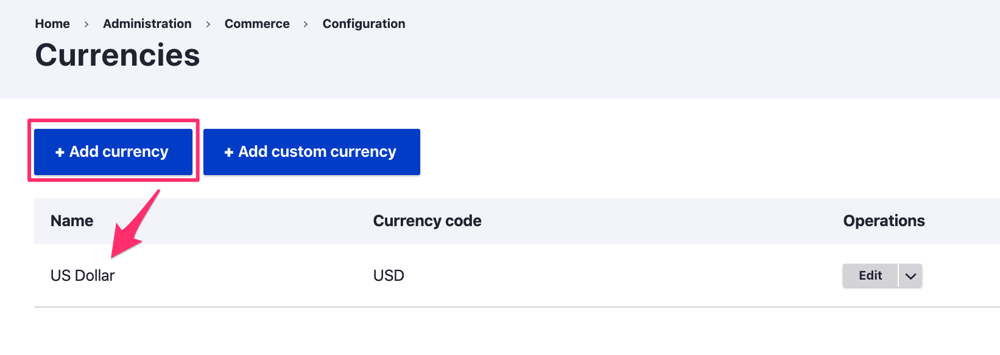

Currency functionality is provided by the commerceguys/intl library. It relies on the CLDR dataset for locale-specific patterns for formatting and displaying numbers and currency values. See [Commerce 2.x Stories - Internationalization] for a detailed introduction and backstory for the commerceguys/intl library.

### Overview

Commerce without borders means we support every language and every
denomination of currency. This is a big undertaking because not only do
we need to support various currencies, we need to support their regional
formatting rules, what each currency is called in every other language,
and many other difficult problems.

Commerce 2’s currency support is built upon the [commerceguys/intl]
library which provides a list of currencies, currency formatting,
countries, and languages. This list in not something we cooked up on the
back of a napkin, the intl library uses the internationally-recognized
standard of [CLDR] data. We parse the CLDR definitions into our own
more compact YAML definitions and use them to re-implement intl’s
NumberFormatter and provide currency, country, language data.

###Currency entity
The Drupal Commerce Price module provides a configuration entity for storing currency definitions. A *Currency* entity has the following properties:

| Property | Description | Example |
|----------|-------------|---------|
| `currencyCode` | A unique alphanumeric currency code, consisting of three uppercase letters, as defined by the [ISO 4217 standard]. | GBP |
| `name` | The currency name, a string. | British Pound |
| `numericCode` | A unique 3-digit numeric currency code, a string. | 826 |
| `symbol` | The currency symbol, a string. | £ |
| `fractionDigits` | The number of fractions digits, an integer between zero and six. | 2 |

#### Importing currencies
While it is possible to create a custom currency, typically you will want to *import* the definition for an existing currency into your site using the `CurrencyImporter` service. This is the service that is used when an adminstrative user adds a currency to the site:

For instructions on managing currencies, see the [Adding a currency](../../../03.user-guide/02.setting-up-store/01.importing-currencies) page in the [Drupal Commerce User guide](../../../../03.user-guide).

When the price module is installed, the currency importer service is used to import a default currency based on the site's default country (or US if not set). When new languages are installed, the currency importer service is used to import currency translations.

The `CommerceGuys\Intl\Currency\CurrencyRepository` class provides the data values used to set the Currency code, name, numeric code, symbol and fraction digits properties for the Currency entity that's created. For more information about the Currency Repository, see the [Formatting Prices documentation](../formatting-prices).

### Links and resources:
* [Internationalization Commerce Story]
* [Internationalization Library]

[Commerce 2.x Stories - Internationalization]: https://drupalcommerce.org/blog/15916/commerce-2x-stories-internationalization
[CLDR]: http://cldr.unicode.org/
[Internationalization Commerce Story]: https://drupalcommerce.org/blog/15916/commerce-2x-stories-internationalization
[Internationalization Library]: https://github.com/commerceguys/intl
[commerceguys/intl]: https://github.com/commerceguys/intl
[ISO 4217 standard]: https://en.wikipedia.org/wiki/ISO_4217
