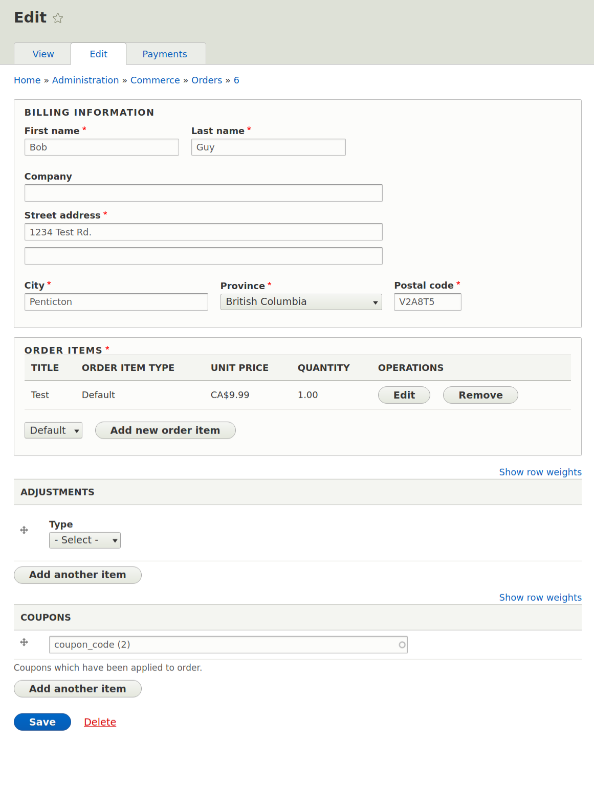

! We need help filling out this section! Feel free to follow the *edit this page* link and contribute.

Introduction
------------

The competitive nature of the current retail market has driven store owners to search for methods and strategies
to stand out from the competition and to drive sales. Creating promotions has been the strategy that has proven most effective 
for achieving those two goals. Commerce Promotions in Commerce 2.x provides the site administrator with the tools necessary to 
turn their innovative promotion ideas into reality. 
How exactly does Commerce Promotions achieve this you ask? Commerce Promotions works with [Commerce Orders] (../07.orders) 
which has the ability to apply price adjustments to orders during the [order refresh process] (../07.orders/01.order-refresh-and-process).
It is during the order refresh process that Commerce Promotions is able to add a price adjustment for the promotion in 
question to the given order.   
Let's dive into the code and see how exactly this is achieved. 

-----------------
Promotion Entity
-----------------
The `commerce_promotion` entity makes the storage and handling of the data related to the Commerce Promotion possible.
It has base fields that enable one to confirm whether or not a given promotion can be applied to a particular order. 
Below is a list of `commerce_promotion`'s base fields along with a brief description of each one. An example of how one
might go about creating a custom Commerce Promotion is also given.

Create a Promotion Entity Example
---------------------------------

```php

  /**
   * name [string]
   *   The promotion name.
   *
   * description [string_long] - [OPTIONAL]
   *   Additional information about the promotion to show to the customer.
   *
   * order_types [entity_reference] - [target_type = commerce_order_type]
   *   The promotion order types for which the promotion is valid.
   *
   * stores [entity_reference] - [target_type = commerce_store]
   *   The stores for which the promotion is valid.
   *
   * offer [commerce_plugin_item:commerce_promotion_offer] 
   *   The offer type that the promotion is using. See Drupal\commerce_promotion\PromotionOfferManager to understand
   *   how the Promotion offer plugins are discovered and instantiated. 
   *   Offers can have their own conditions. The available offer conditions and traits that are used by those conditions
   *   can be found in
   *   \Drupal\commerce_product\src\Plugin\Commerce\Conditions. 
   *   See the section, Create a Condition, for further information regarding conditions.  
   *
   * conditions [commerce_plugin_item:commerce_condition] - [OPTIONAL]
   *   [AVAILABLE = see commerce/modules/order/src/Plugin/Commerce/Condition]
   *   The conditions that must be satisfied in order for the promotion to be created.
   *   Is used in Promotion::applies($order) to check whether the promotion can be applied to the given order.   
   *
   * condition_operator [list_string] - [DEFAULT = AND]
   *   [AVAILABLE = AND, OR]
   *   Whether all conditions must pass (AND) or only one condition must pass (OR).
   *
   * coupons [entity_reference] - [OPTIONAL] - [target_type = commerce_promotion_coupon]
   *   Id of coupon entities for which the promotion may be redeemed. Usually created after creating the parent promotion. See
   *   below for more information.
   *
   * usage_limit [integer] - [DEFAULT = 0]
   *   The maximum number of times the promotion can be used. 0 for unlimited.
   *
   * start_date [datetime] - [datetime_type = date] [DEFAULT = current date]
   *   The date the promotion becomes valid.
   *  
   * end_date [datetime] - [datetime_type = date] - [OPTIONAL] 
   *   The date after which the promotion is invalid.
   *
   * compatibility [list_string] - [DEFAULT = any]
   *   Whether the promotion is compatibile with other promotions (any) or whether the promotion is not compatible with
   *   any other promotions (none). 
   *   Is used in Promotion::applies($order) to check whether the promotion can be applied to the given order.
   *
   * status [boolean] - [DEFAULT = TRUE]
   *   Whether the promotion is enabled.
   *
   * weight [integer] - [DEFAULT = 0]
   *   The weight of this promotion in relation to others.
   *   
   */
  $promotion = \Drupal\commerce_promotion\Entity\Promotion::create([
    'name' => 'Promotion Example',
    'order_types' => ['default'],
    'stores' => [$this->store->id()],
    'status' => TRUE,
    'offer' => [
      'target_plugin_id' => 'order_item_percentage_off',
      'target_plugin_configuration' => [
        'percentage' => '0.5',
      ],
    ],
    'conditions' => [
      'target_plugin_id' => 'order_currency',
      'target_plugin_configuration' => [
        'currencies' => 'CAD',
      ],
    ],
    'condition_operator' => 'OR'
  ]);
  $promotion->save();
```

Coupon Entity
-------------
The `commerce_promotion_coupon` entity allows a customer to redeem a promotion.
Its base field, usage_limit, is used to check whether or not a given promotion can be applied to a particular order. 
Below is a list of `commerce_promotion_coupon`'s base fields along with a brief description of each one. An example of 
how one might go about creating a custom Commerce Coupon is also given.

Create a Coupon Entity Example
---------------------------------
```php

  /**
   * promotion_id [entity_reference] - [target_type = commerce_promotion]
   *   The parent promotion.
   *
   * code [string] - [DEFAULT = '']
   *   The unique, machine-readable identifier for a coupon.
   *
   * usage_limit [integer] - [DEFAULT = 0]
   *   The maximum number of times the coupon can be used. 0 for unlimited.
   *
   * status [boolean] - [DEFAULT = TRUE]
   *   Whether the promotion is enabled.
   *   Is used in Promotion::applies($order) to check whether the coupon can be applied to the given order.      
   *   
   */
  $coupon = \Drupal\commerce_promotion\Entity\Coupon::create([
    'promotion_id' => $promotion->id(),
    'code' => 'coupon_code',
  ]);
  $coupon->save();
```

How Coupons Are Added To An Order
---------------------------------

In commerce_promotion.module, Commerce Promotions adds the `commerce_promotion_coupon` entity as a base field to the
 `commerce_order` entity. 
 ```php
 /**
  * Implements hook_entity_base_field_info().
  */
 function commerce_promotion_entity_base_field_info(EntityTypeInterface $entity_type) {
   if ($entity_type->id() == 'commerce_order') {
     $fields['coupons'] = BaseFieldDefinition::create('entity_reference')
       ->setLabel(t('Coupons'))
       ->setDescription(t('Coupons which have been applied to order.'))
       ->setCardinality(BaseFieldDefinition::CARDINALITY_UNLIMITED)
       ->setRequired(FALSE)
       ->setSetting('target_type', 'commerce_promotion_coupon')
       ->setSetting('handler', 'default')
       ->setTranslatable(FALSE)
       ->setDisplayOptions('form', [
         'type' => 'entity_reference_autocomplete',
         'weight' => 5,
         'settings' => [
           'match_operator' => 'CONTAINS',
           'size' => '60',
           'autocomplete_type' => 'tags',
           'placeholder' => '',
         ],
       ]);
 
     return $fields;
   }
 }
 ```
This allows a site administrator to search for a coupon by it's code and add the coupon to an order in the order's edit 
page.



How Promotion Adjustments Are Added to the Order
-------------------------------------------------

The `Drupal\commerce_promotion\PromotionOrderProcessor` service applies promotions to orders during the order refresh 
process. This is achieved by implementing `Drupal\commerce_order\OrderProcessorInterface` and using the `process(OrderInterface $order)` 
function. Implementing the `OrderProcessorInterface` ensures that the `PromotionOrderProcessor` is added as a processor to
the order during the order refresh. See [order refresh and process] (../07.orders/01.order-refresh-and-process) 
for more information on how this process ensures that an order has up to date product pricing, promotional adjustments
, taxes, and more. 
`PromotionOrderProcessor::process($order)` checks if the given order has coupons. If it does then each coupon's 
parent promotion gets applied to the order if the following is true:
 - the promotion is available
 - the coupon is enabled
 - the usage limits are respected
 - the promotion is compatible with other promotions on the order
 - the conditions pass     

Whether these statements are true or false is dictated by the values 
in the corresponding base fields of the `commmerce_promotion` and `commerce_promotion_coupon` entities; see the 
above sections for further information. The coupon is removed from the order if any of the aforementioned statements are
false.
```php
public function process(OrderInterface $order) {
  /** @var \Drupal\commerce_promotion\Entity\CouponInterface[] $coupons */
  $coupons = $order->get('coupons')->referencedEntities();
  foreach ($coupons as $index => $coupon) {
    $promotion = $coupon->getPromotion();
    if ($coupon->available($order) && $promotion->applies($order)) {
      $promotion->apply($order);
    }
    else {
      // The promotion is no longer available (end date, usage, etc).
      $order->get('coupons')->removeItem($index);
    }
  }
  ...
}
```

For non-coupon promotions, the promotion gets applied to the order if the following is true: 
 - the promotion is compatible with other promotions on the order
 - the conditions pass.
```php
public function process(OrderInterface $order) {
  ...
  // Non-coupon promotions are loaded and applied separately.
  $promotions = $this->promotionStorage->loadAvailable($order);
  foreach ($promotions as $promotion) {
    if ($promotion->applies($order)) {
      $promotion->apply($order);
    }
  }
}
``` 
The promotion gets added as a price adjustment to the order by using `$promotion->apply($order)`. The 
`Promotion::apply($order)` applies the promotion to the given order. 
```php
public function apply(OrderInterface $order) {
  $offer = $this->getOffer();
  if ($offer instanceof OrderItemPromotionOfferInterface) {
    $offer_conditions = new ConditionGroup($offer->getConditions(), 'OR');
    // Apply the offer to order items that pass the conditions.
    foreach ($order->getItems() as $order_item) {
      if ($offer_conditions->evaluate($order_item)) {
        $offer->apply($order_item, $this);
      }
    }
  }
  else {
    $offer->apply($order, $this);
  }
}
```
The promotion offers are plugins that describe the type of promotion being used (eg. buy one get one free, etc.) see
[Create An Offer Type] (01.create-an-offer-type) for more information about offers. By calling the offer's apply function
`$offer->apply($order_item, $this)`, we finally add the promotion as a price adjustment to the order.
```php
public function apply(EntityInterface $entity, PromotionInterface $promotion) {
  ...
  $order_item->addAdjustment(new Adjustment([
    'type' => 'promotion',
    'label' => t('Discount'),
    'amount' => $adjustment_amount->multiply('-1'),
    'source_id' => $promotion->id(),
  ]));
}
```

How Promotion Usage Is Registered
---------------------------------

The `Drupal\commerce_promotion\EventSubscriber\OrderEventSubscriber` listens for the 
`commerce_order.place.pre_transition` event (which occurs before an order is placed) and uses `\Drupal\commerce_promotion\PromotionUsage`
to register promotion usage when the order is placed. Promotion usage is registered by using `\Drupal\Core\Database\Connection`
to insert the promotion information into the database.
```php
public function register(OrderInterface $order, PromotionInterface $promotion, CouponInterface $coupon = NULL) {
  $this->connection->insert('commerce_promotion_usage')
    ->fields([
      'promotion_id' => $promotion->id(),
      'coupon_id' => $coupon ? $coupon->id() : 0,
      'order_id' => $order->id(),
      'mail' => $order->getEmail(),
    ])
    ->execute();
}
```
This system allows the usage of the promotion to be tracked. By storing the email the customer can be tracked which 
allows tracking both authenticated and anonymous customers the same way.
