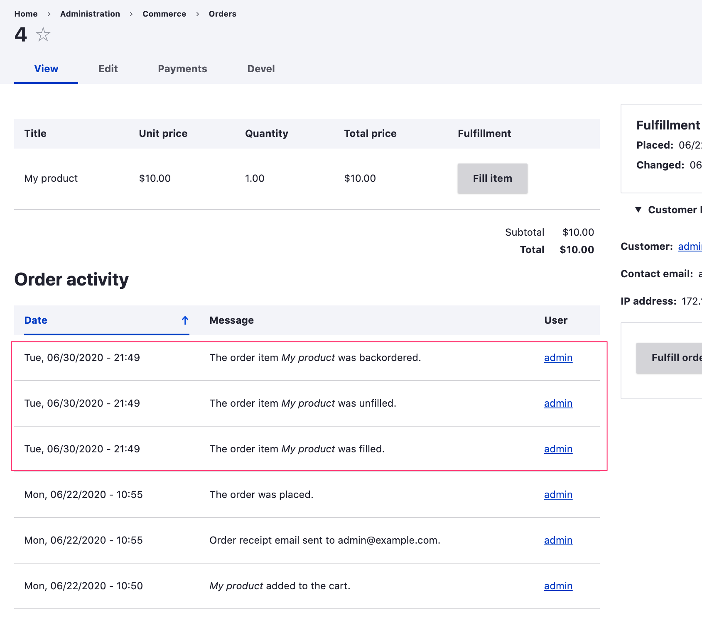

In these code examples, we create logging functionality for a custom Order item State field. See the [State machine documentation](../../core/libraries-and-dependencies/state-machine) for an introduction to *State* fields and *State transition event subscribers*. 

- [Create a custom log category](#creating-a-custom-log-category)
- [Create custom log templates](#creating-custom-log-templates)
- [Generate logs with an event subscriber](#generating-logs-with-an-event-subscriber)
- [Load all logs for an entity](#loading-logs-for-an-entity)

### Creating a custom log category
Log category yaml files must be named `{module-name}.commerce_log_categories.yml` and saved in the root of your `{module_name}` custom module.

Here we use `commerce_order` for the entity type because we want to associate the logs with the order instead of the individual order items. These logs will be displayed along with other order and cart logs on the Order view administrative page.

```yaml
mymodule_order_items:
  label: Fulfillment
  entity_type: commerce_order
```

### Creating custom log templates
Log template yaml files must be named `{module-name}.commerce_log_templates.yml` and saved in the root of your `{module_name}` custom module.

```yaml
# Log IDs match up with transition IDs.
order_item_fill:
  category: mymodule_order_items
  label: 'Order item placed'
  template: '<p>The order item <em>{{ purchased_entity_label }}</em> was filled.</p>'
order_item_unfill:
  category: mymodule_order_items
  label: 'Order item unfilled'
  template: '<p>The order item <em>{{ purchased_entity_label }}</em> was unfilled.</p>'
order_item_backorder:
  category: mymodule_order_items
  label: 'Order item backordered'
  template: '<p>The order item <em>{{ purchased_entity_label }}</em> was backordered.</p>'
```

### Generating logs with an event subscriber
The `Drupal\commerce_log\LogStorageInterface` interface defines the method used for generating logs.

`public function generate(ContentEntityInterface $source, $template_id, array $params = []);`

In the following code, we generate a log for an Order entity and then save the newly created Log entity.

```php
<?php

namespace Drupal\mymodule\EventSubscriber;

use Drupal\Core\Entity\EntityTypeManagerInterface;
use Drupal\state_machine\Event\WorkflowTransitionEvent;
use Symfony\Component\EventDispatcher\EventSubscriberInterface;

class OrderItemFulfillmentSubscriber implements EventSubscriberInterface {

  /**
   * The log storage.
   *
   * @var \Drupal\commerce_log\LogStorageInterface
   */
  protected $logStorage;

  /**
   * Constructs a new CartEventSubscriber object.
   *
   * @param \Drupal\Core\Entity\EntityTypeManagerInterface $entity_type_manager
   *   The entity type manager.
   */
  public function __construct(EntityTypeManagerInterface $entity_type_manager) {
    $this->logStorage = $entity_type_manager->getStorage('commerce_log');
  }

  public static function getSubscribedEvents() {
    $events = [
      'mymodule_order_item.post_transition' => 'onLogOrderItemTransition',
    ];
    return $events;
  }

  public function onLogOrderItemTransition(WorkflowTransitionEvent $event) {
    /** @var \Drupal\commerce_order\Entity\OrderItemInterface $order_item */
    $order_item = $event->getEntity();

    $transition_id = $event->getTransition()->getId();
    // Transition IDs for this workflow are "fill", "unfill", "backorder".
    // Log template IDs are "order_item_fill", "order_item_unfill", "order_item_backorder".
    $this->logStorage->generate($order_item->getOrder(), 'order_item_' . $transition_id, [
      'purchased_entity_label' => $order_item->label(),
    ])->save();
  }

}
```

This event subscriber service class must be defined in your custom module's service definitions file: `{mymodule}.services.yml`.

```yaml
services:
  mymodule.order_item_fulfillment_subscriber:
    class: Drupal\mymodule\EventSubscriber\OrderItemFulfillmentSubscriber
    arguments: ['@entity_type.manager']
    tags:
      - { name: event_subscriber }
```

Rebuild caches after updating the definitions. Now our order item transitions will be logged along with other Order events, using the custom templates we defined.



### Loading logs for an entity
The `Drupal\commerce_log\LogStorageInterface` interface defines a method used for loading logs:

`public function loadMultipleByEntity(ContentEntityInterface $entity);`

Here we load all logs for a given Order entity.
```php
/** @var \Drupal\commerce_log\LogStorageInterface $log_storage */
$log_storage = \Drupal::entityTypeManager()->getStorage('commerce_log');

/** @var \Drupal\commerce_log\Entity\LogInterface[] $logs */
$logs = $log_storage->loadMultipleByEntity($order);
```
