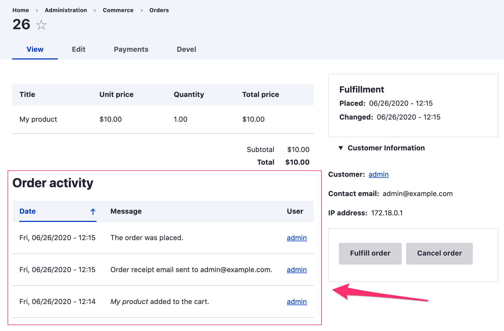
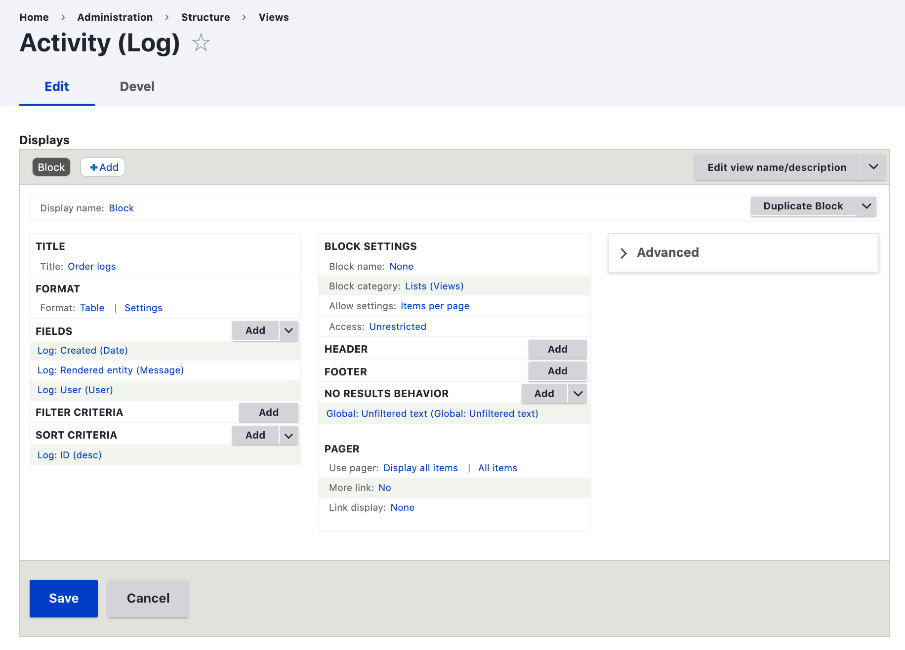

The Drupal Commerce Log module provides activity logs for Commerce entities. Administrative users can view these logs through the UI to help them manage these entities. Currently, the module only includes built-in support for logging activity related to Order entities. However, developers will find that the module can be easily extended to log activity for other entities. 

For information on creating custom activity logs, see these documentation pages:
* [Commerce Log module architecture](architecture)
* [Commerce Log module code recipes](code-recipes)
* [Customize the order's activity log with Drupal Commerce 2] - tutorial provided by Flocon de toile

### Order activity
When the Commerce Log module is installed, logs will be automatically generated for order activity. Those logs are displayed on an Order's *View* page, like this:

This example order has had 3 logs created. The first (bottom-most) entry was created when the customer added an item to his cart. Logs are also created when items are removed from a cart. 

The next two logs were created when the order was placed. All of the default Order state transition events are logged: *Placed*, *Validated*, *Fulfilled*, and *Canceled*. For more information on state transition events, see the [State machine documentation](../core/libraries-and-dependencies/state-machine).

The "Order activity" listing is a Views block that can be modified through the Admin UI like any other [View].

### Other logging resources
If you are looking for information on logging messages in Drupal more generally, you may want to start with these resources:
* [Logging API] - documentation provided by Drupal.org
* [How to Log Messages in Drupal 8] - tutorial provided by Drupalize.me

[Logging API]: https://www.drupal.org/docs/8/api/logging-api/overview
[How to Log Messages in Drupal 8]: https://drupalize.me/blog/201510/how-log-messages-drupal-8
[Customize the order's activity log with Drupal Commerce 2]: https://www.flocondetoile.fr/blog/customize-order-s-activity-log-drupal-commerce-2
[View]: https://www.drupal.org/docs/8/core/modules/views
