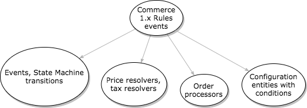

Commerce 2.x no longer relies on the Rules module. We now have event subscribers (example: order state changes), resolvers (example: calculating sell price and calculating VAT), and entities configured with conditions (example: payment gateways).

Be aware that some events correspond to state transitions, and the [State Machine](https://drupal.org/project/state_machine) module fires them upon a transition. You can find the metadata for these in `MODULENAME.workflows.yml`. Events are also documented in the `\Drupal\MODULENAME\Event` namespace as a final class containing constants. For an example of using these, see `\Drupal\commerce_log\EventSubscriber::getSubscribedEvents()`.

## Partial list of where the Rules went

|Commerce 1.x                                          | Commerce 2.x|
|------------                                          |-------------|
|`Completing the checkout process` Rules event         | `commerce_order.place` **transition**; modules react to this and alter the order as needed|
|`When an order is first paid in full` Rules event     | `commerce_order.fulfill` transition (**note: does not correspond 1:1 to Drupal 7, but can be used for many of the same purposes**)|
|`After adding a product to the cart` Rules event      | `commerce_cart.entity.add` **event**|
|`After updating an existing commerce order`           | `commerce_order.commerce_order.update` event|
|`Calculating the sell price of a product` event       | Now handled through price resolvers, tax resolvers, and order processors. Search for `tag: commerce_price.price_resolver` in the codebase for examples.|
|`Select available payment methods for an order` event | Now handled through payment gateway configurations at _Administration » Commerce » Configuration » Payment gateways_. These support various conditions to define when payment gateways should be usable by customers.|

## More on resolvers
https://docs.drupalcommerce.org/commerce2/developer-guide/core/understanding-resolvers

! We need help filling out this section! Feel free to follow the *edit this page* link and contribute.
