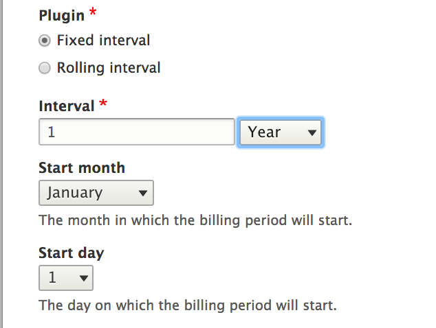
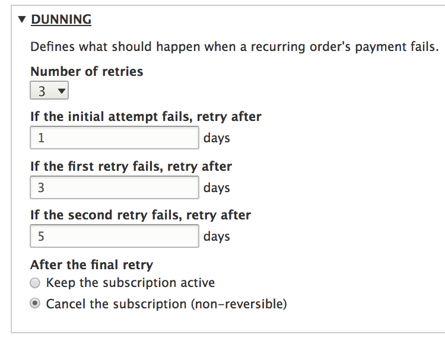

This section of the documentation provides an overview of the Subscription entity and related entities, plugins, and objects. Specifically, this section describes:
* Billing schedules, the billing schedule plugin, Billing periods, and the Prorater plugin
* The Subscription type plugin and Charges
* Recurring order types and order item types
* The PurchasableEntitySubscriptionTrait and the Initial order

## Billing Schedules
Each subscription has a billing schedule. Billing schedules are configuration entities that are created through the admin UI: `Commerce >> Configuration >> Payment`. Each billing schedule has a type, which is either prepaid or postpaid (charge at the beginning or at the end of the billing period). 

### Billing Schedule plugin
A billing schedule also has a billing schedule plugin. Two billing schedule plugins are included in the Commerce Recurring module: Rolling and Fixed. Both rolling and fixed billing schedules have an Interval (some number of hours, days, weeks, months, or years). Fixed billing schedules with monthly intervals also have a Start day (1 - 31). Fixed billing schedules with yearly intervals also have a Start month (Jaunuary - December). 

Suppose a new annual subscription is purchased on October 12th. If the first billing period should be October 12 - October 12, then you should set up a "Rolling" billing schedule. All subsequent billing periods for this subscription will also begin and end on October 12th. Suppose, on the other hand, that you want the annual subscription to start on January 1st every year. Then you should set up a "Fixed" billing schedule; the first billing period will run from October 12 to January 1st, and subsequent billing periods will start and end on January 1st. The billing schedule plugin is configured through the admin UI:

The primary function of a billing schedule plugin is to generate billing periods:
`generateFirstBillingPeriod()` generates the first billing period for a subscription, given a start date.
`generateNextBillingPeriod()` generates subsequent billing periods for a subscription, given a start date and the current billing period.

### What is a billing period?
A billing period is an object that represents a span of time. Examples:
 * - Oct 14th 14:56:20 - Nov 14th 14:56:20
 * - May 1st 00:00:00 - June 1st 00:00:00
 * - June 1st 00:00:00 - July 1st 00:00:00

Billing periods are contiguous and represent [half-open ranges](http://wrschneider.github.io/2014/01/07/time-intervals-and-other-ranges-should.html) (the end date is not included in the duration).

#### Billing period field type
The Commerce Recurring module defines a custom "Billing Period" field type that is used by "recurring" type orders and "recurring" type order items. The field has two properties, the Start date and the End date, both of which are timestamps. A custom field widget and formatter are also provided for the billing period field type.

### Prorater plugin
In addition to the billing schedule plugin, the billing schedule configuration object also has a prorater plugin. Two prorator plugins are included with the core code: Full-Price and Proportional. Given an order item, a partial billing period, and a full billing period, the `prorateOrderItem()` method of the prorater plugin will calculate the prorated price. If a billing schedule uses the Full Price plugin, the order item's full price is simply returned without regard to the billing periods. If a billing schedule uses the Proportional plugin and the duration of the two billing periods is not the same, then the order item's price is adjusted by the duration of the subscription's usage.

### Dunning
Cron jobs are used to handle the processing of payments; the dunning settings affect how declined payments will be handled for the recurring order. How many retries? How much time between retries? What happens if we reach the maximum number of retries without success?

## Subscription type plugin and Charges
The Subscription type plugin serves as the bundle plugin type for the Subscription entity. The Commerce Recurring module provides two default subscription type bundles: the Product variation type and the Standalone type. The key method implemented by these plugins is the `collectCharges()` method, which returns an array of `Charge` objects for a subscription and a billing period. 

### What is a charge?
A `Charge` object holds the values needed to create Recurring type order items:
* purchasedEntity (`PurchasableEntityInterface` or null)
* title (string)
* quantity (string)
* unitPrice (`Price`)
* billingPeriod (`BillingPeriod`)

The constructor validates the property values and sets reasonable defaults, and public getter methods provide access to the properties.

The Charges generated by a subscription type plugin are used by the `RecurringOrderManager` service to apply charges (by updating existing order items or creating new ones) to a Recurring type order.

## Recurring order types and order item types
As mentioned above, both recurring orders and order items have a Billing period field. Recurring orders also have a Billing schedule field that references a billing schedule plugin. Recurring order items have a subscription field that references a subscription entity. Recurring orders can have multiple subscriptions; if they do, their order items will reference different subscriptions. You will never directly create or edit either a recurring order or recurring order items through the UI. These entities are managed internally, as part of the overall subscription system. 

Essentially, a recurring order is created for each billing period of the subscription. The current billing period is the billing period of the most recently created recurring order (the "current" order). The recurring order items  represent the charges applied to the subcription during the billing period.

## The PurchasableEntitySubscriptionTrait
The `PurchasableEntitySubscriptionTrait` that adds an "Allow subscriptions" checkbox to the Product variation type edit form. When this subscription trait is enabled, two new fields will be added to product variations of this type, one is a reference to the Billing schedule configuration entity. The second additional field is a reference to a Subscription Type plugin. Unless a custom subscription type plugin has been created, the only option you'll see for the variation's subscription type is, "Product variation."
    
### The Initial order
When a new subscription order is placed, it's tempting to think, "oh, I've just created a new order with a subscription item. This must be a 'recurring' order with a 'recurring' order item." But that's not the case. A subscription's "Initial order" is never a recurring-type order. It does, however, have at least one order item for a product variation that allows subscriptions. And this product variation will be set as the Subscription's "Purchased entity".
