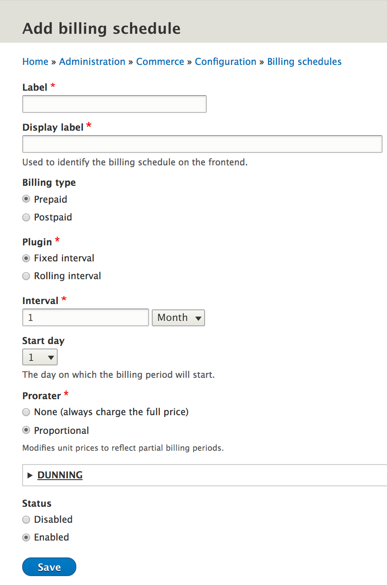

The Commerce Recurring module provides a variety of options for creating subscriptions. You probably have a general idea of what subscriptions are. You might have a monthly magazine subscription or a subscription for a streaming video service, or you might be enrolled in a cheese-of-the-month club. But exactly how are subscriptions different than regular products in Drupal Commerce? Normally, when an order is placed, the customer is charged for the product, just once, at check-out. With the Commerce Recurring module, you can instead charge a customer repeatedly, at regular intervals, starting at the time the order is placed.

Those regular intervals are defined as **billing periods** within the Commerce Recurring module. Some examples of billing periods are:

 * from January 1st 00:00:00 to January 1st 00:00:00 (yearly)
 * from Oct 14th 14:56:20 to Nov 14th 14:56:20 (monthly)
 * from May 1st 00:00:00 to May 15th 00:00:00 (bi-weekly)
 * from September 13th 03:00:00 to September 14th 03:00:00 (daily)
 * from June 10th 02:30:00 to June 10th 14:30:00 (every 12 hours)

Billing periods are contiguous and represent [half-open ranges](http://wrschneider.github.io/2014/01/07/time-intervals-and-other-ranges-should.html) (i.e., the end date is not included in the duration).

**How is a customer charged "repeatedly"?** The Commerce Recurring module relies on the Drupal's [Cron service](https://api.drupal.org/api/drupal/core%21core.api.php/function/hook_cron/8.5.x) and the [AdvancedQueue module](https://www.drupal.org/project/advancedqueue) to run recurring tasks in the background. Specifically, at the end of each billing period, one AdvancedQueue job is created for charging the customer for the current billing period, and a second AdvancedQueue job is created for renewing the subscription. See [Close and renew subscriptions](../04.close-and-renew-subscriptions/docs.md) for additional details.

## Subscription types
Out of the box, the Commerce Recurring module provides two types of subscriptions: `product variation` and `standalone`. Product variation type subscriptions have an underlying product variation that defines the base price for the subscription. Customers can place orders for subscriptions of this type by adding those product variations to their carts. Standalone type subscriptions can be created for a customer through the Admin UI; the base price for a standalone type subscription is set directly through the Admin UI.  Subscription types contain billing logic that defines how much the customer should be charged.

##### See also:
 * Product variation subscriptions: [Setting up subscriptions](../02.getting-started/docs.md)
 * Standalone subscriptions: [Create standalone subscriptions](../05.create-standalone-subscriptions/docs.md) 
 * Subscription Type plugin and charges

## Billing Schedules
Regardless of its subscription type, every subscription also has a Billing schedule. A billing schedule defines when and how to bill a customer for the subscription. Should a customer be billed on an annual, monthly, or daily basis? Or should some other billing period be used? Should the customer be charged right when the order is placed or not until the end of the billing period? Does the billing period always start on the first day of the month or if, for example, the customer initially places an order on the 10th of the month, should the subscription be billed and automatically renewed on the 10th of every month? And what about proration? If a customer places an order in June for an annualy renewable subscription, should he be billed for a full year or should the charges be *prorated* so that the customer is only charged for half the standard price? All of this and more is defined by the billing schedule. So let's look a little more closely at billing schedules.

A billing schedule is a configuration entity that stores settings on how/when a product variation will be billed. Billing schedules are created through the admin UI: `Commerce >> Configuration >> Payment`. The primary components that define the funtionality of a billing schedule are:

* [Billing type](#billing-types)
* [Billing schedule plugin](#billing-schedule-plugin)
* [Prorater](#prorater)
* [Dunning](#dunning)

 

### Billing types
Each billing schedule has a billing type, which is either prepaid or postpaid (charge at the beginning or at the end of the billing period). If a subscription is postpaid, then the customer will not be charged for the subscription at the time the order is placed. Instead, the customer will be charged for the first billing period at the end of that period. If a subscription is prepaid, the customer will be charged at the time the order is placed and will subsequently be charged at the start of each billing period for the duration of the subscription.

### Billing schedule plugin
A billing schedule is powered by a billing schedule plugin, which is responsible for generating the billing period. Out of the box, the Commerce Recurring module supports rolling and fixed billing periods. Rolling periods start at the moment of subscription and last until the configured interval passes. Fixed periods start at the beginning of the configured interval (some number of hours, days, weeks, months, or years). 

Fixed billing schedules with monthly intervals are defined with a Start day (1 - 31). Fixed billing schedules with yearly intervals are defined with both a Start day and a Start month (Jaunuary - December). The billing schedule plugin is configured through the admin UI for the billing schedule configuration entity. 

Suppose a new annual subscription is purchased on October 12th. If the first billing period should be October 12 - October 12, then you should set up a "Rolling" billing schedule. All subsequent billing periods for this subscription will also begin and end on October 12th. Suppose, on the other hand, that you want the annual subscription to start on January 1st every year. Then you should set up a "Fixed" billing schedule; the first billing period will run from October 12 to January 1st, and subsequent billing periods will start and end on January 1st. Here is the configuration for this example "Fixed" annual subscription: 

### Prorater
In some cases, it may be appropriate to prorate, or adjust, the price charged for a subscription in shorter-than-usual billing periods. For example, if the subscription is a time-based service (such as a streaming video service), and the subscription is only active for a portion of the billing period, then proration can be used to reduce the price charged. In the Commerce Recurring module, this functionality is managed by the billing schedule's `Prorater plugin`. 

The `Proportional` prorater plugin adjusts the subscription price based on the duration of the subscription's usage. For example, suppose a subscription that charges $1,000 per year is only active for 3 months of a year. The proportional prorater plugin will reduce the charge for that year to just a quarter of the full amount: $250.

In other cases, such as a magazine subscription, proration might not be appropriate. A magazine is a physical product, and its usage is not time-based, so using the proportional prorater plugin doesn't make sense. Instead, the `Fixed-Price` prorater plugin should be selected for the billing schedule. The fixed-price prorater plugin will not reduce a subscription's price in shorter-than-usual billing periods; the full price will always be charged.

### Dunning
As long as a subscription is active, the customer is automatically charged at regular intervals for the continued usage of the subscription. If the attempt to collect payment from the customer fails, the billing schedule's Dunning settings are used to determine what should happen next:

* How many retries should be attempted? (The default is 3 retries; the minimum is 1, and the maximum is 8.)
* How many days should pass between retries?
* After the final retry, should be subscription remain active or be canceled?

