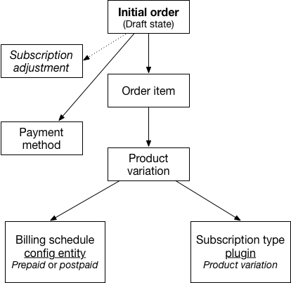
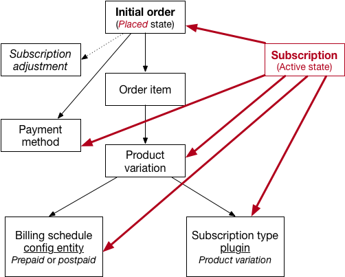
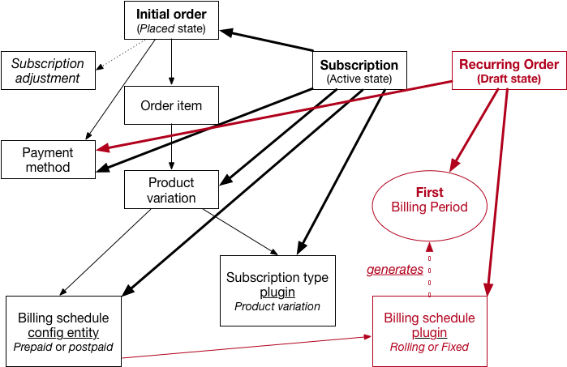
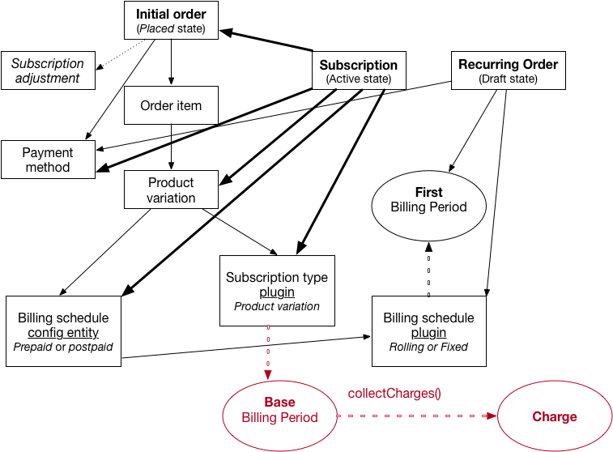
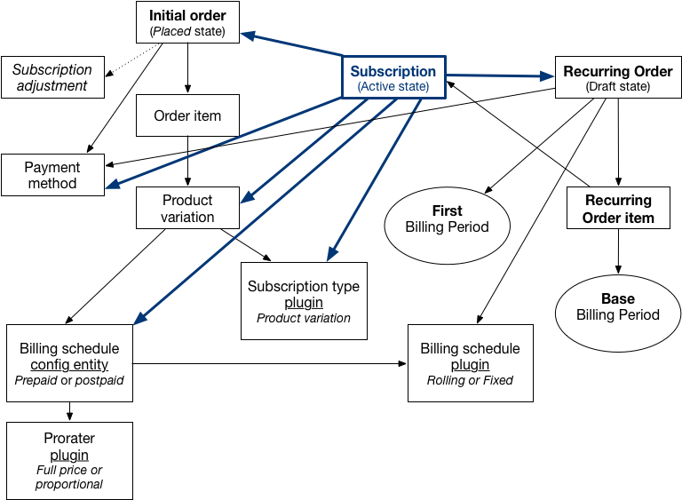

## Ordering a subscription/recurring product
This section describes the sequence of events that occurs when a customer completes checkout for an order that includes a subscription/recurring product variation. At the end of the [Getting started section](../02.getting-started/docs.md), we had a non-recurring order wth a payment method and at least one order item for a product variation that allows subscriptions. A "subscription" adjustment may have been added to the order (depending on the variation's billing schedule and timing of the order.)

### OrderSubscriber onPlace() method
The Commerce Recurring module includes an `OrderSubscriber` service that subscribes to the `commerce_order.place.pre_transition` event. When a customer completes checkout, the order is placed, and the order subscriber's `onPlace()` method is triggered. In this method, we first confirm that the order type is *not* recurring and that the payment method has been set. If the order is valid, we iterate through the order's items. If an order item's purchasable entity has both a "subscription type" and "billing schedule", then a new subscription is created for the item.

### SubscriptionStorage createFromOrderItem() method
The subscription entity is created by the `SubscriptionStorage` class, in its `createFromOrderItem` method. The subscription's `state` is set to 'active'. The subscription type and billing schedule are set based on the purchased entity's values. The subscription's purchased_entity, title, quantity, and price field values are set based on the corresponding order item values. (The price value is the *resolved* order item unit price but not adjusted/prorated.) The subscription's payment method, store_id, uid, and initial_order fields are set based on the data for the order that was placed. 

This method also triggers the onSubscriptionCreate() method for the `SubscriptionType` plugin. In the default "Product variation" subscription type, this method does nothing, but you could add your own custom logic here by overriding the method in a custom SubscriptionType plugin (and creating a product variation type that uses your custom plugin.)

### Return to OrderSubscriber::onPlace()
`SubscriptionStorage` returns the newly created Subscription entity to the `onPlace()` method in the OrderSubscriber class, which saves the entity: 

There's one last step in the `onPlace()` method, but it's a *BIG* one: a call to the `ensureOrder` method provided by the `RecurringOrderManager` service. The RecurringOrderManager holds almost all of the module logic, so we'll see it used throughout the Commerce Recurring module. For now, we'll limit ourselves to just the `ensureOrder()` method (and the methods it calls.)

### RecurringOrderManager ensureOrder() method
The Subscription entity is passed to the `ensureOrder` method as its only argument. First, the subscription's billing schedule plugin is used to generate the first billing period. (For more information on how this happens, review [Subscriptions overview](../01.subscriptions-overview/docs.md) as well as the `Fixed` and `Rolling` billing schedule plugin code.) 

Next, RecurringOrderManager's `createOrder()` method is used to create a new recurring-type order entity. Its store, customer, billing profile, payment method, payment gateway, and billing schedule fields are set to values provided by the subscription entity and its payment method. The order's billing period is set to the first billing period.

After the billing period and recurring order are created, the RecurringOrderManager's `applyCharges()` method is called. There's a lot of logic in this method, but to keep things simple here, we'll just look at what happens for our *newly created* recurring order.

### RecurringOrderManager applyCharges() method
Our newly created *recurring* order does not yet have any order items. The `applyCharges()` method is where recurring-type order items are created and added to our recurring-type order. First, the subscription type plugin's `collectCharges()` method is used to create [`Charge` objects](../01.subscriptions-overview/docs.md). Assuming our subscription is using the product variation subscription type plugin, the `collectCharges()` method is implemented in the `SubscriptionTypeBase` class.

### SubscriptionTypeBase::collectCharges()
Here is a short synopsis of what the method does; for full details, take a look at the full source code for `SubscriptionTypeBase::collectCharges()`.

`collectCharges()` uses the subscription's start date (the date the initial order was placed) and the first billing period that was calculated for the recurring order. It determines a "base billing period" using the billing schedule plugin's `generateNextBillingPeriod()` method, if needed. Depending on whether the billing schedule is Prepaid or Postpaid as well as the whether the billing schedule's plugin is fixed or rolling, the base billing period could be the same as the first billing period or some other combination of start and end dates.

In the case of a Prepaid billing schedule, the base billing period will be the *next* billing period after the first billing period. Its start date will be either the subscription start date plus a single interval or, if the billing schedule is fixed, the adjusted subscription start date plus a single interval; its end date will be the start date plus an interval.

Otherwise, the billing schedule is POSTPAID, and we're charging for the current/initial billing period. The base billing period's start date will be either the subscription start date or the adjusted subscription start date. The base billing period's end date will be one of:
* the start date plus a single interval
* the adjusted start date plus a single interval
* the subscription end date (if it ends before the end of the interval)

Once the base billing period is determined, a new `Charge` is created using that billing period and subscription entity field values.

### Return to RecurringOrderManager::applyCharges()
The subscription type plugin returned an array containing just a single `Charge` object that is used for the purchased entity, title, quantity, billing period, and unit price fields values of the recurring-type order item. Also, the `subscription` field of the recurring order item is set to the `id` of the subscription entity.

At this point, we have a problem with our recurring order item: the unit price might not be valid for the base billing period that was calculated. So here's where the prorater plugin gets called into action. Recall that the billing schedule configuration entity has a [prorater plugin](../01.subscriptions-overview/docs.md). In the prorater plugin's `prorateOrderItem` method, a prorated unit price is returned, and the recurring order item's unit price is updated. Note that the unit price is set here as 'overridden' so that it will not be subsequently changed by any price resolvers.

Finally, the `applyCharges()` method finishes by adding the recurring order item to the recurring order. The recurring order's total is automatically recalcuated so that it matches the unit price of the recurring order item.

### Return to RecurringOrderManager::ensureOrder()
After the `applyCharges()` method finishes, `ensureOrder()` triggers the `onSubscriptionActivate()` method for the `SubscriptionType` plugin. In the default "Product variation" subscription type, this method does nothing, but you could add your own custom logic here by overriding the method in a custom SubscriptionType plugin (and creating a product variation type that uses your custom plugin.)

Next, `ensureOrder()` finishes up by saving the recurring order item and the recurring order. Then the recurring order is added to the `Subscription` entity, and the Subscription is saved. The recurring order is returned to the OrderSubscriber's `onPlace()` method and we're done!

### Summary
Here's an overview of "who did what" when the OrderSubscriber's `onPlace()` method was triggered by the `commerce_order.place.pre_transition` event:
1. SubscriptionStorage:
    * create subscription
    * trigger `onSubscriptionCreate()` (SubscriptionType plugin method)

2. OrderSubscriber: save subscription

3. BillingSchedule plugin: generate first billing period

4. RecurringOrderManager: create recurring order

5. SubscriptionType plugin: generate base billing period for the recurring order item (with an assist by the BillingSchedule plugin)

6. RecurringOrderManager:
    * create recurring order item
    * prorate the recurring order item price (with an assist by the Prorater plugin)
    * trigger `onSubscriptionActivate()` (SubscriptionType plugin method)
    * save recurring order item
    * save recurring order
    * add recurring order to the subscription
    * save the subscription

(Note that these steps would be repeated if the initial order has multiple subscription items.)

At the end of this process, we have an 'active' subscription with a single recurring order (in the draft state). The billing period for the recurring order is the "first" billing period for the subscription. The billing period for the recurring order item is the base billing period. The order total is the *next* amount due, calculated using the base billing period and taking the amount already charged in the initial (non-recurring) order into consideration.

In the next section, we'll look at how this recurring order is closed and renewed.

