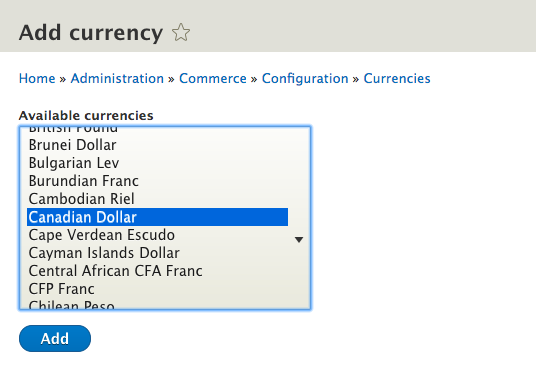

## Overview

Drupal Commerce uses the internationally-recognized standard of [CLDR] data to
provide multiple currency support. Currencies are formatted based on the locale
of a language, giving a true localized experience. All of this is possible
due to the underlying multilingual and localization capabilities of Drupal.

## Adding a new currency.

Visit the Commerce configuration page and go to the Currencies page in the Store
section.

The currencies page shows a list of all currencies currently added. To add a
currency, such as the Canadian Dollar, click on **+ Add currency**. The next form
will provide you with a list of available currencies to import. Select your
currency and click **Add**

## Editing Currencies

While not common, sometimes you may wish to modify a currency that was added. Once
a currency is added, you can click **Edit** to modify the currency.

[CLDR]: http://cldr.unicode.org/
