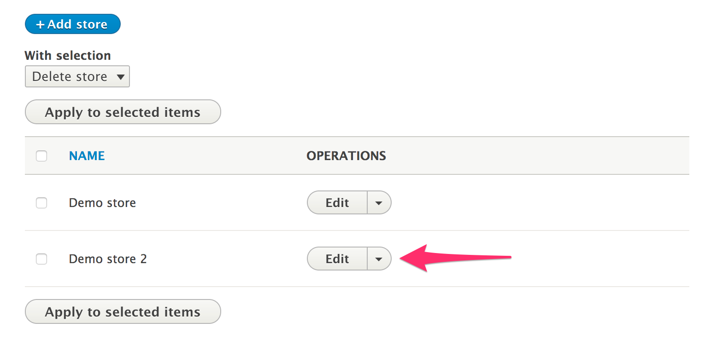
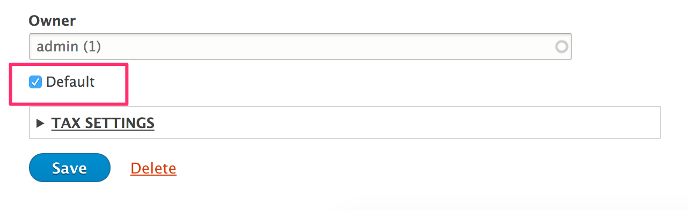

The default store can be thought of as your primary store. When Drupal Commerce determines the current store for a product or order, this will be used if it cannot be determined.

Go to the Stores management page from the Configuration page

Click on **Edit** for the store you would like to make default.

At the bottom of the form, check the **Default** checkout, and then press **Save** to update the store and make it default.

