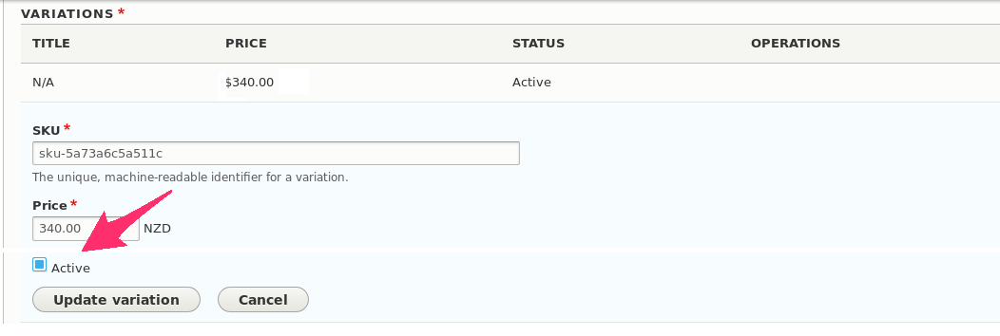
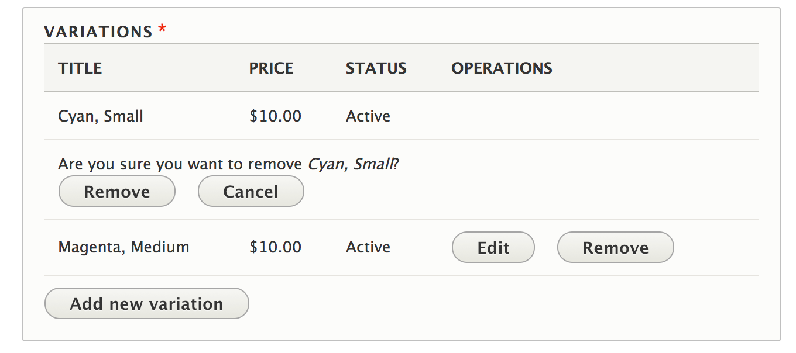

Sometimes you may wish to delete a product or one of its variations. Before deleting a product or variation, consider unpublishing the product or disabling the variation.

## Disabling a product variation

This will remove the product variation from the site, but will leave it in the system should you want to re-enable it at a later point.
 
A product's variation is disabled while editing the product. Click on the variation's **Edit** button. Locate the **Active** checkbox on the Variation form and uncheck it. Click **Update Variation** to complete the process. The product variation will no longer be available to purchase on your site.

## Deleting a product variation

A product's variation is deleted while editing the product. Click on the variation's **Remove** button. A confirmation form will display. Click **Remove** once more to confirm.

## Deleting entire product

A product can be deleted by editing it. At the bottom of the form there is a **Delete** link, which will display a confirmation form. Click **Delete** once more to confirm deletion. All variations will also be deleted.

