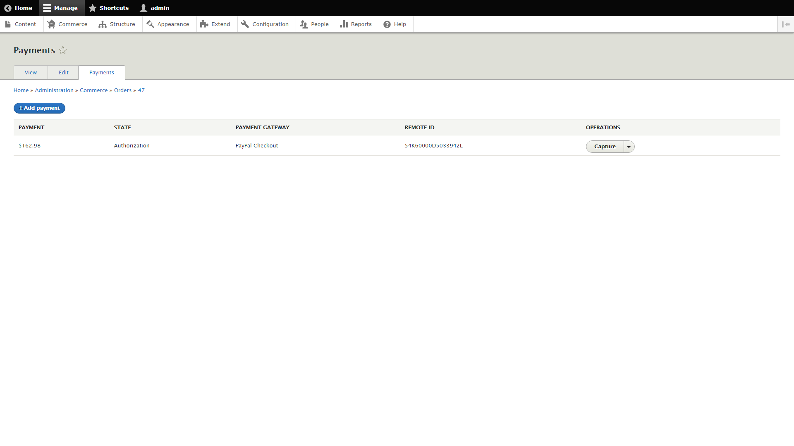
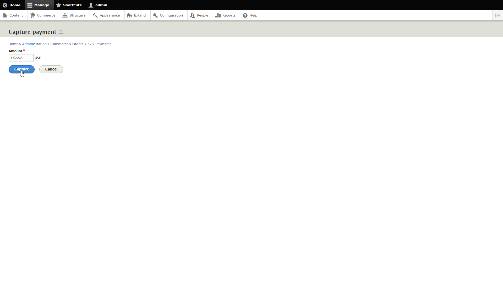
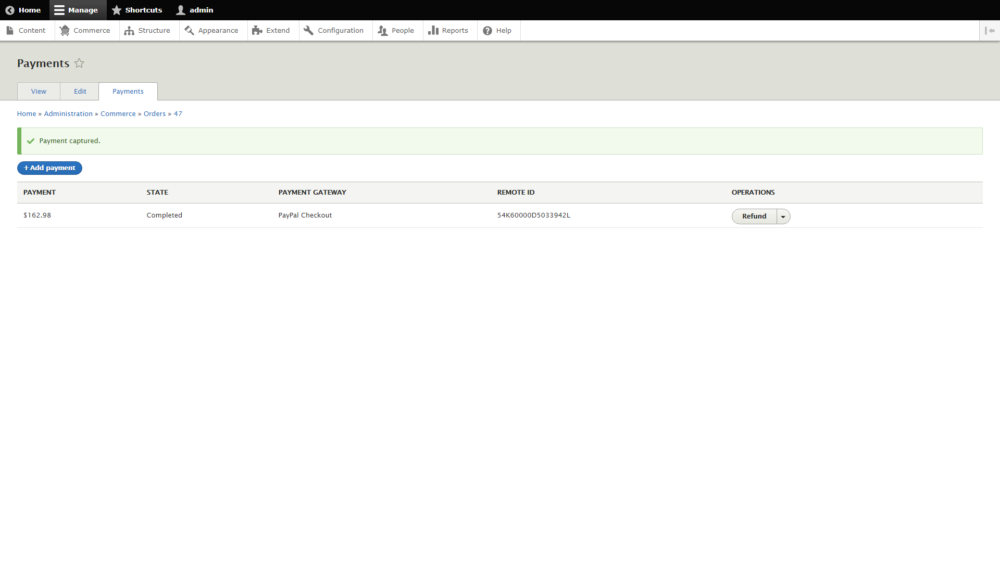

Payments can be authorized during the checkout flow and captured separately by store administrators at a later time (e.g., when a shipment is sent to fulfillment, when a shipment is shipped, or when a shipment is delivered). Note: not all payment gateways support this feature. Store administrators will only have the ability to capture a prior payment authorization if the payment gateway was configured for this type of transaction at the time the order was placed.

To capture a prior payment authorization for an order, navigate to the *Orders* management page from the *Commerce* menu using the administrative toolbar. Search or browse for the order with a prior payment authorization to be captured. Expand the operations popup and click *Payments* from the menu or click the hyperlinked order number to open the order view page then click the *Payments* tab to view the order payments.

Click the *Capture* button from the operations popup to view the *Capture payment* page.

Update the *Amount* field as needed. Click the *Capture* button to submit the form and transmit the capture request to the payment gateway.

If the capture request was successful, a success message will be displayed on the order payments page. Additionally, the payment state will be updated to *Completed*.
