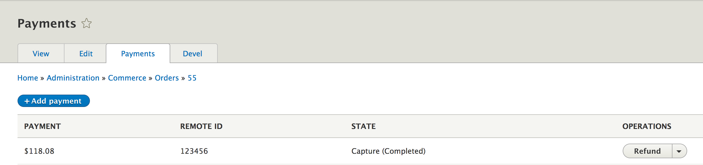
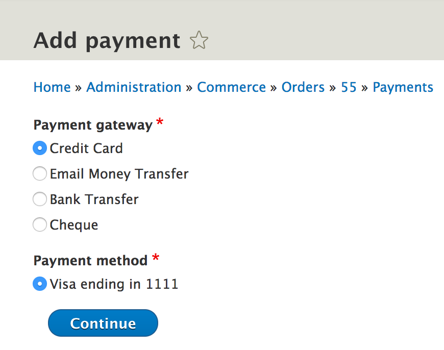
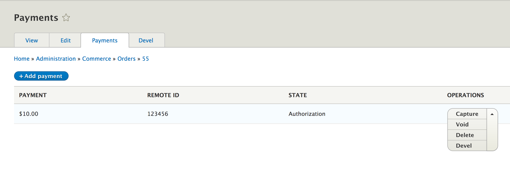
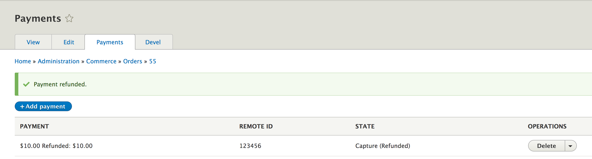

<h2>Managing Order Payments</h2>

As a store administrator there are times where you often find yourself having to manage orders and payments on behalf of customers. Some customers might call in to modify their saved credit cards, or you might need to refund or capture payments for orders. With Drupal Commerce, you get a nice interface that let's you manage order payments and authorizations with ease.

<h2>Capturing a Payment</h2>
Let's assume a scenario where the customer calls in and requests to make a change to their order. Let's say they wanted to modify the quantity ordered for one of the products. Instead of 1 quantity, they now want 2 of this item. As an admin you can go ahead and edit the item and enter "2" for the quantity. However, you now have a changed order total. You need to request more payment from the customer.

Capturing payments for an order is done from the Payments tab above.

Notice, the payments that have already been captured for our example order, is displayed in the page. For this order, the customer has already paid $118.08, now a difference of $30.74 needs to be paid. Click on the `Add payment` button.
 

 
 Now, select the payment type and continue with the prompt.
 

 
 Once the payment is successful, you'll be notified and the new payment will be added to the list.
 

<h2>Voiding An Authorization</h2>

In order to cancel an authorization we 'Void' it. For example, on travel sites, normally when a customer adds a trip request, a payment authorization is added to the order. It is only when the trip is confirmed that the authorization becomes a charge. 

Similary, in our case, let's say we had added a payment authorization for an order. However, upon processing the order, we notice that the item is out of stock. We now need to 'Void' the payment. Voiding payments are quite easy. Just as before, you first need to locate the order. Then, as you did before, click on the `Payments` tab and locate the authorized payment.
 

 
 Click the `Void` link and confirm that you want to void the payment.
 

 
 Once you confirm, the payment page should look like this, with a "(Voided)" added next to the payment that you just voided.
 

<h2>Refunding a Captured Payment</h2>

Payments can be refunded when they've been authorized and captured. There maybe times when you've already taken payment but need to refund an order, either due to lack of stock, damaged product, cancelled order, or some other reason. Similar to voiding payments, refunding payments follow the same process. You locate the order, click the `Payments` tab, find the captured payment and hit the `Refund` link. You'll be taken to a confirmation page.
 

 
 Once you confirm the refund, the payment will be refunded to the customer and the refunded payment would look like this.

