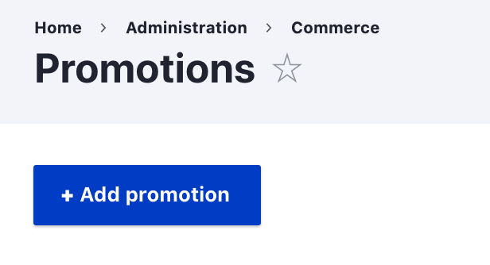
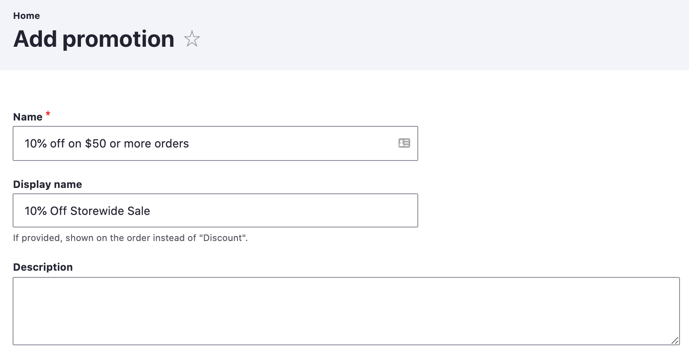
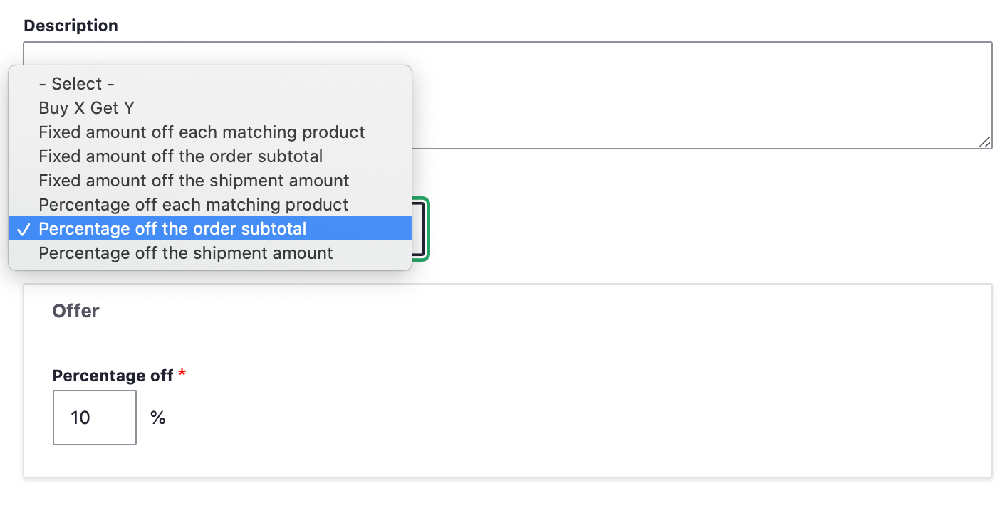
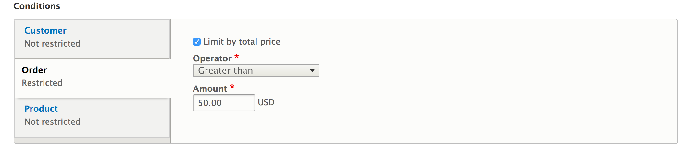
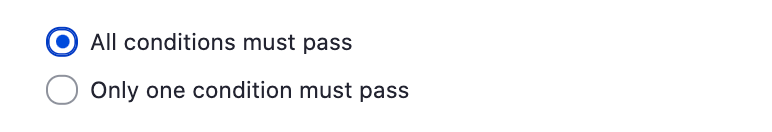
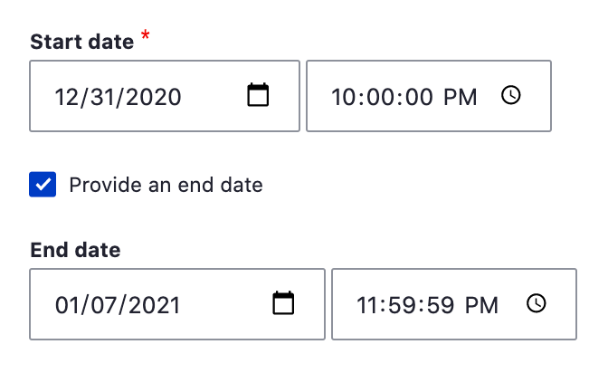

Imagine that your store is planning to run a special New Year campaign where you'd like to give customers a 10% discount on orders worth $50 or more. You'd like to set up the promotion ahead of time and limit it to a specific date range. With the default offers and conditions provided by the promotion system, it is quite simple.

## Adding a New Promotion

- You can create a new promotion by going to ``/admin/commerce/promotions`` and clicking the "Add promotion" button.

- Give your promotion a descriptive name, for example, "10% off on $50 or more orders".

- If you would like to use a different name for what customers will see on their order/cart, enter a "Display name", for example, "10% Off Storewide Sale". If the display name is set, only administrative users will see the "Name" of the promotion.

- Optionally, you can also enter a description for the promotion. This description can only be viewed by administrative users, not customers.

  
Setting the Offer
-----------------

- Let's now decide on the type of offer you'd like to give users. As our goal is to give customers a 10% discount on orders worth $50 or more, let's select the "Percentage off the order subtotal" option under ``Offer type``. Notice that whenever you change the offer type, the form changes below the list of options to provide additional inputs.
- Now enter the percentage you'd like to give the customer as the "Percentage off". For this example, we enter "10".

>See the [Edit a promotion](../edit-promotion) documentation page for a description of all Offer types provided by Drupal Commerce core. Note that additional offer types can be created in custom code by a developer. See the [Create an offer type](../../../developer-guide/promotions/create-an-offer-type) page in the Developer guide for documentation and example code.

  
Adding Conditions
-----------------

The conditions section allows you to further manage the promotions so that you can tell the system to apply the promotion only if the order meets certain criteria. There are three categories of Conditions: Customer, Order, and Products. Click on each to see condition options in that category. You can specify multiple conditions. For this example, we want to add a condition so that our promotion will only apply to orders worth $50 or more. This is the "Current order total" condition, an "Order" condtion. Similar to the "Offer type" options, whenever we select a Condition type, a new form will appear under that condition. We'll select the "Greater than or equal to" Operator and enter "50" as the Amount:

At the end of the Conditions section of the page, you can specify whether "all conditions must pass" or "only one condition must pass". Since our example promotion has only one Condition, it doesn't matter which option we select. We'll leave it set to the default, "all conditions must pass":

>See the [Edit a promotion](../edit-promotion) documentation page for a description of all Condition types provided by Drupal Commerce core. Note that additional condition types can be created in custom code by a developer. See the [Create a condition](../../../developer-guide/promotions/create-a-condition) page in the Developer guide for documentation and example code.

Additional Configuration
------------------

On the right-hand side of the page, you'll see options for setting additional limitations on the promotion. For this example, we stated that we wanted to limit our promotion to a specific date range. So we'll enter a Start date of "12/31/2021" at "10:00 PM" and an End date of "1/7/2020" at "11:59 PM", right before midnight. To do so, we need to enable the "Provide an end date" option by clicking the checkbox.

Note that the date and time constraints are applied based on the Timezone of the *Store*, not that of the customer.

Testing the Promotion
-----------------
Now, that you've entered the necessary conditions let's "Save" the promotion. You can test this out by adding a product or a number of products to the cart. Once the order total reaches $50 or more, note, a discount is automatically applied to the order total.

**Testing Tip**: if you want to test a promotion before it goes live, use the "Customer role" Condition to temporarily require an administrative role. Then you can safely enable and test a promotion without exposing it to customers. In this example, you would also need to adjust the starting date to allow orders during the testing period. Just remember to restore the correct starting date and remove the Customer role condition after testing and before it needs to go live!

