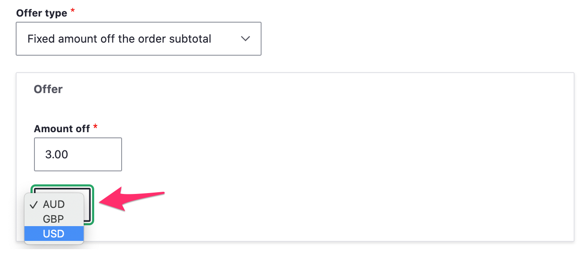
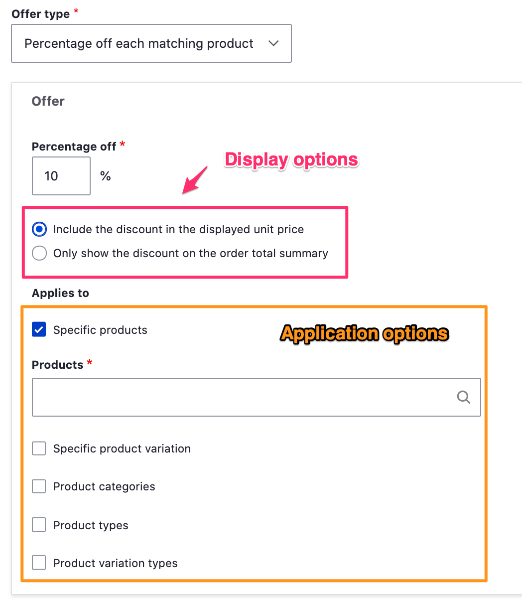
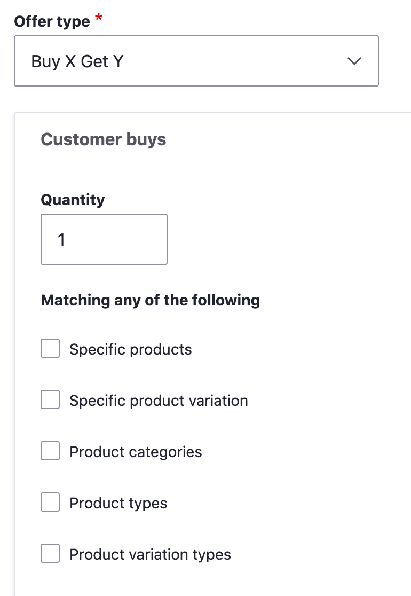
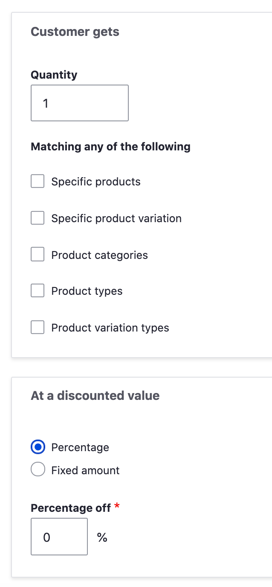
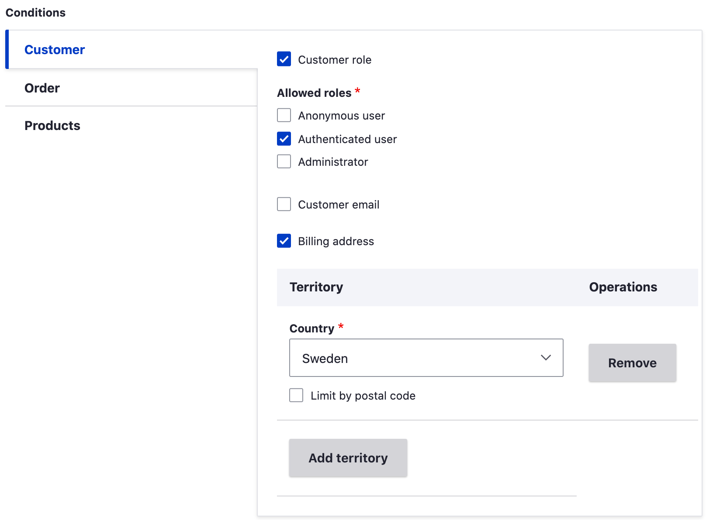
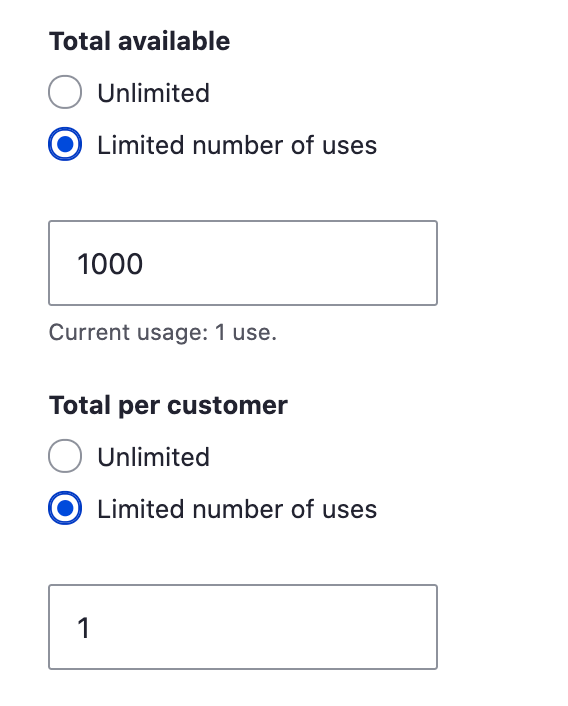
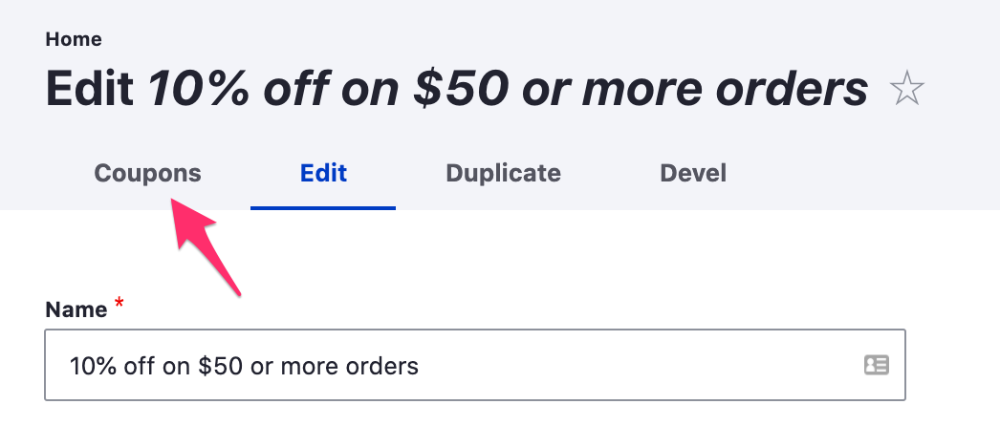

After creating a promotion, you can make updates by editing its various configuration options. The [Create a promotion](../create-promotion) documentation page provides an introduction to those options; this page provides a more comprehensive summary.

Updating Names and Description
-----------------
The "Name", "Display name", and "Description" fields can be updated after a promotion is created, even if the promotion is already active. However, if the promotion has already been applied to existing orders, the name that customers see on their order/cart may or may not be updated, depending on the state of the order.

- If the order has already been placed, the promotion name will not be updated.
- If the order is still an in-progress shopping cart, the promotion name will be updated.

Offer types
-----------------
Commerce Core includes five different offer types. The Commerce Shipping module, if installed, provides two additional offer types. When the Offer type is changed, the "Offer" form below the list of options will be updated with configuration options specific to the offer type.

#### Fixed amount or Percentage off the order subtotal
The two simplest offer types are, "Fixed amount off the order subtotal" and "Percentage off the subtotal". For the "Fixed amount" offer, enter the exact amount that should be deducted from the order subtotal. If your site has multiple currencies installed, you will need to specify the currency in addition to the amount.

For the "Percentage" offer, enter the percentage that should be applied to the order subtotal to calculate the discount amount. Decimal amounts can be entered. For example, enter, "1.5" for a 1.5% discount amount. If the subtotal amount is $1,000.00, the discount will be $15.00.

#### Fixed amount or Percentage off each matching product

These offer types are similar to the Fixed amount and Percentage off the order subtotal offer types but offer additional options for how the discounts are displayed and applied to individual order items.

##### Display options
- Use the Display options to control whether displayed unit prices for individual order items remain unchanged or adjusted by discount amounts.

##### Application options
Use the Application options to limit the application of the discount to only order items that match your criteria.

- **Specific products**: Enter the titles for one or more products, separated by commas.
- **Specific product variation**: Enter either titles or SKUs for one or more product variations, separated by commas.
- **Product categories**: For any product types with custom fields that reference taxonomy terms, enter one or more term names, separated by commas. The discount will be applied to products that reference those terms. For example, suppose you have a "Product catalog" taxonomy with terms like "Clothing", "Electronics", "Toys", etc. You could use this offer type to create discounts that only apply to products classified as "Toys".
- **Product types and product variation types**: if only a few options exist, you will see checkbox options for the product/variation types; otherwise, enter the names of the product/variation types, separated by commas.

#### Buy X Get Y

The Buy X Get Y offer type provides discounts for 1 or more items in the customer's cart based on the existence of other items in the cart. The first part of the configuration form is the, "Customer buys" section. Use this section to specify *what must exist in the cart* in order for the discount to apply:

The "Quantity" value can be any non-negative integer or decimal amount. The "Matching" criteria are the same as the [Application options](#application-options) described in the previous section.

The next section of the form, labeled, "Customer gets", specifies additional items that:
1. Must be in the cart for the discount to apply, and
2. If present, will be discounted.

Again, there is a "Quantity" value and "Matching" criteria for these items.

Finally, the third section of the form, labeled, "At a discounted value", specifies whether the items that are discounted should be discounted based on a Percentage or Fixed amount. See the explanation above for [Fixed amount or Percentage off the order subtotal](#fixed-amount-or-percentage-off-the-order-subtotal) offer types for more information.

#### Example: Buy 3 get 1 free for Product X
Suppose you create a promotion with a "Buy X Get Y" offer type configured as follows:
- Customer buys quantity: **3**
- Matching specific products: **Product X**
- Customer gets quantity: **1**
- Matching specific products: **Product X**
- At a discounted value percentage off: **100**

Then the following logic will be applied:
- If the customer has less than 4 units of Product X in his cart, no discount will be applied.
- If the customer has 4-7 units of Product X in his cart, 1 of those items will be free (100% discount).
- If the customer has 8-11 units of Product X in his cart, 2 of those items will be free, and so on.

#### Fixed amount or Percentage off the shipment amount
The Commerce Shipping module, if insalled, provides these two offer types which work just like the [Fixed amount or Percentage off the order subtotal](#fixed-amount-or-percentage-off-the-order-subtotal) offer types. However, instead of applying the discount to the subtotal, the discount is applied to the Shipping amount. By entering "100" as the percentage amount, a "Free shipping" discount can be created.

Other custom or contributed modules can also define additional offer types or selection criteria.

Conditions
-----------------
Add conditions to a promotion to create limitations for its discount offer. Conditions are grouped into three categories: Customer, Order and Products. Like Offer Types, selecting a Condition triggers the display of a configuration form specific to that condition. Promotions can have any number of conditions. 

For example, here we've selected two Customer conditions. The Customer role has been set to "Authenticated user", so the customer must be logged in for the discount to apply. And the Billing address has been limited to the country of Sweden, so the discount will only apply to orders with Swedish billing addresses. "Customer email" is another Customer condition, but it has not been enabled for this example promotion.

Order conditions allow you to limit the promotion by the total price of the order, currency, or selected payment gateway.

Product conditions allow you to limit the promotion based on the items that have been added to the cart
or by the quantity of products the customer purchases. You can use the autocomplete to enter a comma separated list of products to apply the promotion to.

#### All conditions vs. Only one condition must pass
If multiple conditions have been added to the order, use this option to control whether all or only one of the conditions must be TRUE for the promotion to apply.

If more complex logic is required for your promotions, custom or contributed modules can be installed to provide specialized conditions or order processors.

Start and End dates
-----------------
The [Create a promotion](../create-promotion) documentation page provides an example of setting the Start and End date for a promotion. The Start date is required but can be set to the current date and time if you want the promotion to be immediately available.

Date and time constraints are applied based on the timezone of the Store, not the customer's timezone.

Usage limitations
-----------------
A promotion can also be limited based on total usage or on a per user basis. For example, here we've limited a promotion so that it's available to only the "first 1000 customers", and each customer can only use the discount once. 

Customer usage is tracked based on email address. If the customer is shopping as a guest and his email address is not yet known, customer usage will not be factored into the logic for determining whether the promotion applies. Once a guest customer enters an email address or logs in, a previously applied discount will be removed if its application would violate the customer usage limit.

Compatibility options
-----------------
Compatibility options allow you to specify whether the promotion can be combined with other promotions.

- Once a promotion that is *not* compatible with other promotions is added to an order, no other promotions will be added.
- If a promotion that is compatible with any promotion is added to an order, then any subsequent promotions with limited compatibility will *not* be added to the order.

See the [Promotions table](../managing-promotions#ordering-promotions) documentation for information on how to manage the order in which promotions are added to an order.

Coupons
-----------------
If your promotion requires coupons, you can create and manage its coupons by clicking the "Coupons" link at the top of the promotion's Edit page:

See [Using coupons](../coupons-with-promotion) for coupon-specific documentation.
