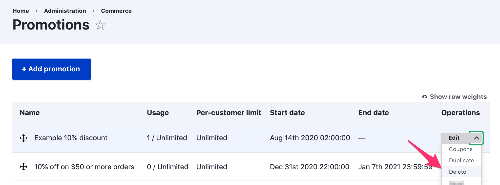
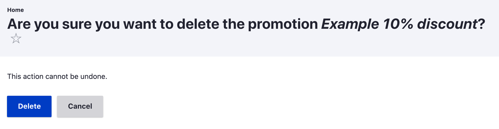

Promotions can be deleted from the [Promotions table](../managing-promotions) or using the Promotion edit form.

Whenever you elect to delete a promotion through the administrative UI, you will need to confirm the deletion. Deleting a promotion is an irreversible operation.

Whenever a promotion is deleted, all of its coupons and associated customer usage records will also be deleted. However, deleting promotions does *not* affect discounts that have already been applied to placed orders. Also, orders continue to store references to promotions, even after they are deleted.
