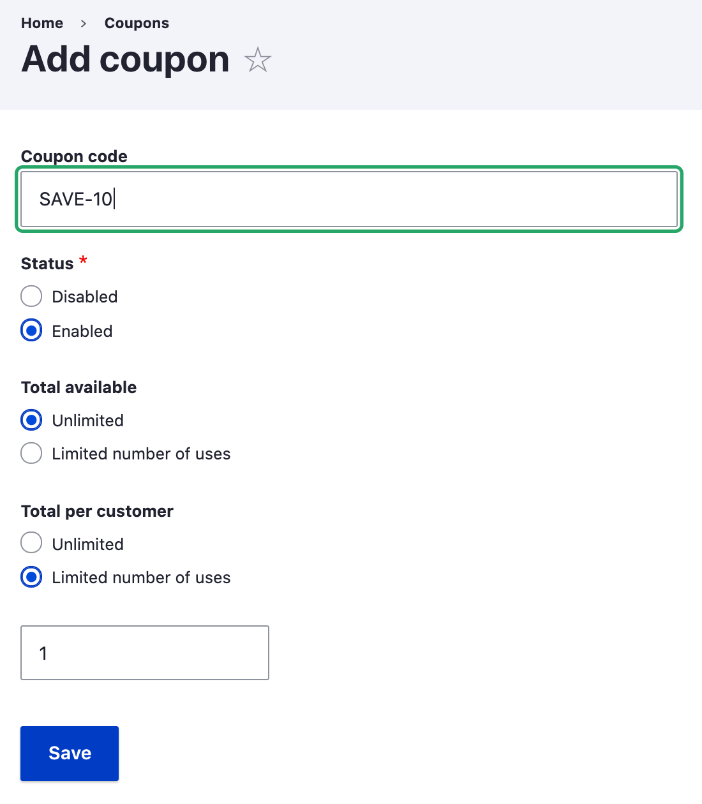
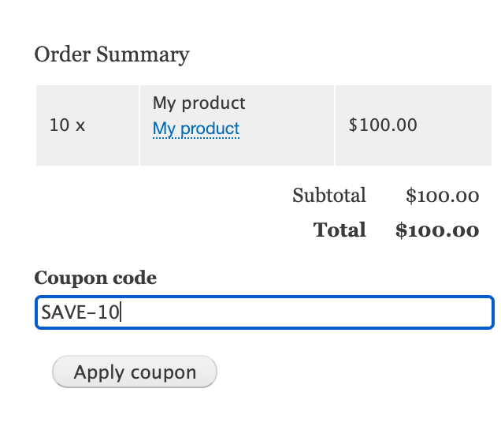
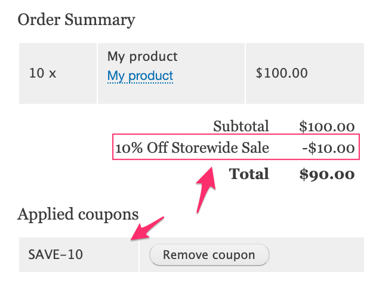
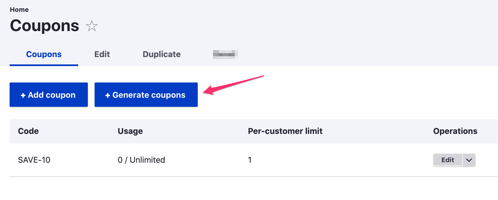
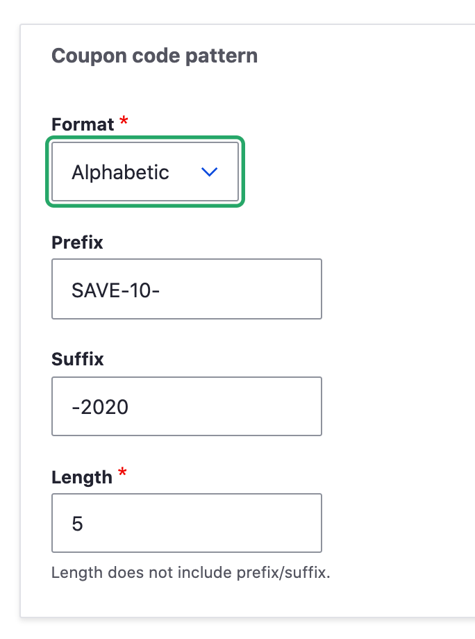
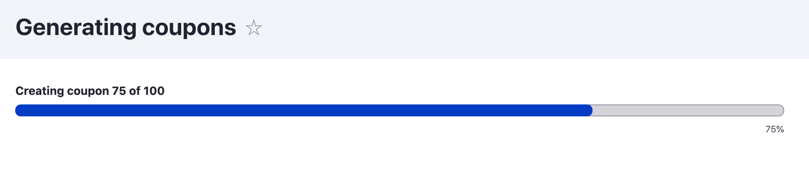
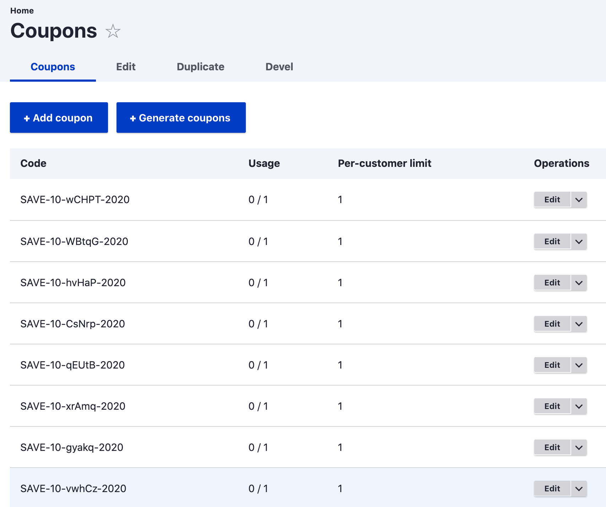

Let's now imagine that you're running a new email campaign that sends customers a coupon that they can use to get 10% off each order over $50. 

Setting up a coupon-based promotion is the same as creating a new promotion but with a extra step. You set up the promotion the [same way as before](../01.create-promotion), but this time let's add a Coupon to the promotion.

Click on the Coupon tab at the top of the page. Click on "Add Coupon", and add the following:
- Enter a specific coupon code.
- Mark it as enabled (active).
- Set the number of times this coupon can be used as the "Total available" amount.
- To limit the number of times this coupon can be used by a single customer, set the "Total per customer" amount.
  

Finally, "Save" the coupon. 

Let's test this out by adding a products to a cart so that the order totals over $50. Notice that the discount is not automatically applied. It will only be applied if the coupon code is entered. During Checkout, you can see a "Coupon code" textfield in the "Order summary". Enter the coupon code for the promotion, and click the "Apply coupon" button.

You can now see that the 10% discount has been applied to the entire order.

### Bulk coupon generation 

Now let's suppose that you want to create a large number of unique coupons for a promotion. You can use the Bulk coupon generator by clicking "Generate coupons" instead of "Add coupon" on a promotion's Coupons page:

For each batch of coupons you'd like to generate, you need to specify three things:

1. The number of coupons to be generated.
2. The coupon code pattern.
3. Usage limitations, if any. By default, generated coupons are limited to a single use by a single customer. (See the description of [Usage limitations](../edit-promotion#usage-limitations) for promotions for more information.)

#### Coupon code pattern

Coupon code patterns are based on four attributes: format, prefix, suffix, and length.

**Format** options are alphanumeric, alphabetic, and numeric and define the type of characters that will form the unique portion of the coupon code. For alphanumeric patterns, the characters 'I', 'O', 'i', 'l', '0', '1' are not used, to avoid recognition issues. Similarly, for alphabetic patterns, the characters 'I', 'i', 'l' are not used. All digits 0-9 are used for numeric patterns.

**Length** is a positive integer that defines the number of characters that form the unique portion of the coupon code. Here are some examples of format/length values and the types of unique codes they produce:

| Format | Length | Example code |
| ------ | ------ | ------------ |
| Alphanumeric | 8 | Xj7kcWn2 |
| Alphabetic | 5 | HPAsu |
| Numeric | 10 | 8974406511 |

**Prefix** and **Suffix** are optional strings that can be added before and after the unique portion of the coupon code.

In this example, we will generate coupon codes that look like "SAVE-10-HPAsu-2020", with "SAVE-10" as the prefix, "-2020" as the suffix, and a unique 5 character alphabetic code.

Let's generate 100 coupons for this pattern. Coupons are generated in batches, with progress displayed:

We now have 100 unique coupons for our promotion:

