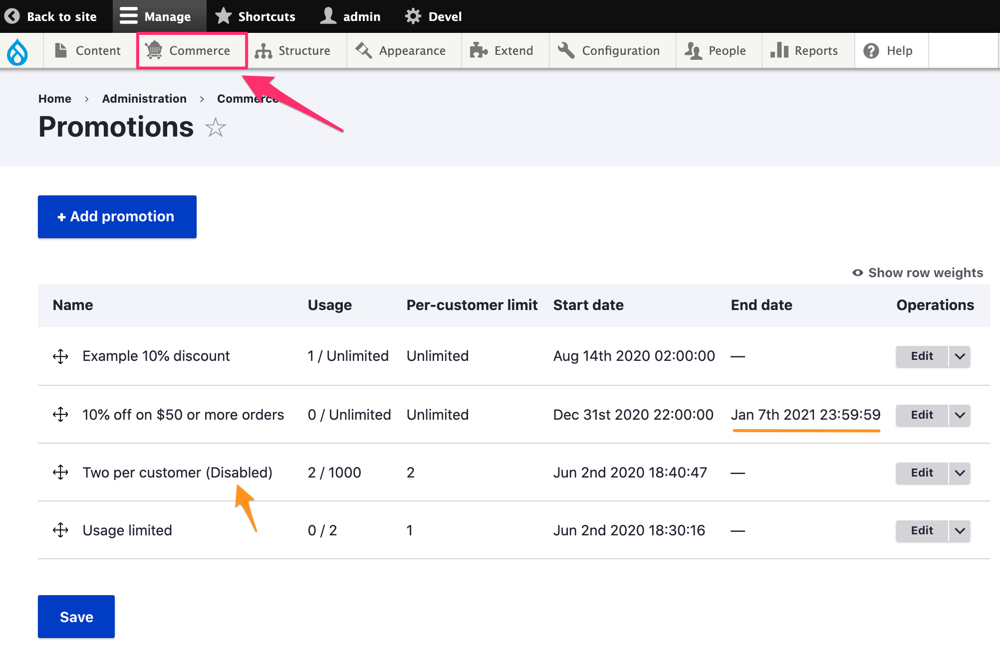
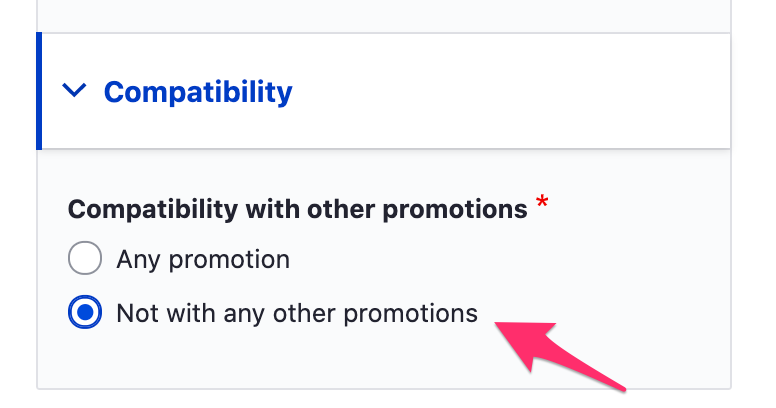
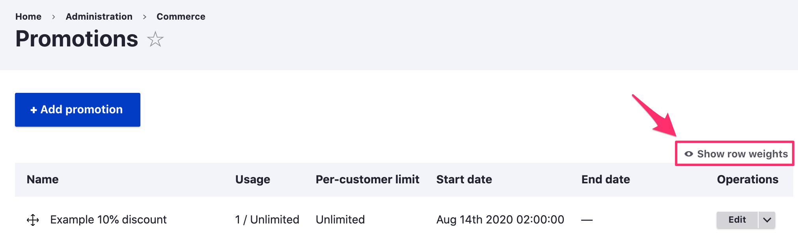
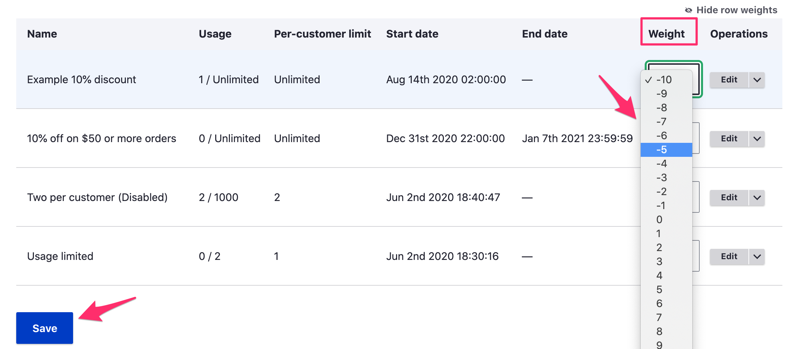

To manage promotions, select "Promotions" from the "Commerce" administrative menu.

The Promotions table lists all promotions, including both enabled and disabled promotions. In the first column, the name of the promotion is displayed along with a "Disabled" label for any disabled promotions. The "Usage" column displays both the current total usage and the usage limit (or "Unlimited" when there is no usage limit). The "Per-customer limit" displays the per-customer usage limit or "Unlimited". All promotions have a start date and time that is displayed in the "Start date" column. If a promotion has an end date and time, that value is displayed in the "End date" column. 

Standard operations links for editing/deleting/etc. promotions are provided in the last column, labeled, "Operations".

If your site has more than 50 promotions, they will be grouped into pages with up to 50 promotions per page.

#### Ordering promotions
If any of your promotions have limited compatibility, then the order in which promotions are listed in the Promotions table can affect whether any particular promotion is applied to an order. [Compatibility options](../edit-promotion#compatibility-options) can be set when editing a promotion:

Whenever a cart or draft order is updated, all "available" promotions are checked, in order, for applicability to the order. A promotion is considered **available** if all of the following are true:

- The promotion is enabled.
- The promotion does not have coupons. (Coupons are handled separately.)
- The promotion applies to the order's *type*.
- The promotion applies to the order's *store*.
- The current date/time is between the order's start and end dates.
- If the promotion has any general or customer-specific usage limits, they have not yet been met.

The available promotions are sorted first by *weight*, from lowest to highest, and then by name, in the case of equally weighted promotions.

To view the **weight** of promotions, click the "Show row weights" link at the top of the Promotions table, on the right:

When weights are displayed, a new "Weight" column appears with editable weight values. When weights are hidden, the grab-and-drop tool in the leftmost column can be used to reorder promotions and adjust their weights. Once the weights have been updated, click the "Save" button at the bottom of the page to save the new weight values.

