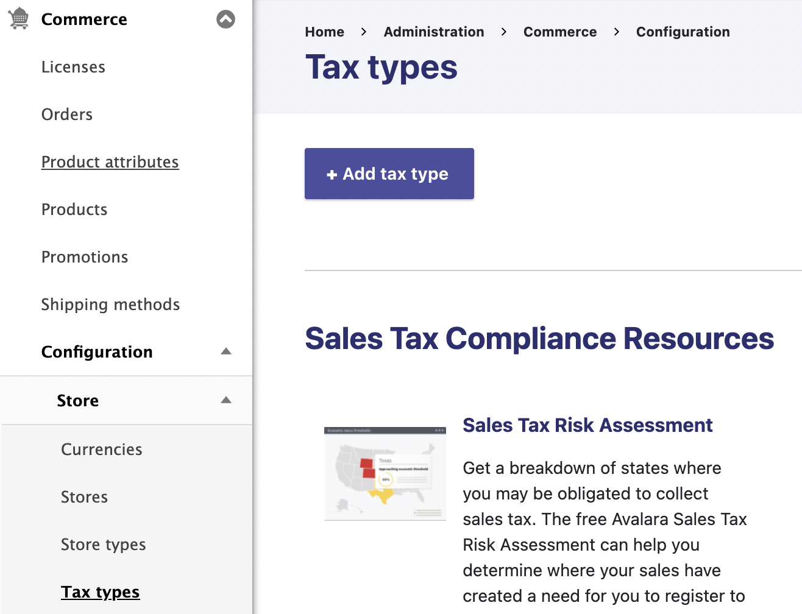
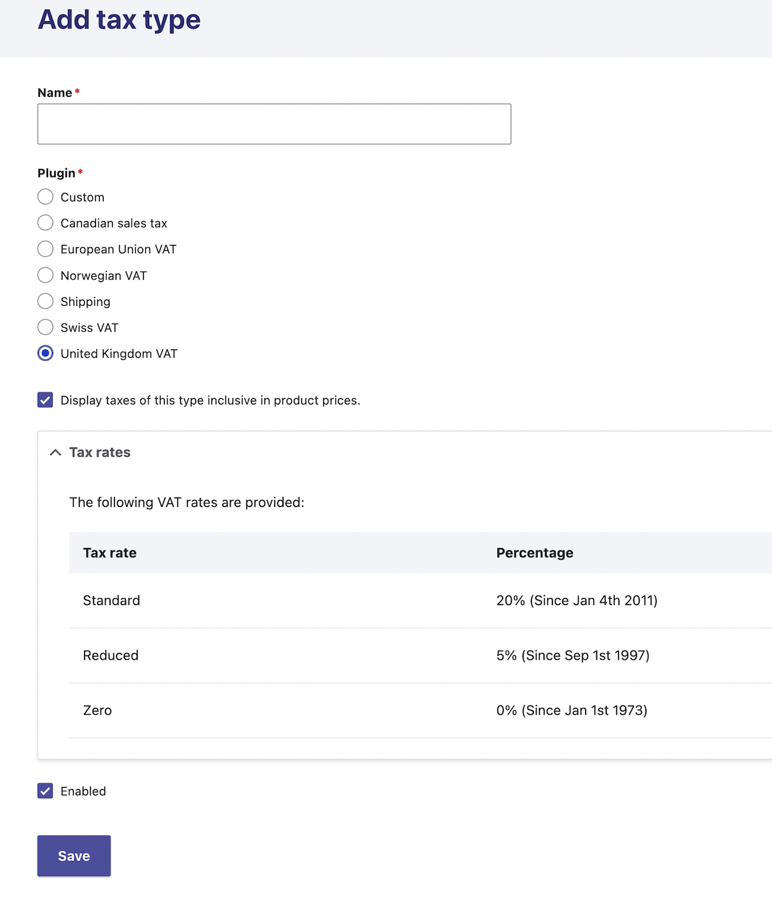
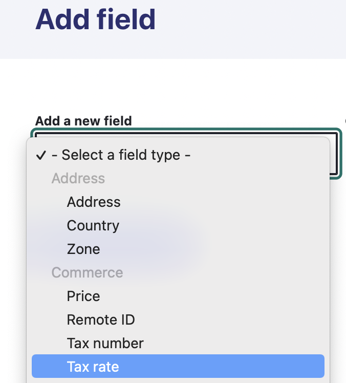
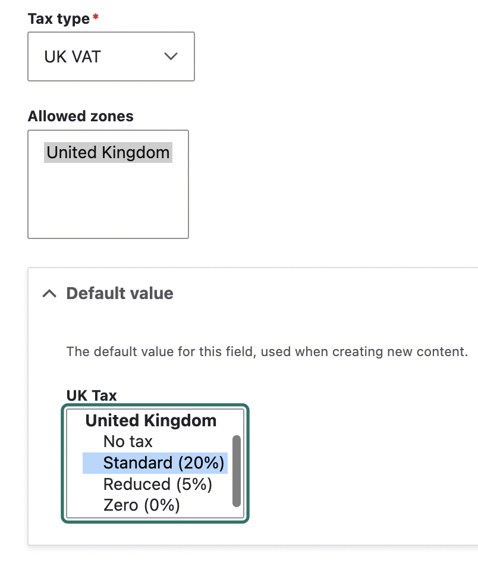

## Overview

Commerce Product Tax provides a user interface for selecting applicable tax rates on the product variation.

This module provides a `commerce_tax_rate` field type, which allows selecting a standard, reduced or no tax rate, in cases of tax free products.

## Adding a new Tax Type

You will need to add a new tax type to your Store.

Select a tax type from the available plugin options and you will see a list of the tax rates. 
Give the tax type an appropiate name and click **save**.

## Update Product Variation types

Next you will need to create a new field for your product variation(s).
Select `Tax rate` from the dropdown and give the field an appropiate label.

On the next page, you will be able to select what tax type you wish to use and the allowed zones. 
You can also set the default value to the Standard rate or a reduced/zero rate.

## Update Product Variations

You can now edit your product variations and select the applicable tax rate.
Depending on your Store settings, your tax rate will be visible on the cart page.
If you have products with different tax rates, they will be displayed on separate rows.

> If you have multiple stores, you can add multiple tax rate fields to a product variation. For example, a product could have a UK tax rate of 20% and a ROI tax rate of 23%

### Example

We have a UK based Store that sells both physical and digital products.
Most products have the standard 20% VAT tax rate. 
Digital products are exempt and have a zero rate.
Some products have a reduced rate of 5% VAT.

When viewing the cart, we can see the three different levels of tax applied. 
All prices displayed are inclusive of VAT.

