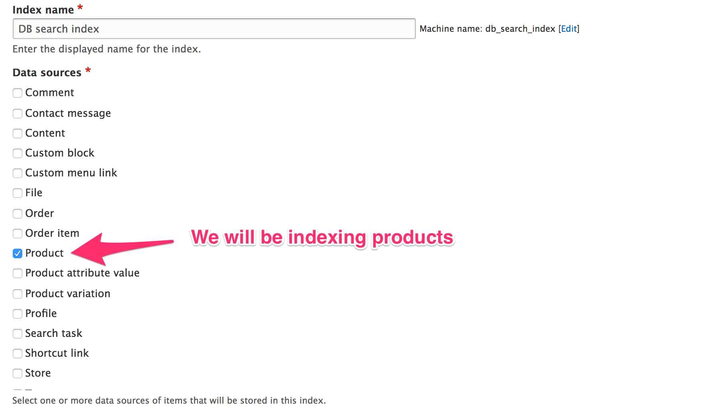
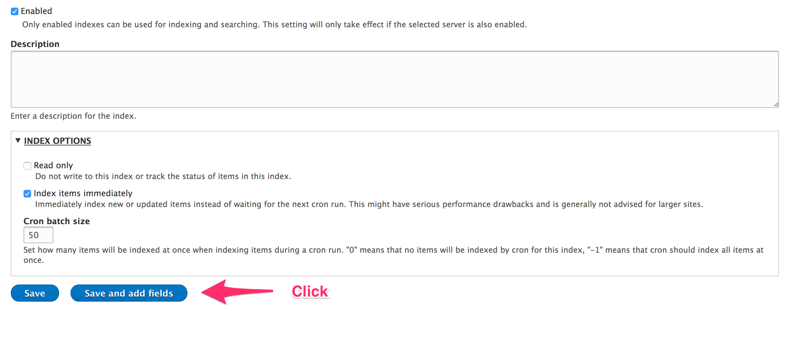
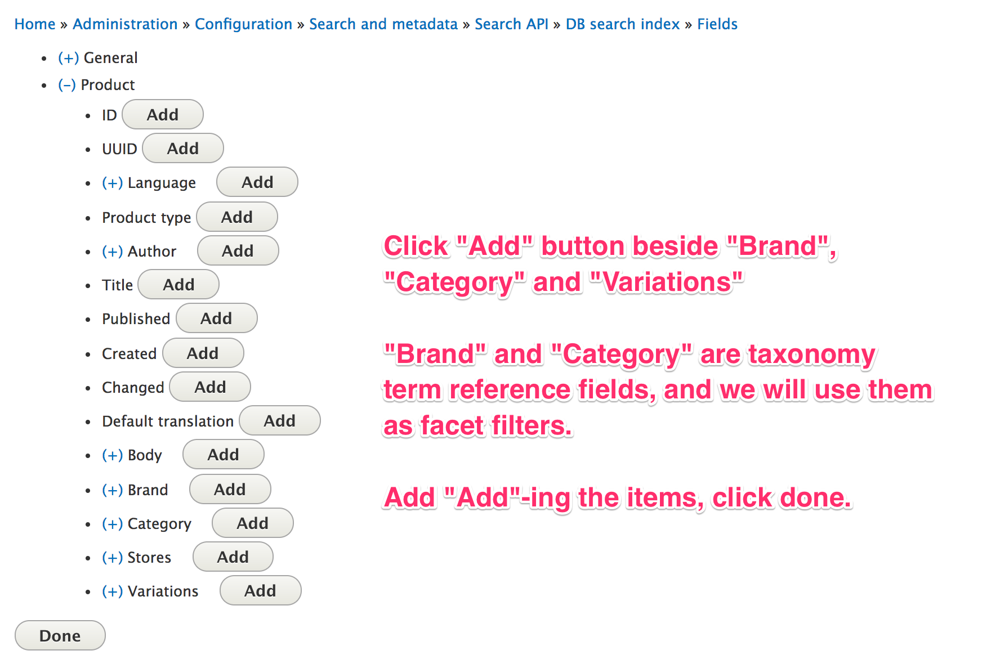
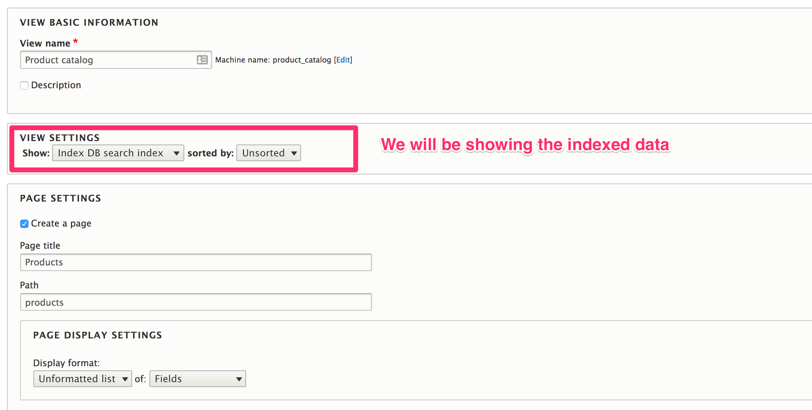
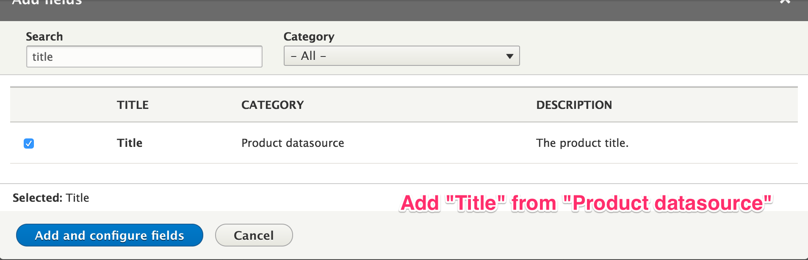
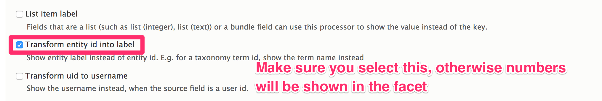
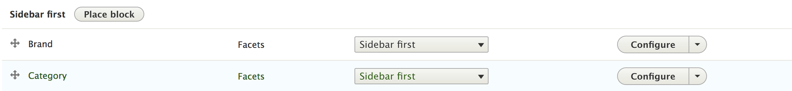

## Install the Search API module

Install [Search API](https://www.drupal.org/project/search_api). Here we will
be using database search that is available in the `search_api` module by default. You can
also use other extension modules listed [here](https://www.drupal.org/node/1999262).
If you do not have `search_api` installed, execute the following commands:

```bash
composer require drupal/search_api
drupal module:install search_api search_api_db
```

## Create search server

Go to `/admin/config/search/search-api/add-server`. Fill out the information as
follows:


## Create search index

Go to `/admin/config/search/search-api/add-index`. Fill out the information as follows:

 




Now you will be adding fields. The search data will be indexed based on these
fields, and these fields will be available when you create view, and you can
create facets out of these fields.

We will be showing the required fields to create a basic product catalog, you
can add other fields as necessary.


We will be showing variations in product catalog.



Click **Save changes**.

## Create view

Go to `/admin/structure/views/add`, fill out the information as follows:



Click "Save and edit"

Let's show the products in grid-style.


We will be showing the product title and "Add to cart" widget. You can change it
as you per your requirement.





Click "Add and configure fields".


Click "Apply and continue".


Click "Apply".


Click "Save".

Now go ahead and visit `/products` page.


Voila!! Your product catalog is ready.

## Create facets

We are going to add facets to the product catalog. Your catalog will look like
this:


First things first, install [Facets](https://www.drupal.org/project/facets) module. Execute the following commands:

```bash
composer require drupal/facets
drupal module:install facets
```

The **Facets** module is now installed. Now, we will be adding the facets.

Go to `/admin/config/search/facets`. Since we have already added a view of type
DB index, it should show there.


Click **+ Add facet**.

Earlier we have added "Brand" and "Category" fields while creating the search
index. Now we are going to use them as facets.

Do the settings as follows:





Click **Save**.

Repeat the above steps for adding the "Category" facet.


Finally, you will have two facets.


These facets are now available as blocks. We will place them in the catalog
page.

Go to `/admin/structure/block`.

Select any block region. In this case *Bartik* theme is used, and the facet
blocks will be placed inside *Sidebar first*.
   


Place "Brand" facet.


Similarly, place "Category" facet.



**Rebuild the cache.**

Visit ``/products`` page, and...


