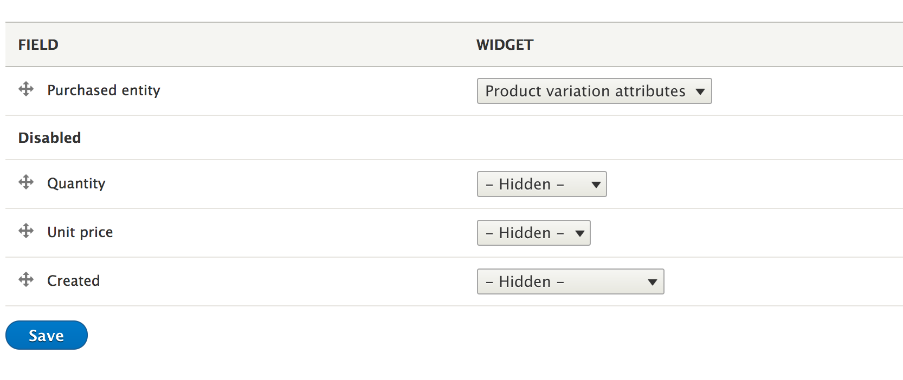

Previously we learned how to create a product catalog.

Now, lets customize the *Add to cart* form a little bit. We will learn how to
add quantity field in that form.

Go to `/admin/commerce/config/order-item-types/default/edit/form-display/add_to_cart`.

Drag the **Quantity** field, and **Save** the form.

Go ahead and refresh the ``/products`` page.

And voila!! You can now choose quantity while adding products to cart.
