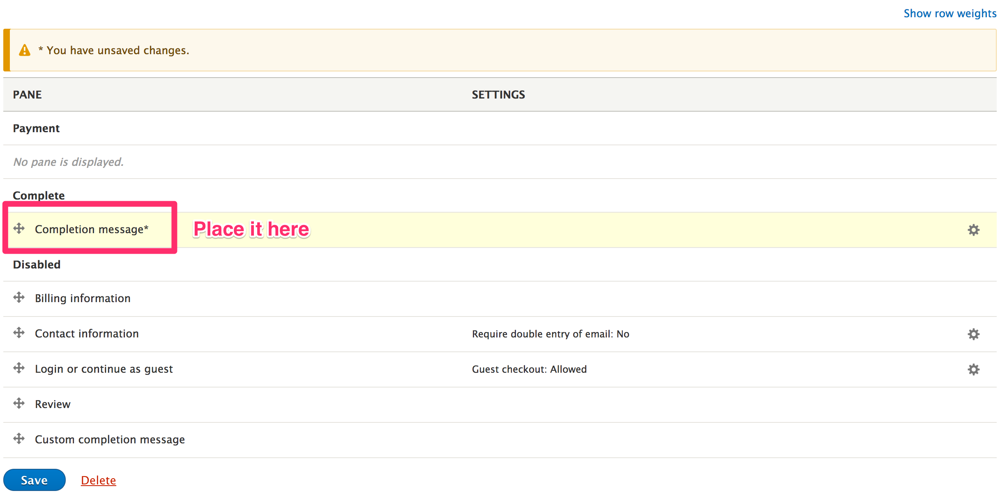
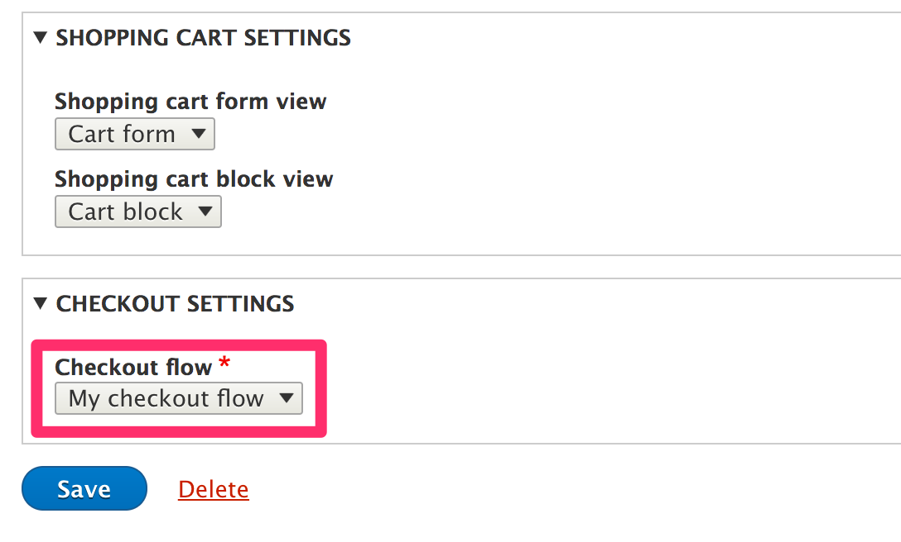

We will learn how to create a custom checkout flow.

Lets create a custom flow and we are going to use it for new orders.

Lets create a module that will do this.

If you are using [Drupal Console](https://drupalconsole.com/), then you can
execute this command from docroot:

```bash
drupal generate:module \
  --module="My checkout flow" \
  --machine-name="my_checkout_flow" \
  --module-path="/modules/custom" \
  --description="My checkout flow" \
  --core="8.x" \
  --package="Custom" \
  --composer \
  --dependencies="commerce:commerce_checkout"
```

Create the plugin using this command.

```bash
drupal generate:plugin:skeleton \
  --module="my_checkout_flow" \
  --plugin-id="commerce_checkout_flow" \
  --class="CustomCheckoutFlow"
```

A new file ``CustomCheckoutFlow.php`` will be created inside ``src/Plugin/Commerce/CheckoutFlow``.

Make sure that file looks like this:

```php
<?php

namespace Drupal\my_checkout_flow\Plugin\Commerce\CheckoutFlow;

use Drupal\commerce_checkout\Plugin\Commerce\CheckoutFlow\CheckoutFlowWithPanesBase;
use Drupal\Core\Form\FormStateInterface;

/**
 * @CommerceCheckoutFlow(
 *  id = "custom_checkout_flow",
 *  label = @Translation("Custom checkout flow"),
 * )
 */
class CustomCheckoutFlow extends CheckoutFlowWithPanesBase {

  /**
   * {@inheritdoc}
   */
  public function getSteps() {
    return parent::getSteps();
  }

}
```


Here we are not adding any custom step. We are just **inheriting** the steps
from the ``parent``.

The ``parent`` provides these steps.

```php
    return [
      'payment' => [
        'label' => $this->t('Payment'),
        'next_label' => $this->t('Pay and complete purchase'),
        'has_order_summary' => FALSE,
      ],
      'complete' => [
        'label' => $this->t('Complete'),
        'next_label' => $this->t('Pay and complete purchase'),
        'has_order_summary' => FALSE,
      ],
    ];
```

You can see these steps here ``/path/to/drupal/modules/commerce/modules/checkout/src/Plugin/Commerce/CheckoutFlow/CheckoutFlowBase.php`` inside ``getSteps()``.

Enable the module ``my_checkout_flow``.

```bash
drupal module:install my_checkout_flow
```

We are going to create a new checkout flow.

Go to ``/admin/commerce/config/checkout-flows/add``


Click **Save**.


Now, it can be as simple as displaying only the completion message.



Click **Save**.

We are going to use this checkout flow for future orders. To do that, go to
``admin/commerce/config/order-types/default/edit``.

At the bottom you will see **Checkout settings** section. Select the checkout
flow that you just created.



Click **Save**.

When the customers now place an order, they will just see the completion
message, and they don't have to pay a dime. Funny isn't it?

Lets make it more sophisticated. We will add login and review steps.

Alter ``CustomCheckoutFlow.php`` so that it looks like this:

```php
    <?php

    namespace Drupal\my_checkout_flow\Plugin\Commerce\CheckoutFlow;

    use Drupal\commerce_checkout\Plugin\Commerce\CheckoutFlow\CheckoutFlowWithPanesBase;
    use Drupal\Core\Form\FormStateInterface;

    /**
     * @CommerceCheckoutFlow(
     *  id = "custom_checkout_flow",
     *  label = @Translation("Custom checkout flow"),
     * )
     */
    class CustomCheckoutFlow extends CheckoutFlowWithPanesBase {

      /**
       * {@inheritdoc}
       */
      public function getSteps() {
        return [
          'login' => [
            'label' => $this->t('Login'),
            'previous_label' => $this->t('Return to login'),
            'has_order_summary' => FALSE,
          ],
          'review' => [
            'label' => $this->t('Review'),
            'has_order_summary' => TRUE,
          ],
        ] + parent::getSteps();
      }

    }
```

Go back to ``/admin/commerce/config/checkout-flows`` and *edit* the checkout flow
that you just created.

You will see the new steps.


Click **Save**.

The customers will now have to *login*, and they will be able to *review* the
order while placing them.
