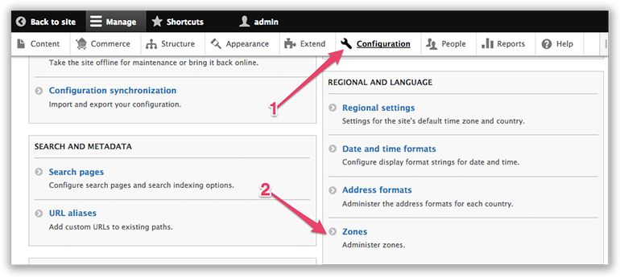

Zones
=====

See Also: `Zone Library`_   \|   `Addressing Library`_   \|   `Address
Drupal Module`_

Overview
--------

| Zones are territorial groupings mostly used for shipping or tax
  purposes.
| For example, a set of shipping rates associated with a zone where the
  rates
| become available only if the customer’s address matches the zone.

| A zone can match other zones, countries, subdivisions
  (states/provinces/municipalities), postal codes.
| Postal codes can also be expressed using ranges or regular
  expressions.

Examples of zones:

-  California and Nevada
-  Belgium, Netherlands, Luxemburg
-  European Union
-  Germany and a set of Austrian postal codes (6691, 6991, 6992, 6993)
-  Austria without specific postal codes (6691, 6991, 6992, 6993)

To locate Zones in your Commerce install, (1) click on Configuration and
(2) click on Zones:

|Navigate to zones|

| Each zone consists of zone members, which represent conditions that
  can be matched.
| For example, a “France and Germany” zone would have two zone members:
  1) France 2) Germany
| and an address would match that zone if it matches one of those two
  zone members.

Taxes and Zones
---------------

| The Commerce Tax submodule creates a matching zone for each imported
  tax type.
| For example, importing the German VAT tax type also creates a German
  VAT zone hich contains two zone members: 1) Germany 2) Austria (postal
  codes 6691, 6991, 6992, 6993)

.. _Zone Library: https://github.com/commerceguys/zone
.. _Addressing Library: https://github.com/commerceguys/addressing
.. _Address Drupal Module: https://www.drupal.org/project/address

