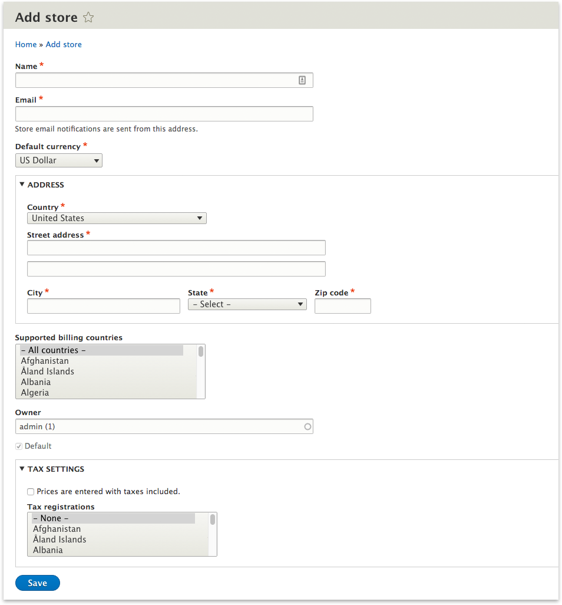

# Getting Started with Commerce 2

_Note: These are the steps immediately following the [installation process](install.md) and assumes your site is installed
and ready to be configured._

Congratulations! You have downloaded and installed Commerce and are now ready to start creating and selling products.
YAY! There are just a few steps you need to follow before you can create products. Below we detail them out.

----
**Shortcut!** - The getting started process can be quickly done using Drupal Console command:

>`drupal commerce:create:store` 
>
>_You are welcome to ignore this shortcut if you prefer the user interface and proceed to step 1._

## Step 1: Import the currency(s) your store will use.

The most basic piece of information that defines your store is the currency(s) you want to use. The vast majority of
Commerce stores will simply have one currency and one store. To set this up, first you need to locate the currencies
page at `admin/commerce/config/currencies`

Next, click the `Import` tab (`admin/commerce/config/currency/import`). The reason currencies need to be imported is
because we don't want to store all the world's currencies in your database if we don't have to, so we make no
assumptions and let each store request specific access to specific currencies. The dataset is coming from the intl
library which generates its dataset from an international and frequently updated standards body.

Once you've imported one or more currencies, you can move on to creating a store.

## Step 2: Create a store.

Next, we need to create a store. Every product requires one store. Additional details will be shared about the power of
having stores baked into the core of Commerce, but for now, all you need to do is define your store's name, address, and
select a few things about taxes and billing.

Once you've got all those details filled out, click save and move on to creating products! Woohoo!

## Step 3: Create a product.

Now you're ready to create your first product. You can simply go to `admin/commerce/products` and click "Add Product."

