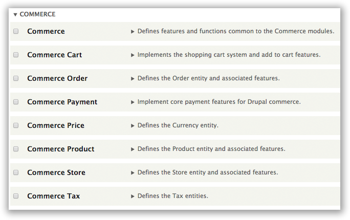

# Installing Drupal Commerce 2.x

_Note: Command-line examples use [Drupal Console](#installing-drupal-console) with the common alias "drupal", not Drush._

## Install Commerce 2

1. **Install Composer -** You must have composer installed in your system. ([Why?](https://bojanz.wordpress.com/2015/09/18/d8-composer-definitive-intro/) [How?](#installing-composer))

2. **Download & Install Drupal 8 -** Download and extract the latest release of [Drupal 8](https://drupal.org/project/drupal).

 ```sh
 # Using Drupal Console can make this super easy
 drupal site:new commerce2
 cd commerce2
 drupal site:install
 ```
3. **Download Commerce 2 -** Acquire the latest _**DEV**_ release of [Commerce 2](https://drupal.org/project/commerce) and [Composer Manager](https://drupal.org/project/composer_manager)

 ```sh
 drupal module:download commerce;
 drupal module:download composer_manager;
 ```

4. **Initialize Composer -** From the Drupal root directory, initialize composer_manager ([Why Composer?](https://bojanz.wordpress.com/2015/09/18/d8-composer-definitive-intro/)), and run it for the first time:

 ```sh
   php modules/contrib/composer_manager/scripts/init.php;
   composer drupal-update;
 ```

5. **Install Commerce -** Enable the Commerce modules, e.g.:

 ```sh
 # This line installs all commerce
 drupal module:install commerce commerce_order commerce_product commerce_tax commerce_cart commerce_payment profile;
 # This command is sometimes necessary to force the menu to rebuild;
 drupal cache:rebuild;
 ```


## Installing Drupal Console

You can go to [Drupal Console's website](http://drupalconsole.com/) for more documentation and support.

```sh
# Run this in your terminal to get the latest Console version:
curl -LSs http://drupalconsole.com/installer | php

# Or if you don't have curl:
php -r "readfile('http://drupalconsole.com/installer');" | php

# You can place this file anywhere you wish.
# If you put it in your PATH, you can access it globally.
# For example: move console.phar and rename it, 'drupal':
mv console.phar /usr/local/bin/drupal

# Copy configuration files.
drupal init

# Show all available Drupal Console commands.
drupal list
```

## Installing Composer

You can go to [GetComposer.com](https://getcomposer.org/doc/00-intro.md) for more documentation and support.

```sh
curl -sS https://getcomposer.org/installer | php
```

See Also:
* [Composer Manager Module](https://drupal.org/project/composer_manager)
* [Composer on Drupal Intro](https://bojanz.wordpress.com/2015/09/18/d8-composer-definitive-intro/)
* [Community Docs](https://www.drupal.org/node/2405811)

There is a big long list of requirements and steps including downloading the project, setting up a server, and making sure you have a database. Currently, the best place for accurate installation notes is the [INSTALL.txt file that comes with Drupal 8](https://api.drupal.org/api/drupal/core!INSTALL.txt/8). We expect drupal.org will have a much nicer step-by-step screenshot installation process posted soon.