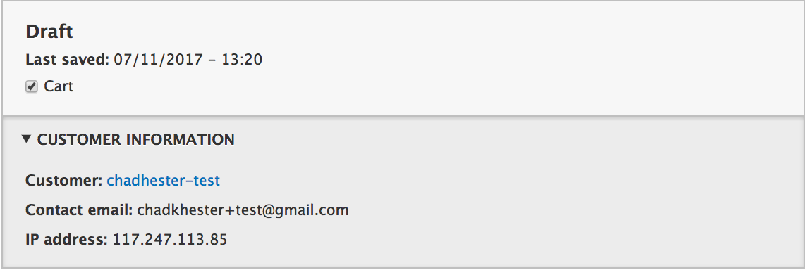

Order Processing
================

Order processing is part of the order refresh process. This is run when
on draft orders to ensure that it has up to date adjustments and that
its order items are up to date.

In Commerce Core, the order process moves through the following cycle:

.. image:: ../images/order_workflow.png

It starts with the order being in the shopping cart, which is the Draft/Cart state, then, once the order is placed, it is put in the Validation state. Once we're ready to ship the goods, the order is moved to the Fulfillment state. And finally, once it leaves our store, the order is officially Completed.

Now, that you know the process, let's take a look at how you can create orders on behalf of customers and move them along the order life cycle.

Creating an Order
-----------------
Site administrators can create orders on behalf of their customers by going to ``/admin/commerce/orders/add``. From here, we can either create a new order for an existing customer (chosen from the autocomplete search box). Or, we can create a new customer on the fly by providing just an email address.

.. image:: ../images/create_a_new_order.png

**Note:** You also have the option to create the order for a different date.

Once you've made the appropriate selections, you are taken to the order creation page where you enter the billing details and the products in the order.

.. image:: ../images/order_details.png

As you move further down, you'll see that there is an "Adjustments" section. This where you can add promotions, add a shipping amount, add tax, as well as, any custom amount to the order total. (`See steps on creating a promotion <../creating-a-promotion.rst>`__)
 
 And finally, you can apply coupons to the order. (`See steps on creating a coupon <../creating-a-coupon.rst>`__)
 
.. image:: ../images/applying_coupons_to_order.png

If we already have promotions running, this will automatically be reflected in the item pricing and the overall order total.

Saving an Order
---------------

Now that we've added all the order details, let's save the order. We also have the option of saving this new order to our cart. This will automatically add the products in this order to our shopping cart so we can complete the checkout by going to ``/cart``. 

Now, click to view the order. Notice that a discount has been automatically applied to the order total as we had a "20% Off" promotion running store-wide. Also, notice that the order is currently in "Draft" state. 

.. image:: ../images/promotion_applied_to_order.png

Adding Payments
----------------

As an admin, once we've got all the order details done, our next job would be to complete payment on the order. That's where the 'Payments' tab comes in. The payments page allows us to process a Credit Card/Email Money Transfer/Bank Transfer/Cheque payment for the order using the store's preferred Payment Gateway.

.. image:: ../images/capture_order_payment.png

Now, that we've got money for our products from the customer, let's go ahead and officially place the order by clicking on the "Place order" button. This will put the order in 'Validation' state.

.. image:: ../images/order_in_validation_state.png

Completing the Order
--------------------

The next steps are pretty obvious, once we are ready to ship the order, we click the "Validate Order" button and it will put the order in `Fulfillment` state.

.. image:: ../images/order_in_fulfillment_state.png

And finally, once the order has shipped out, we hit the "Fulfill Order" button and the order enters `Completed` state.

.. image:: ../images/order_completed.png