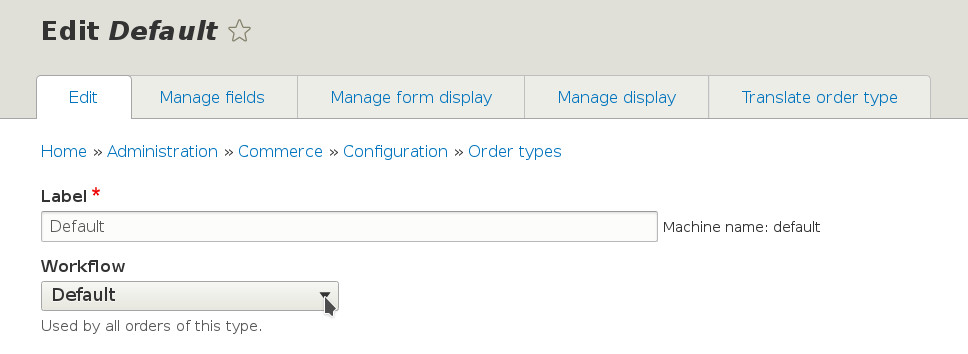

Associating an Order Type with a Workflow
=========================================

An order type can be associated with a specific workflow, and that forces the order to follow that workflow's rules such as to only move through the defined transitions. To associate an order type with an order workflow, go to ``/admin/commerce/config/order-types`` and select to Edit the desired order type. You can then choose the desired workflow from the Workflow dropdown field. Save the form.

   Associating an Order Type with an Order Workflow
