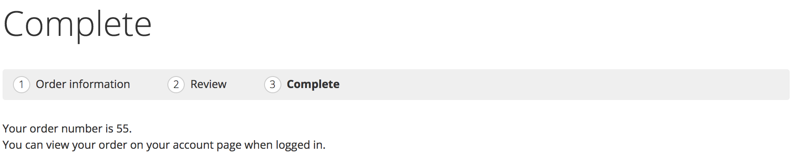
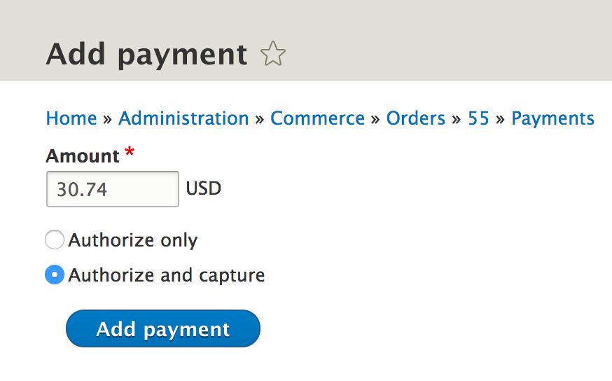
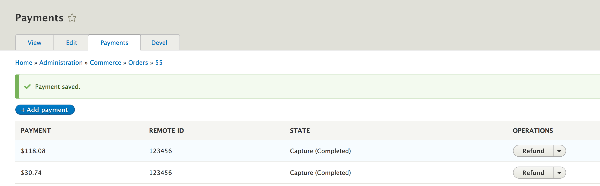
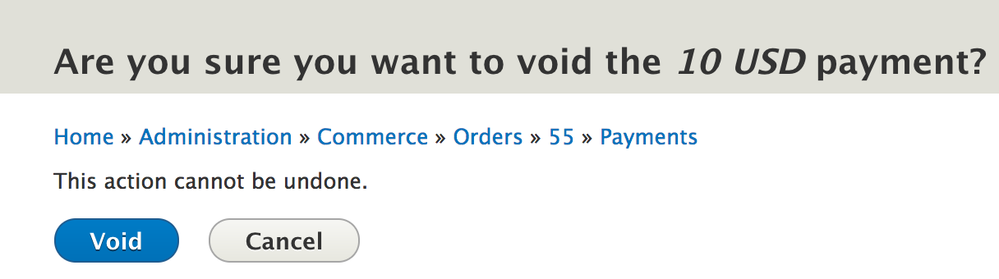
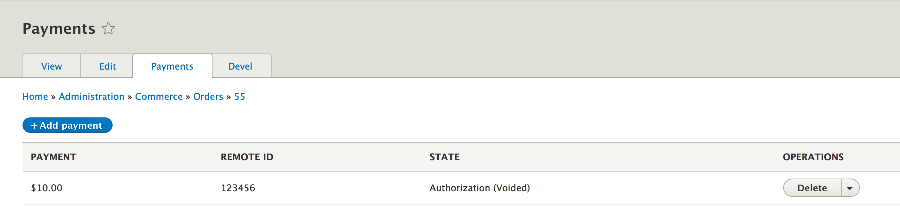
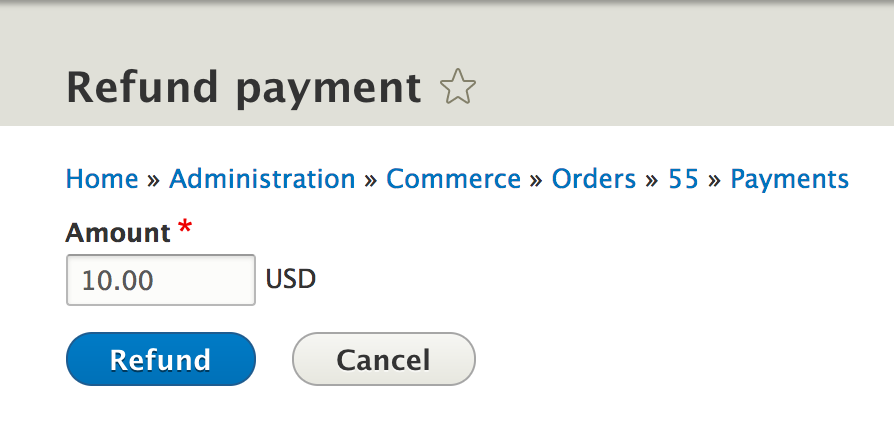
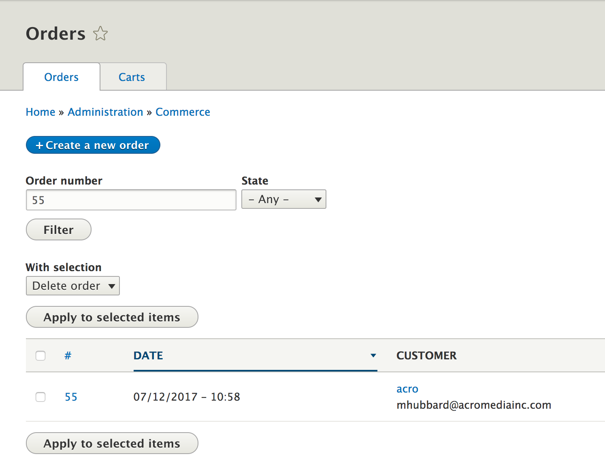

Managing Order Payments
=======================

As a store administrator there are times where you often find yourself having to manage orders and payments on behalf of customers. Some customers might call in to modify their saved credit cards, or you might need to refund or capture payments for orders. With Drupal Commerce, you get a nice interface that let's you manage orders and payments with ease.

Locating an Order Payment
-------------------------

Let's assume a scenario where you've got a customer on the line that tells you that they need to make a change to their order before it gets shipped out. The customer might be looking at a confirmation page like this right after they have completed the order.

So, they tell you that the order number is 55. Ideally, the next step would be for you to locate the order and edit it. In order to find the order, go to `/admin/commerce/orders`. You'll see a page similar to this:

.. image:: images/orders_page.png

Enter "55" in the `Order Number` textfield and hit Filter. It should bring up the order now. Click the `Edit` button and you'll see the entire contents of the order.

.. image:: images/edit_order.png

Now that you have located the order you can continue to make the necessary changes requested by the customer.

Capturing Payments
------------------

In our previous scenario the customer requested to make a change to their order. Let's say they wanted to modify the quantity ordered for one of the products. Instead of 1 quantity of "Distressed Flannel Shirt - Small", they now want 2 of this item. As an admin you can go ahead and edit the item and enter "2" for the quantity. However, now you have a changed order total. If you go over to the `View` tab, you can see the order total is now "$148.82". You need to request more payment from the customer. 

Capturing payments for a order is done from the `Payments` tab above.

.. image:: images/order_payment.png

Notice, the payments that have already been captured for this order is displayed in the page. The customer has already paid $118.08, so a difference of $30.74 needs to paid. Click on the `Add payment` button.

.. image:: images/new_payment_for_order.png

Now, select the payment type and continue with the prompt.

Once the payment is successful, you'll be notified and the new payment will be added to the list.

Voiding Payments
----------------

Payments are basically voided to cancel an authorization. For example, on travel sites, normally when a customer adds a trip request, a payment authorization is added to the order. It is only when the trip is confirmed that the authorization becomes a charge. 

Similary, in our case, let's say we had added a payment authorization for an order. However, upon processing the order, we notice that the item is out of stock. We now need to the 'Void' the payment. Voiding payments are quite easy. Just as before, you first need to locate the order. Then, as you did before, click on the `Payments` tab and locate the authorized payment.

.. image:: images/payment_authorization.png

Click the `Void` link and confirm that you want to void the payment.

Once you confirm, the payment page should look like this, with a "(Voided)" added next to the payment that you just voided.

Refunding Payments
------------------

Payments can be refunded when they've been authorized and captured. There maybe times when you've already taken payment but need to refund an order, either due to lack of stock, damaged product, cancelled order, or some other reason. Similar to voiding payments, refunding payments follow the same process. You locate the order, click the `Payments` tab, find the captured payment and hit the `Refund` link. You'll be taken to a confirmation page.

Once you confirm the refund, the payment will be refunded to the customer and the refunded payment would look like this.

.. image:: images/payment_refunded.png

Managing Customer Credit Cards
------------------------------
Handling customer credit cards can be done through the user's profile. If a customer has requested changes to their saved payment method's, the easiest way to make modifications would be to first locate the customer's order, then, cick on the name in the "Customer" column.

Now, click on the `Payment Methods` tab.

.. image:: images/customer_payment_methods.png

Notice, you'll see a list of the payment methods they have used. From here, you can add/delete payment methods.

**Note:** You need to have the appropriate permissions to modify customer payment methods.