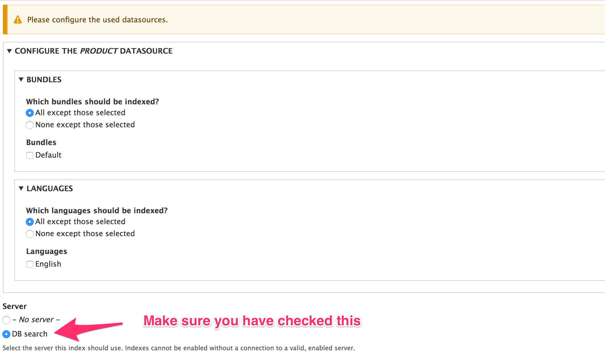
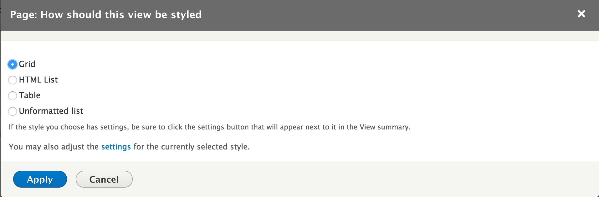
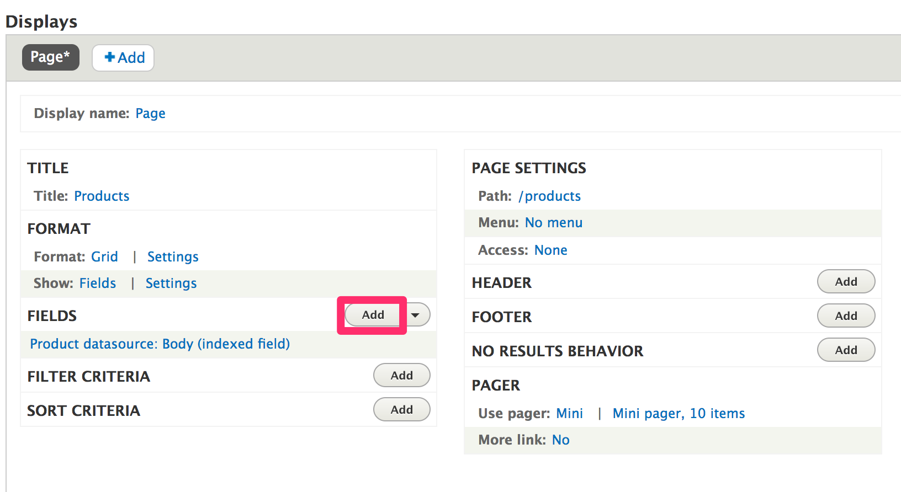
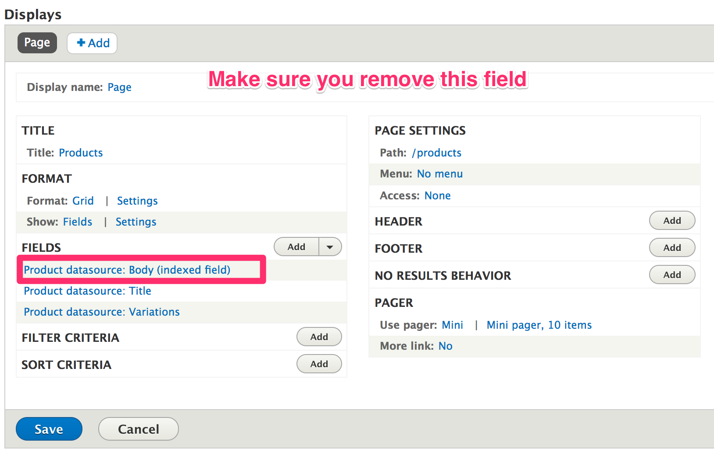
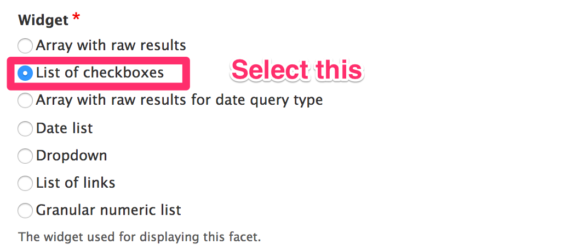
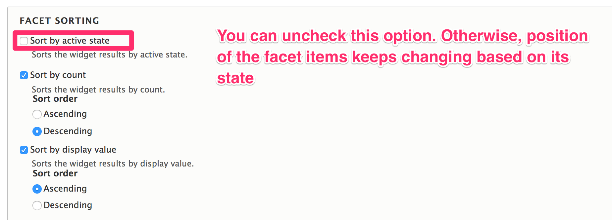

Create a product catalog
========================

Install ``search_api`` module
~~~~~~~~~~~~~~~~~~~~~~~~~~~~~

Install `search_api <https://www.drupal.org/project/search_api>`_. Here we will
be using database search that is available in ``search_api`` by default. You can
also use other extension modules listed `here <https://www.drupal.org/node/1999262>`_.
If you do not have ``search_api`` installed, execute the following commands:

.. code-block:: bash

    composer require drupal/search_api
    drupal module:install search_api search_api_db

Create search server
~~~~~~~~~~~~~~~~~~~~

Go to ``admin/config/search/search-api/add-server``. Fill out the information as
follows:

.. figure:: images/search_create_server.png
   :alt: Search add server

Create search index
~~~~~~~~~~~~~~~~~~~

Go to ``admin/config/search/search-api/add-index``. Fill out the information as
follows:

.. figure:: images/search_create_index_1.png
   :alt: Search add server 1

.. figure:: images/search_create_index_3.png
   :alt: Search add server 3

Now you will be adding fields. The search data will be indexed based on these
fields, and these fields will be available when you create view, and you can
create facets out of these fields.

We will be showing the required fields to create a basic product catalog, you
can add other fields as necessary.

.. figure:: images/search_create_index_4.png
   :alt: Search add server 4

We will be showing variations in product catalog.

.. figure:: images/search_create_index_5.png
   :alt: Search add server 5

Click "Save changes".

Create view
~~~~~~~~~~~

Go to ``admin/structure/views/add``, fill out the information as follows:

.. figure:: images/search_create_view_1.png
   :alt: Search add view 1

Click "Save and edit"

Let's show the products in grid-style.

.. figure:: images/search_create_view_3.png
   :alt: Search add view 3

We will be showing the product title and "Add to cart" widget. You can change it
as you per your requirement.

.. figure:: images/search_create_view_5.png
   :alt: Search add view 5

.. figure:: images/search_create_view_6.png
   :alt: Search add view 6

Click "Add and configure fields".

.. figure:: images/search_create_view_7.png
   :alt: Search add view 7

Click "Apply and continue".

.. figure:: images/search_create_view_8.png
   :alt: Search add view 8

Click "Apply".

Click "Save".

Now go ahead and visit ``/products`` page.

.. figure:: images/product_catalog_page.png
   :alt: Product catalog page

Voila!! Your product catalog is ready.

Create facets
~~~~~~~~~~~~~

We are going to add facets to the product catalog. Your catalog will look like
this:

First things first, install `facets <https://www.drupal.org/project/facets>`_
module. Execute the following commands:

.. code-block:: bash

    composer require drupal/facets
    drupal module:install facets

``facets`` module is now installed. Now, we will be adding the facets.

Go to ``admin/config/search/facets``. Since we have already added a view of type
DB index, it should show there.

.. figure:: images/search_create_facet_sample.png
   :alt: Sample facet setting

Click **+ Add facet**.

Earlier we have added "Brand" and "Category" fields while creating the search
index. Now we are going to use them as facets.

Do the settings as follows:

.. figure:: images/search_create_facet_1.png
   :alt: Create facet 1

.. figure:: images/search_create_facet_3.png
   :alt: Create facet 3

Click **Save**.

Repeat the above steps for adding the "Category" facet.

.. figure:: images/search_create_facet_5.png
   :alt: Create facet 5

Finally, you will have two facets.

.. figure:: images/search_create_facet_6.png
   :alt: Create facet 6

These facets are now available as blocks. We will place them in the catalog
page.

Go to ``admin/structure/block``.

Select any block region. In this case *Bartik* theme is used, and the facet
blocks will be placed inside *Sidebar first*.

.. figure:: images/search_place_facet_1.png
   :alt: Place facet 1

Place "Brand" facet.

.. figure:: images/search_place_facet_2.png
   :alt: Place facet 2

.. figure:: images/search_place_facet_3.png
   :alt: Place facet 3

Similarly, place "Category" facet.

.. figure:: images/search_place_facet_4.png
   :alt: Place facet 4

**Rebuild the cache.**

Visit ``/products`` page, and...

