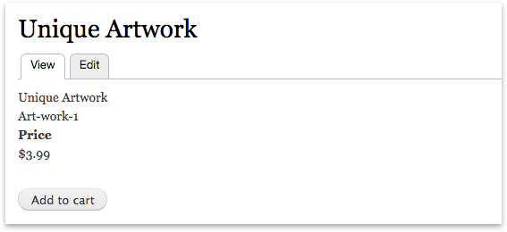

# Product Attributes

Most products have attributes (pictured on the left, above) that differentiate the Stock Keeping Units (SKUs) and prices 
(pictured above, right). Each type of differentiating attribute in Drupal Commerce has a
screen that lets you manage every possible value and a separate screen to help you manage the kinds of fields and
rendered display modes you want to use. 

> **For example:** A `Color` attribute may include a hexadecimal field for rendering a
> color swatch and/or an image field. You could add both kinds of fields to the `Color` attribute and modify the 
> attribute's display mode to render a swatch instead of text-representation.

## Technical Relationships

The product attributes are their own kind of fieldable entity. Each attribute can belong to one or more product variation
bundles. The above diagram depicts `Attributes` that have `Attribute Values` (which are fieldable) and how they relate to
Products. In one sentence: A product can have one or many variations and a variation can have zero or more attribute values,
but only one attribute value per attribute.

## Creating Attributes and their Values

The first step in adding an attribute to a product, is to create the type of attribute. Often this is a very obvious 
designation falling into the category of a differentiation. Common examples include: Color, Size, Capacity, Complexity.

After you have created an attribute, we need to define at least one value. By default, the attribute value screen will
only display a label for the attribute. In the next section, we describe how to manage the fields that show up for each
attribute value. 

The product attribute values user interface allows creating and re-ordering multiple values at the same time and a very
powerful translation capability:

Next, you will need to add the attribute to the product variation type. You can find these at 
`/admin/commerce/config/product-variation-types` and you just need to add/edit a product variation type that requires your
new attribute.

Finally, users are able select attributes on the product variation type form, the checkbox in the last step automatically 
created entity referenced fields as needed:

## Adding fields to Attributes

Product attributes are so much more than a word. Often times they represent a differentiation between products that is
useful to call out visually for customers. The fieldable attribute value lets the information architect decide what kind of
best describes this attribute (does it need an image field and three text fields? Good, because we can do that). Like 
any other fieldable entity, you can locate the list of attribute bundles and click edit fields:

`/admin/commerce/product-attributes`

Add a field as you would expect. Most fields are supported and will automatically show up when you go to add attribute
values:

## Editing Attributes

Editing the attribute values is pretty easy. Simply locate the attribute type that has the values you want to edit:

`/admin/commerce/product-attributes`

And click "edit" and you will be taken to a screen to edit all the attributes of that type.

## Optional Attributes

After creating attributes, the product variation type needs to know that it uses the attribute. The product variations are at 
`/admin/commerce/config/product-variation-types` and once you've clicked on the attribute you want...

Fields are added to the variation type that can then be modified. By default, the field is required. If your attribute is
optional (not all shirts have embroidery options, but some do), then you need to locate the manage fields of your particular
product variation type by following these steps:

1. Go to `/admin/commerce/config/product-variation-types`
2. Click the drop down next to the variation type you want and click "manage fields"

3. Un-select the "required" checkbox to make the attribute optional.

## Product Variations that don't have Attributes

Product Variations do not require attributes (pictured above is a product with two variations that have no attributes).
Products may have one or many product variations with or without attributes. Any variations that do not have attributes
will simply be listed without a selection widget. 

*The way non-attributed products are listed may change before a beta version of Commerce is released.*
