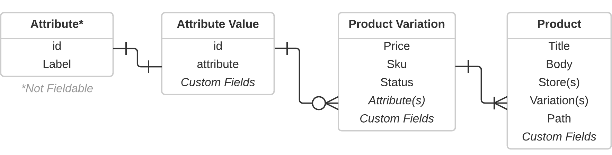
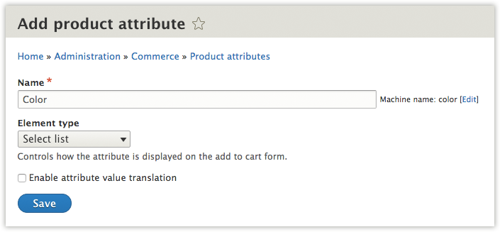

# Product Attributes

Most products have attributes (pictured on the left, above) that differentiate the Stock Keeping Units (SKUs) and prices 
(pictured above, right). Each type of differentiating attribute in Drupal Commerce has a
screen that lets you manage every possible value and a separate screen to help you manage the kinds of fields and
rendered display modes you want to use. 

> **For example:** A `Color` attribute may include a hexadecimal field for rendering a
> color swatch and/or an image field. You could add both kinds of fields to the `Color` attribute and modify the 
> attribute's display mode to render a swatch instead of text-representation.

## Technical Relationships

The product attributes are their own kind of fieldable entity. Each attribute can belong to one or more product variation
bundles. The above diagram depicts `Attributes` that have `Attribute Values` (which are fieldable) and how they relate to
Products. In one sentence: A product can have one or many variations and a variation can have zero or more attribute values,
but only one attribute value per attribute.

## Creating Attributes and their Values

The first step in adding an attribute to a product, is to create the type of attribute. Often this is a very obvious 
designation falling into the category of a differentiation. Common examples include: Color, Size, Capacity, Complexity.

After you have created an attribute, we need to define at least one value. By default, the attribute value screen will
only display a label for the attribute. In the next section, we describe how to manage the fields that show up for each
attribute value. 

The product attribute values user interface allows creating and re-ordering multiple values at the same time and a very
powerful translation capability:

Next, you will need to add the attribute to the product variation type. You can find these at 
`/admin/commerce/config/product-variation-types` and you just need to add/edit a product variation type that requires your
new attribute.

Finally, users are able select attributes on the product variation type form, the checkbox in the last step automatically 
created entity referenced fields as needed:

## Adding fields to Attributes

## Editing Attributes

... needs description ...

... needs screenshot ...

## Optional Attributes

... needs description ... Optional attributes can be made by making them “not required”

... needs screenshot ...

## Products that don't have Attributes

But what happens if a variation type has no attributes? For example, a product is only selling a single file. In that
case, the Inline Entity Form widget will render the variation form as a regular fieldset on the product. 

... needs screenshot ...
